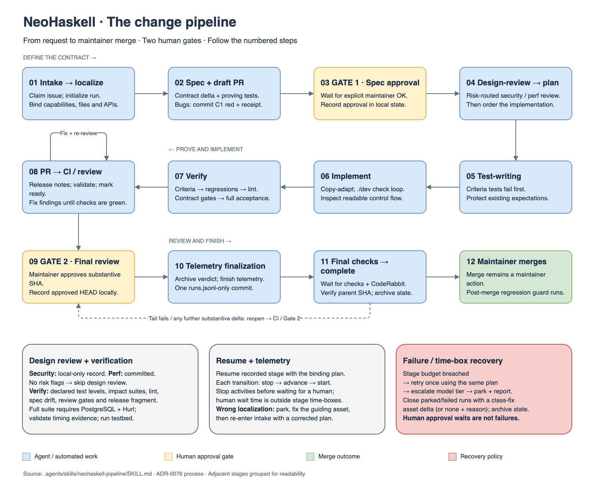

# Contributing to NeoHaskell

Use the [README](README.md) for environment setup, build commands, and running
tests.

## Required change pipeline

NeoHaskell contributions must use the
[NeoHaskell change pipeline](.agents/skills/neohaskell-pipeline/SKILL.md).
It takes a change from its initial request through a reviewed specification,
implementation, tests, and a pull request. When working with an agent, ask it to
use the `neohaskell-pipeline` skill.

The pipeline has two maintainer approval gates: first, approval of the
specification in a draft PR before implementation; second, review of the final
change after tests and CI pass. Between those gates, write failing tests,
implement the change, and verify it against the agreed specification. The
maintainer performs the merge after final checks.

[Open the full-size diagram](.assets/img/neohaskell-pipeline.png) ·
[Edit the diagram in draw.io](.assets/img/neohaskell-pipeline.drawio)

The diagram groups adjacent stages for readability. The linked pipeline skill
is the source of truth for commands, approval records, verification, and
resuming interrupted work; update the diagram when that process changes.

The Rust CLI and bundled IDE under `neo/` follow their
[separate contribution contract](neo/AGENTS.md) and CLI skills, rather than the
Haskell pipeline shown here.
