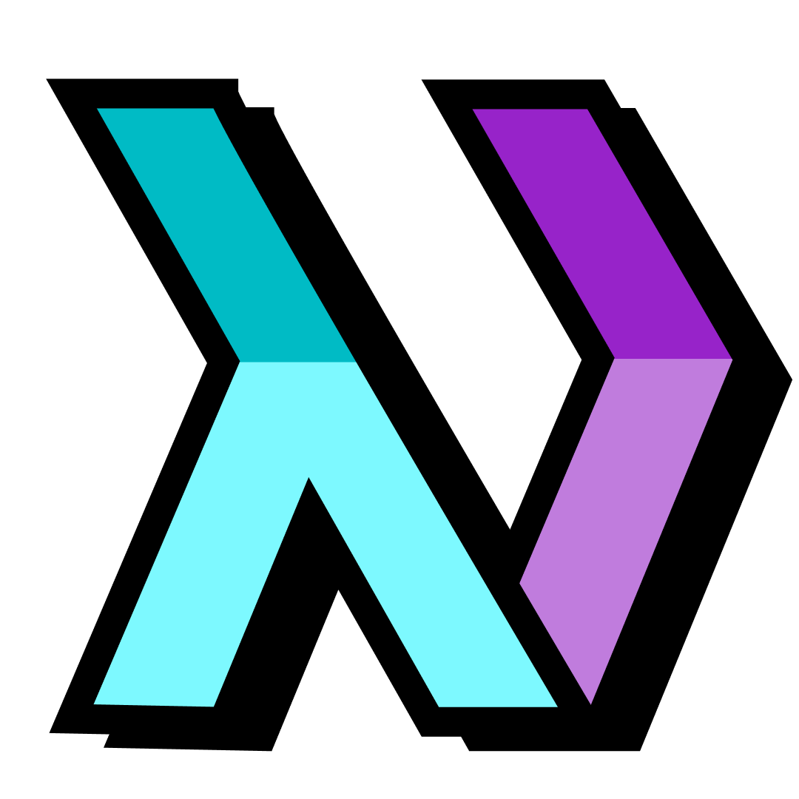

<div align="center">
  
  <h1>NeoHaskell</h1>
  <b>
    NeoHaskell is a dialect of Haskell that is focused on newcomer-friendliness and productivity.
  </b>
  <p>
    It is designed to be easy to learn and use, while also being powerful enough to release your app with minimum effort and maximum confidence.
  </p>
  <a href="#contributors">
    
  </a>
</div>

---

# Welcome to the contributor guide

If you want to learn about NeoHaskell itself, checkout
[the NeoHaskell website](https://neohaskell.org).

This guide is intended to streamline the process of
contributing to the NeoHaskell tooling.

The repository will be a mono-repo that contains all the
different parts of NeoHaskell.

## Installing the required tools

(This assumes that you're using MacOS, WSL2 or Linux)

- Install [Nix](https://nixos.org/download/)
- Run `nix-shell`
- Run `cabal update && cabal build all`

The recommended IDE for any NeoHaskell project is [Visual Studio Code](https://code.visualstudio.com/).

## Get the code

- Fork this repository
- `git clone <url to your fork>`
- `cd NeoHaskell && code .`

## Install the recommended extensions

When opening the project for the first time, you will be prompted to install the recommended extensions, install them.

## Code Formatting

This project uses the fourmolu formatter for consistent Haskell code styling. When using VS Code with the recommended extensions:

- Code will automatically format on save
- The formatter settings are controlled by the fourmolu.yaml file in the root directory

## Linting

This project uses hlint, it will automatically be run in VSCode by the recommended extension.
To run manually:

```sh
hlint .
```

## Collaborate on Discord

It's always better to hack with people, so why not join the [Discord server](https://discord.gg/invite/wDj3UYzec8)?

## Contributors

<!-- ALL-CONTRIBUTORS-LIST:START - Do not remove or modify this section -->
<!-- prettier-ignore-start -->
<!-- markdownlint-disable -->

<!-- markdownlint-restore -->
<!-- prettier-ignore-end -->

<!-- ALL-CONTRIBUTORS-LIST:END -->
