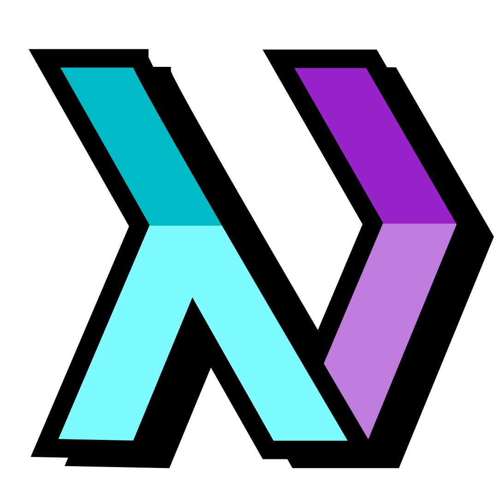

<div align="center">
  
  <h1>NeoHaskell</h1>
  <b>
    NeoHaskell is a dialect of Haskell that is focused on newcomer-friendliness and productivity.
  </b>
  <p>
    It is designed to be easy to learn and use, while also being powerful enough to release your app with minimum effort and maximum confidence.
  </p>
  <a href="#contributors">
    
  </a>
  <a href="https://vscode.dev/redirect?url=vscode://ms-vscode-remote.remote-containers/cloneInVolume?url=https://github.com/neohaskell/neohaskell">
    
  </a>
</div>

---

# Welcome to the contributor guide

If you want to learn about NeoHaskell itself, checkout
[the NeoHaskell website](https://neohaskell.org).

This guide is intended to streamline the process of
contributing to the NeoHaskell tooling.

The repository will be a mono-repo that contains all the
different parts of NeoHaskell.

## Installing the required tools

(This assumes that you're using MacOS, WSL2 or Linux)

1. Install [Nix](https://nixos.org/download/) with flakes enabled
2. Run `nix develop` to enter the development shell
3. Run `cabal update && cabal build all`

### Binary Cache (Faster Builds)

The project uses [Cachix](https://cachix.org) to cache build artifacts. The `flake.nix` is pre-configured to use our cache, so `nix develop` should automatically prompt you to trust it on first run.

If you want to explicitly enable it (or if you have a restrictive Nix config):

```sh
# Install cachix (if not already installed)
nix-env -iA cachix -f https://cachix.org/api/v1/install

# Add the NeoHaskell cache
cachix use neohaskell
```

This dramatically speeds up the first `nix develop` (from ~30 min to ~2 min).

The recommended IDE for any NeoHaskell project is [Visual Studio Code](https://code.visualstudio.com/).

## Get the code

- Fork this repository
- `git clone <url to your fork>`
- `cd NeoHaskell && code .`

## Install the recommended extensions

When opening the project for the first time, you will be prompted to install the recommended extensions, install them.

## Code Formatting

This project uses the fourmolu formatter for consistent Haskell code styling. When using VS Code with the recommended extensions:

- Code will automatically format on save
- The formatter settings are controlled by the fourmolu.yaml file in the root directory

## Linting

This project uses hlint, it will automatically be run in VSCode by the recommended extension.
To run manually:

```sh
hlint .
```

> ⚠ The current hlint configuration does not yet encode NeoHaskell's dialect
> rules and does not run in CI — don't treat its output as style guidance.
> The dialect-first rebuild is tracked in
> [#715](https://github.com/neohaskell/NeoHaskell/issues/715) (Phase 2).

## Fast inner loop

The same tools the CI/agent pipeline uses work on demand for humans (they are
the *same scripts* on purpose — if you can't reproduce what the pipeline saw,
you can't debug it):

```sh
scripts/dev-loop                     # persistent typecheck watcher (ghcid, -O0);
                                     #   errors stream to .ghcid-errors.txt
scripts/test-match "EventStore"      # run only matching specs, no linking (~9s)
scripts/test-match "insert" nhcore-test-service   # pick a suite
scripts/refresh-dev-cache            # re-warm the -O0 build after pull/branch switch
```

All of these build with `cabal.project.dev` (`-O0`) — typecheck feedback lands
in under a second once `dev-loop` is running. You don't need to be inside
`nix develop`: the scripts enter it on demand via `scripts/with-toolchain`
(pinned toolchain from any bare shell). Full details and measured baselines:
`telemetry/SCHEMA.md`.

## Running Tests

The core library tests are split into domain-specific suites that run in parallel on CI:

```sh
# Run all tests
cabal test all

# Run specific test suites
cabal test nhcore-test-core         # Core primitives (fast)
cabal test nhcore-test-auth         # Auth & JWT tests
cabal test nhcore-test-service      # Service layer (requires PostgreSQL)
cabal test nhcore-test-integration  # Integration tests
```

Note: `nhcore-test-service` requires a PostgreSQL instance. You can start one with:

```sh
docker run -d --name neohaskell-postgres \
  -e POSTGRES_USER=neohaskell \
  -e POSTGRES_PASSWORD=neohaskell \
  -e POSTGRES_DB=neohaskell \
  -p 5432:5432 \
  postgres:16-alpine
```

## Collaborate on Discord

It's always better to hack with people, so why not join the [Discord server](https://discord.gg/invite/wDj3UYzec8)?

## Contributors

<!-- ALL-CONTRIBUTORS-LIST:START - Do not remove or modify this section -->
<!-- prettier-ignore-start -->
<!-- markdownlint-disable -->
<table>
  <tbody>
    <tr>
      <td align="center" valign="top" width="14.28%"><a href="https://github.com/NickSeagull"><br /><sub><b>Nick Seagull</b></sub></a><br /><a href="#code-NickSeagull" title="Code">💻</a></td>
      <td align="center" valign="top" width="14.28%"><a href="https://github.com/DavideWalder"><br /><sub><b>Davide Walder</b></sub></a><br /><a href="#infra-DavideWalder" title="Infrastructure (Hosting, Build-Tools, etc)">🚇</a></td>
      <td align="center" valign="top" width="14.28%"><a href="https://github.com/SiriusStarr"><br /><sub><b>ScribblyBirb</b></sub></a><br /><a href="#ideas-siriusstarr" title="Ideas, Planning, & Feedback">🤔</a></td>
      <td align="center" valign="top" width="14.28%"><a href="https://github.com/JYCabello"><br /><sub><b>Yeray Cabello</b></sub></a><br /><a href="#test-JYCabello" title="Tests">⚠️</a> <a href="#ideas-JYCabello" title="Ideas, Planning, & Feedback">🤔</a></td>
      <td align="center" valign="top" width="14.28%"><a href="https://github.com/ussgarci"><br /><sub><b>Steven Garcia</b></sub></a><br /><a href="#code-ussgarci" title="Code">💻</a></td>
      <td align="center" valign="top" width="14.28%"><a href="https://github.com/DeviousStoat"><br /><sub><b>Thomas</b></sub></a><br /><a href="#code-DeviousStoat" title="Code">💻</a></td>
      <td align="center" valign="top" width="14.28%"><a href="https://github.com/verogarp"><br /><sub><b>Verónica García Pulido</b></sub></a><br /><a href="#doc-verogarp" title="Documentation">📖</a></td>
    </tr>
  </tbody>
</table>

<!-- markdownlint-restore -->
<!-- prettier-ignore-end -->

<!-- ALL-CONTRIBUTORS-LIST:END -->
