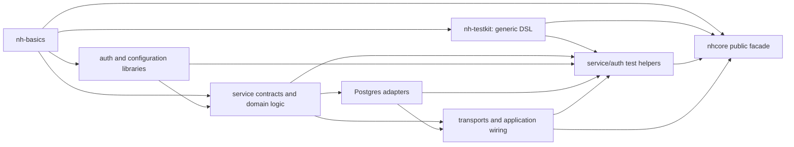

# Finer-grained builds, tests and documentation

Root research at `ea50205`, 2026-09-25. This extends
[the CI latency research](ci-latency-research.md) in response to the request to
split service tests and nhcore further, investigate PostgreSQL issue #843, and
separate codemap/doctest optimization. These are proposed experiments, not
implemented package boundaries or permission to omit required verification.
The no-skills/direct-execution exception remains in force. Root owns decisions;
Luna may execute bounded implementation/measurement instructions.

## Recommendation

Treat this as four related workstreams, with different success measures:

1. Isolate fixtures, then shorten the longest test execution path.
2. Establish real library boundaries, so unrelated implementation and test-helper
   edits stop rebuilding the monolith.
3. Produce compiler-derived documentation once; separately cache the search indexes.
4. Run doctests against the smallest correct source context and compiled peers.

Keep narrow output transfers and conservative affected-work planning from the
earlier proposal. Logical work units need not each become a GitHub job. Start with
2–4 execution slots on one already-provisioned worker; compare separate workers
only when saved execution exceeds setup/transfer overhead. Concurrency is bounded
by CPU, memory and database connection capacity, not by the number of tests.

Observed service execution is 38.308s median (three Linux repetitions); codemap
209/225s and doctest 160/164s are two descriptive observations each. Faster service
tests alone will not remove the current documentation critical paths. No proposed
speedup below has been measured.

## 1. Split service tests by behavior and fixture ownership

`core/test-service/Main.hs` registers **50 top-level spec groups**. They include
pure configuration assertions, in-memory stores, real PostgreSQL, filesystem work,
HTTP transports, Template Haskell, and real timeout behavior. The current binary
boundary is much broader than an execution or dependency boundary.

Candidate logical groups (final assignments must come from actual imports/fixtures):

| Group | Representative current specs | Execution constraint |
|---|---|---|
| Domain and derivation | Command, CommandExecutor.TH, Entity.TH, Event.TH, command authorization | Keep compile-time fixtures; isolate any runtime state |
| In-memory stores and queries | EventStore.InMemory/Simple, SnapshotCache, QueryObjectStore.InMemory, query definition/registry/updater | Independent stores/streams per fixture; Simple may use files |
| PostgreSQL storage contracts | EventStore.Postgres batch/order/concurrency cases, QueryObjectStore.Postgres | Separate database per concurrently resetting fixture group |
| PostgreSQL notifications and recovery | Notifications, SubscriptionStore, listener reconnect/cancellation | Own database and listener connections; preserve real races |
| Uploads | BlobStore.Local, lifecycle/dedup/download/routes, both state stores | Own temp directories and database where required |
| Transports and application wiring | CLI, MCP, Web, integration registry/wireup, Application | Identify actual ports, auth state and external dependencies |
| Readiness and timeout behavior | Subscriber.Readiness, Web.ReadinessRoute, Health Check | Preserve bounded deadlines and cold-start assertions |

These are scheduling groups, not seven proposed packages. For example,
`Postgres.PoolBudgetSpec` is mostly pure arithmetic/config validation, so a
directory-name selector would incorrectly require PostgreSQL for it.

First profile the unchanged suite with Hspec `--times --print-slow-items` and
record full example identifiers, fixture time and test counts. Then generate an
explicit group registry from the existing spec registration. A dry-run inventory
must prove the groups cover the original examples exactly once; fail on missing,
duplicate, unknown or unexpectedly empty selections. Preserve existing describe
paths and fixture tags consumed by runtime criterion evidence. Text filters are
acceptable for exploratory measurements, not an unchecked permanent partition.

Run independent groups concurrently using the existing executable initially.
This tests execution scheduling without simultaneously changing package layout.
Start with 2 slots, then 4, measuring peak memory, CPU and connection use. Avoid
giving each subprocess all cores through the existing `-N` default. Keep genuinely
shared-state examples sequential until their fixture contract changes safely.
Within a race regression, participants still share the SAME fixture: isolation is
between test sessions, not between the actors whose interaction is being tested.

If execution results justify it, split into real Cabal test components. That adds
independent compile/cache ownership; merely filtering a large binary does not.
Use narrow implementation libraries/test helpers rather than making every test
component depend on the final public umbrella. Preserve a single full-suite entry
point. Aggregate all shard reports; a missing report, nonzero exit or injected
failure must fail the job and required gate. Missing PG/Hurl remains a failure.

Replace readiness sleeps with an observed condition and a bounded deadline,
preferably a notification/channel or completion counter. Polling is acceptable
when no signal exists, with useful timeout diagnostics. Do not shorten deadlines
as a performance trick. NotificationsSpec deliberately tests the production
10-second initialization timeout: its blocked factory sleeps 20 seconds but is
canceled, so summing literal sleeps overstates execution. An injectable clock or
timeout policy can accelerate additional logic tests, while the real production
timeout regression remains. Altering an existing expectation requires approval.

## 2. PostgreSQL isolation: implement the launch namespace at the right layer

[Issue #843](https://github.com/neohaskell/NeoHaskell/issues/843) describes exactly
this interference and asks for per-launch namespacing. It is useful for worktrees,
agents and CI shards. The runner should choose a unique run/shard namespace and
pass explicit configuration; database adapters must consistently apply it.

**First implementation recommendation: database per run/shard (or independently
resetting fixture group), on one shared PostgreSQL server.** Existing adapter
configuration already has `databaseName`; propagate it through every test fixture
instead of hardcoding `neohaskell`. A database boundary isolates table names and
notification channels without rewriting every static SQL statement. Require a
test role with database-creation privileges, record provisioning cost separately,
and fail clearly if provisioning fails. Do not fall back to the shared database.
Use lazy provisioning for groups that actually require PG.

Why a table prefix alone is insufficient in this revision:

- `Sessions.hs` uses unqualified `Events`, a sequence, trigger function and trigger.
  Its trigger-existence query checks `pg_trigger.tgname` without identifying the
  owning relation. A second schema's table could therefore miss its trigger.
- `Notifications.hs` listens on the literal `global` channel and on stream IDs;
  the trigger publishes those same names. Schemas do not namespace channels.
- File-state tests drop `file_upload_state`; query objects have their own table.
  All stores used by a fixture must receive the same isolation context.
- EventStore connection-leak tests count `pg_stat_activity` for the current user
  and database. Database isolation preserves that assertion's scope; schema-only
  isolation would still count other sessions unless the observation is redesigned.
- Pooled, one-off and reconnected listener/query connections must all use the
  selected configuration. Setting a namespace on one connection is insufficient.

[PostgreSQL's NOTIFY documentation](https://www.postgresql.org/docs/16/sql-notify.html)
defines delivery within the current database, independently of table names.
[Schemas](https://www.postgresql.org/docs/16/ddl-schemas.html) namespace database
objects, with unqualified lookup controlled by each connection's search path.

**If sharing one database is a requirement**, use a schema-backed namespace plus
explicit namespaced notification channels, not scattered table-name string
concatenation. Scope trigger lookup to the actual table, qualify sequence/function
references and resets, initialize every connection (including reconnects), and
scope advisory-lock keys wherever such locks are used. This audit did not find an
advisory-lock call in the EventStore directory; do not invent a current defect.
Validate/quote identifiers, bound their size, and derive channel identifiers from
namespace plus stream identity. Never silently use `public` for a missing schema.
This is a larger adapter feature and should be independently tested against #843.

For both designs: names include a random per-launch token plus a readable
worktree/run/shard label; print the non-secret identity in reports. Close owned
connections before dropping owned objects. Cleanup must not terminate another
run's connections. Handle cancellation and leave enough ownership metadata for
safe stale-fixture cleanup. Tests deliberately sharing state retain their scope.
Separate databases still share server CPU and maximum connections, so budget
parallel slots and pool sizes; do not change production pool defaults for CI.

Acceptance: run two processes concurrently using identical entity/stream IDs;
prove writes, notifications, reset, reconnect and cleanup remain isolated; then
prove within-session concurrency regressions still execute. Exercise all three
stores, teardown failure, invalid config and missing prerequisites. Repeat with
multiple worktrees. A unique namespace per launch solves cross-launch interference;
same-launch parallel resets require narrower fixture ownership too.

## 3. nhcore: split foundations, generic testing and service helpers separately

The failed Text pilot is evidence against that boundary, not evidence against all
library extraction. A low-level implementation edit still invalidates its many
dependents. Better gains may come from upper-level edits leaving most components
unchanged, and from test helpers no longer being compiled with production code.
Measure representative edit frequency and GHC compile cost before calling this
the biggest gain. Lines of source are not compile-time measurements.

[RFC #460](https://github.com/neohaskell/NeoHaskell/issues/460) is useful prior
thinking, but its old counts and directory-based foundation need revision. Keep
public `nhcore`; do not follow its proposed eventual rename/deletion or add its
unrelated whole-repository base-import enforcement work.

Current source audit findings:

- `core/testlib` contains 51 module declarations / 9,980 lines. Its service/auth
  fixtures cannot depend only on basics. It currently belongs to nhcore's library.
- `Test.Spec` imports 14 concrete service cleanup contexts plus EventStore.
  Its `before`/`beforeAll` use a hidden `AutoCleanup` class with those instances.
- `Core` reexports commands, queries, entities and their TH derivation APIs.
  Importing it from a proposed foundational package creates a dependency back to
  the public/service layer. Config and Auth.OAuth2.TokenRefresh also import Core.
- A textual import traversal reaches 125 local modules / 18,751 lines from
  `Test.Spec`; the closure of Array/Text/Task/Var/Environment is 20 / 4,555.
  This illustrates coupling, not a finalized package inventory or promised saving.
- No multi-module cycle appeared in that textual graph, but aggregating modules
  into packages can create cycles even when module imports are acyclic. CPP, TH,
  generated/embedded files and actual Cabal ownership require compiler validation.
- Schema.OpenApi depends on application/transport types. Do not move the entire
  schema directory into basics. Array imports QuickCheck for an existing instance;
  extracting helpers alone will not automatically remove every testing dependency.

Proposed shape, with arrows meaning dependency to consumer:

This is a target layering, not a verified final Cabal graph. Some configuration,
schema, parsing and TH code will require narrower ownership than these boxes.
Ordinary users keep `build-depends: nhcore`; internal packages depend downward on
specific libraries. Retaining historical Test.* reexports in the facade may retain
its broad dependency closure, while internal builds/tests still gain isolation.
Consumers still depending on the whole facade may also invalidate when a helper
changes, even when their own used API is unchanged. Move internal tests and suitable
internal consumers to narrow dependencies; do not promise complete downstream
isolation while retaining a universal facade dependency everywhere.

Start with a small, coherent `nh-basics` closure providing the Task/collection/text
vocabulary needed by a generic test DSL. Keep public Core at the top and use
explicit narrow imports or a private low-level prelude internally. Do not dump
HTTP, OpenAPI, configuration and all system adapters into basics by directory.
Give each package actual dependencies instead of copying `common_cfg` wholesale.

For testlib, introduce a lower module such as `Test.Spec.Core` in `nh-testkit`:
assertions, Task adaptation, grouping and hooks with explicit acquisition/cleanup.
Keep existing public `Test.Spec` as a compatibility adapter with its AutoCleanup
behavior while service contexts move into a higher helper package. This avoids
making service production libraries depend on Hspec just to define cleanup
instances, and avoids silently losing instances through import changes. Generic
tests can use the lower API; existing consumers retain the old API. Select
Test.CompileTime/AppSpec pieces only after checking their actual imports.

Validate Cabal's component graph including each library's own test dependencies;
do not assume library-level acyclicity proves the entire test-enabled plan works.
Keep full-workspace REPL/watch behavior and the compiler's HIE outputs. Exercise
package-qualified `import "nhcore" Path`, TH derivation/reification and
Config.Builder's Typeable-to-TH conversion in a consumer depending only on nhcore.
Moving definitions changes their defining package identity; reexports preserve
names, not every observable identity. Verify supported behavior explicitly.

Stage extraction on the experiment branch: prove the foundational boundary and
generic test layer first; measure a test-helper edit and an unrelated service edit
in addition to a foundational edit. Then choose ONE expensive service leaf (PG
adapter or transport are candidates) from measured dependency/compile evidence.
Keep the previous seven invalidation controls and three matched repetitions. The
existing expansion threshold remains >=15% and >=60s representative-edit saving,
without >10% fresh-path/aggregate-runner regression; any decision to change it must
be recorded before interpreting results. Do not deploy a whole graph merely
because the diagram is attractive.

## 4. Codemap: four independently reusable products

Today `refresh-codemap` runs Cabal Haddock for nhcore/nhintegrations, resolves files
from dist-newstyle, renders codemap, and rebuilds both Hoogle databases. The vanilla
index scans all dev-shell packages, fetches missing Hackage text sequentially and
rebuilds even with unchanged dependencies. Missing texts can be retried on every
run. This is more work than checking whether the current API map is synchronized.

| Product | Inputs and invalidation | Proposed execution |
|---|---|---|
| Source map / documentation counters | capabilities, module/source inventory, renderer | Cheap local generation/check; no Haddock prerequisite for these portions |
| Public API signatures | package sources, dependencies, compiler/flags, Haddock, canonicalizer | Per-package Nix Haddock/Hoogle output; canonicalize and compare exact outputs |
| NeoHaskell search database | canonical signature content, Hoogle version/options | Rebuild only when the normalized API input changes; smoke-check restoration |
| External dependency search database | exact package set, versioned doc content, Hoogle and exclusion rules | Separate reusable toolchain artifact; application edits do not regenerate it |

Pinned haskell.nix `d7e420f` was inspected directly: `builder/comp-builder.nix`
exposes library `haddock` and (when enabled) `doc`; `haddock-builder.nix` creates a
separate derivation with `doHoogle` support and depends on the compiled component.
This is a concrete basis for a docs output, not an assumed flake attribute name.
Current `doHaddock=false` means it must be enabled deliberately for selected local
docs. Verify the resulting library paths/flags before adoption. The builder still
runs Haddock: existing compiled objects do not make fresh documentation free.

Publish the small required text/interface artifacts, use exact paths in a manifest,
and preserve the current canonicalization, doc ratchet and sync gate. Handle new
packages/reexports using explicit module ownership; keep consumer-facing signatures
complete. Do not infer API equivalence from a body-only diff: TH, inferred types,
instances and exports can change the public surface. HIE remains useful for
localization, but is not a drop-in replacement for Haddock/Hoogle documentation.

Make dependency documentation acquisition reproducible through versioned content
hashes before building a hermetic Nix index. A package-name/version alone is not
proof that downloaded documentation is unchanged. Bounded concurrent acquisition
and a deliberate refresh policy for unavailable docs can replace repeated serial
timeouts. Keep existing index canaries, exclusions and parse-warning budget; cache
restoration must not turn an incomplete/wrong index into success. Preserve the
deliberate raw-Hoogle compatibility configuration in nix/hix.nix.

Keep `./dev codemap` as the full developer command, composed from these steps. CI
can schedule index/tooling verification independently of source-map synchronization
without removing either required check. A frozen dependency index and unchanged
signature index should be reusable even when Haddock reruns for source changes.

## 5. Doctest: reduce loading without weakening example isolation

Current discovery finds ten files with examples: six primitive modules (Array,
Bytes, Float, Int, Set, Uuid), Entity.TH, Postgres.SslMode, a testlib regression
module, and one testbed command. There are no integration-package example files
in this revision. The script runs core then testbed, supplying upstream source
directories; compiled local packages are not in its package database. Three jobs
for the three packages therefore would not be a useful initial partition.

Investigate three costs separately: entering/evaluating the toolchain, initial
source/TH loading, and executing/resetting example groups. The available doctest
0.24.2 source confirms `:reload` between groups unless `--fast` is enabled. The
[upstream documentation](https://github.com/sol/doctest#readme) explains that fast
mode changes isolation/order semantics. Do not enable it globally as a free fix.

First keep the native doctest runner and compile upstream peer packages once.
Construct its package database from the exact Nix component/compiler configuration;
load only the package under test as source. Testbed should not reload all nhcore
sources. Split libraries make this more effective. Do not retry the previously
failed `cabal repl --with-ghc=doctest` route without addressing its recorded Cabal
inplace/configuration-identity problem. Keep doctest linked against the same GHC.

Compare a small number of sessions grouped by shared source dependencies: basics,
service/TH/helpers, testbed. If GHC startup and duplicate loads dominate, more
processes can be slower; use measured groups rather than one job per file. Retain
default example resets. A later public-API-only example runner could import compiled
packages, but examples using private module scope, setup blocks, multiline commands
or properties need native context. That would be a separate compatibility project,
not a regex rewrite of doctest examples.

Example discovery must follow Cabal/package ownership and preserve automatic
coverage of newly added examples, including setup/property syntax. Record example
inventory, attempted counts and failures before/after. Validate missing modules,
wrong package DBs, setup errors and deliberately failing examples. Affected-doctest
selection starts conservative: source/transitive dependencies, TH and embedded
files, compiler/extensions, runner, examples and runtime fixtures all participate.
Unchanged example text does not imply unchanged behavior. Execute selected examples
fresh; prior cached compilation is not proof of execution in the current run.

## Experiment order and durable reporting

1. Record per-example/per-fixture service timings and subdivide codemap/doctest
   stages at an immutable revision. Retain commands, counts and three repetitions.
2. Implement run/fixture database configuration and isolation regression tests;
   then compare service execution at 1, 2 and 4 slots. Keep the real timeout shard.
3. Independently separate/index-cache codemap and add exact Nix docs outputs.
   Compare native doctest with compiled peers and measured session grouping.
4. Audit compiler module/TH dependencies and build costs; prototype basics plus
   generic test DSL separation, preserving the public compatibility layer. Choose
   further service extraction only after the stated threshold is met.
5. Use resulting component/fixture ownership for affected-work shadow planning.
   Full CI continues while predictions are checked; activate only proven cases.

Root interprets results. Luna executors can implement a specified fixture adapter,
run an exact benchmark matrix, or update the persistent performance chart. Separate
workers must not contend with comparative measurement batches. Add measured points
only after valid batches; there are no new performance samples from this research.

Report both critical elapsed time and aggregate runner time, including provisioning,
transfer, compilation, linking, tests and docs. Warm unchanged/small affected checks
may approach sub-second on a persistent worker. Fresh compilation, hosted startup
and preserved real timeout tests impose different floors. The aim is to eliminate
unnecessary work and overlap truly independent work, with no unsupported promise of
sub-second full verification.
