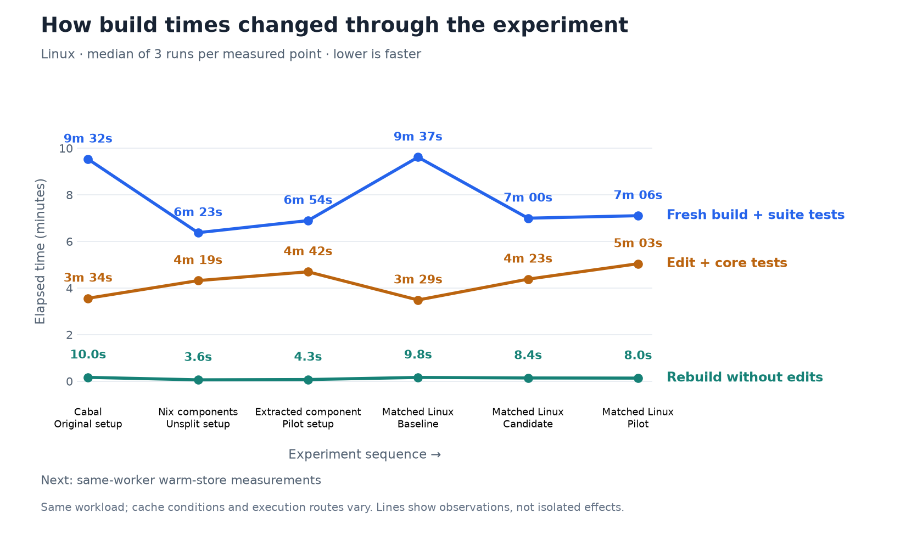

# PR #899 performance log

This is the running measurement log for the build-cache experiment. It is
deliberately diagnostic: no speedup claim is established by the current data.
The compact source is [`performance.json`](performance.json), and the figure is
regenerated by [`performance.py`](performance.py).



For a PR description after this branch is pushed, use an absolute raw-image
URL so the image is stable outside the checkout:

```text
https://raw.githubusercontent.com/neohaskell/NeoHaskell/<PERFORMANCE_COMMIT>/docs/build-cache/performance.png
```

The figure is a single append-only timeline. Its three lines are **Fresh build +
suite tests**, **Edit + core tests**, and **Rebuild without edits**. Each measured
point is the median of three raw repetitions. D and E are pending cumulative
checkpoints: upload duplication is disabled first, then the candidate compiler
flags are aligned; neither has an invented value. The lines follow the measured
experiment history in x-order.

“Suite tests” means the five component suites (`nhcore` core/auth/integration/
service and `nhintegrations`) plus Hurl integration and cold-start readiness;
doctest and codemap jobs are excluded.

Hosted CI is kept as a separate table below. Its one-run critical elapsed time
is not mixed with summed runner time, and the 987fe3d production run is labeled
as the unsplit candidate with rate-limited/disabled cache behavior, not as
evidence that the pilot is faster.

## Comparability guard

Cabal and Nix are intentional alternatives on the same declared workload, so
F-H support descriptive route comparison. The archived logs confirm GHC 9.8.4,
`-O1` and disabled split sections for all three routes. Exact equality of every
remaining package, compiler, linker and codegen default is unconfirmed; cache and
dependency state differ, so the lines do not isolate causal percentages.

The route totals below are calculated from raw observations by summing every
stage within each repetition and then taking the median of those totals. The
stage medians are never added together and labelled as a total median. Detailed
stage arrays remain in [`performance.json`](performance.json). The historical
archive is [commit `4a913b4`](https://github.com/neohaskell/NeoHaskell/tree/4a913b4/docs/build-cache/evidence);
the matched F-H raw archive is [checkpoint-2026-09-25-measurements](https://github.com/neohaskell/NeoHaskell/tree/727dd11/docs/build-cache/evidence/checkpoint-2026-09-25-measurements).

## Sequential running log

All rows in this table are Linux measurements with `n=3`. The observation list
is ordered by repetition; the final value is the median of the per-repetition
route totals. The source benchmark has exit code 0 for every observation.

| Commit | Technique | Platform | Cache condition | n | All observations / median (s) | Status | Evidence |
|---|---|---|---|---:|---:|---|---|
| `e94a6c5` | Baseline fresh execution: five suites + Hurl + cold start | x86_64-Linux | Fresh runner; upstream substituters; Cabal project outputs not substitutable | 3 | `[155.318, 156.863, 154.619] / 155.318` | Diagnostic / unmatched | [benchmark JSON](https://github.com/neohaskell/NeoHaskell/blob/4a913b4/docs/build-cache/evidence/benchmark.json) |
| `e94a6c5` | Baseline fresh route: setup + compile/link + execution | x86_64-Linux | Same as above | 3 | `[579.421, 571.947, 570.348] / 571.947` | Diagnostic / unmatched | [benchmark report](https://github.com/neohaskell/NeoHaskell/blob/4a913b4/docs/build-cache/evidence/benchmark.md) |
| `d8f9f95` | Baseline representative edit: compile/link + core test | x86_64-Linux | Existing Cabal outputs retained before one edit | 3 | `[213.613, 213.482, 216.040] / 213.613` | Diagnostic / unmatched | [benchmark report](https://github.com/neohaskell/NeoHaskell/blob/4a913b4/docs/build-cache/evidence/benchmark.md) |
| `e94a6c5` | Baseline repeat build | x86_64-Linux | Exact Cabal outputs and shell present | 3 | `[10.071, 9.972, 9.956] / 9.972` | Diagnostic / unmatched | [benchmark JSON](https://github.com/neohaskell/NeoHaskell/blob/4a913b4/docs/build-cache/evidence/benchmark.json) |
| `c65700c` | Candidate fresh execution: five suites + Hurl + cold start | x86_64-Linux | Fresh runner; Nix substituters enabled; no magic cache | 3 | `[65.513, 68.383, 67.748] / 67.748` | Diagnostic / unmatched | [benchmark JSON](https://github.com/neohaskell/NeoHaskell/blob/4a913b4/docs/build-cache/evidence/benchmark.json) |
| `c65700c` | Candidate fresh route: evaluate/realize + execution | x86_64-Linux | Same as above | 3 | `[353.080, 418.866, 382.511] / 382.511` | Diagnostic / unmatched | [benchmark report](https://github.com/neohaskell/NeoHaskell/blob/4a913b4/docs/build-cache/evidence/benchmark.md) |
| `eeb6673` | Candidate representative edit: evaluate/realize + core test | x86_64-Linux | Baseline Nix outputs retained before one edit | 3 | `[249.537, 295.596, 259.086] / 259.086` | Diagnostic / unmatched | [benchmark report](https://github.com/neohaskell/NeoHaskell/blob/4a913b4/docs/build-cache/evidence/benchmark.md) |
| `c65700c` | Candidate repeat build | x86_64-Linux | Exact component outputs and inputs present | 3 | `[2.445, 4.500, 3.586] / 3.586` | Diagnostic / unmatched | [benchmark JSON](https://github.com/neohaskell/NeoHaskell/blob/4a913b4/docs/build-cache/evidence/benchmark.json) |
| `c65700c` | Candidate cache export / transfer encoding | x86_64-Linux | Complete component closure present | 3 | `[7.026, 9.476, 7.759] / 7.759` | Diagnostic / unmatched | [benchmark JSON](https://github.com/neohaskell/NeoHaskell/blob/4a913b4/docs/build-cache/evidence/benchmark.json) |
| `05c07df` | Pilot fresh execution: five suites + Hurl + cold start | x86_64-Linux | Fresh runner; Nix substituters enabled; no magic cache | 3 | `[67.857, 67.464, 66.571] / 67.464` | Diagnostic / unmatched | [benchmark JSON](https://github.com/neohaskell/NeoHaskell/blob/4a913b4/docs/build-cache/evidence/benchmark.json) |
| `05c07df` | Pilot fresh route: evaluate/realize + execution | x86_64-Linux | Same as above | 3 | `[412.097, 413.649, 729.464] / 413.649` | Diagnostic / unmatched; realization outlier retained | [benchmark report](https://github.com/neohaskell/NeoHaskell/blob/4a913b4/docs/build-cache/evidence/benchmark.md) |
| `9f27e46` | Pilot representative edit: evaluate/realize + core test | x86_64-Linux | Pilot outputs retained before one edit | 3 | `[291.603, 281.773, 274.446] / 281.773` | Diagnostic / unmatched | [benchmark report](https://github.com/neohaskell/NeoHaskell/blob/4a913b4/docs/build-cache/evidence/benchmark.md) |
| `05c07df` | Pilot repeat build | x86_64-Linux | Exact component outputs and inputs present | 3 | `[3.742, 4.431, 4.321] / 4.321` | Diagnostic / unmatched | [benchmark JSON](https://github.com/neohaskell/NeoHaskell/blob/4a913b4/docs/build-cache/evidence/benchmark.json) |
| `05c07df` | Pilot cache export / transfer encoding | x86_64-Linux | Complete component closure present | 3 | `[9.333, 10.221, 11.045] / 10.221` | Diagnostic / unmatched | [benchmark JSON](https://github.com/neohaskell/NeoHaskell/blob/4a913b4/docs/build-cache/evidence/benchmark.json) |
| `9f27e46` | Pilot compatibility build + execute | x86_64-Linux | Pilot outputs present; configured flake substituters | 3 | `[11.465, 10.463, 10.630] / 10.630` | Separate compatibility check | [benchmark report](https://github.com/neohaskell/NeoHaskell/blob/4a913b4/docs/build-cache/evidence/benchmark.md) |

## Matched Linux reruns (F-H)

Runs F-H hold the five component suites, Hurl, cold-start, repeat build, deterministic Text edit + core test, and Int sibling edit + core test constant across three fresh Linux repetitions. Cabal and Nix are intentional alternatives on this workload, so these rows support descriptive route comparison. Remaining dependency, cache, and compiler/runtime differences keep causal percentage claims out of scope.

Route totals sum corrected stages within each repetition and then take the median. Candidate and pilot add each matching cache audit `evaluation.eval_s`; `probe_s` and remaining audit wall time are excluded. The pilot `export` and `compatibility` stages are retained in `performance.json` and excluded from these matched routes.

| Event / workload | Route | All observations / median (s) | Status | Evidence |
|---|---|---:|---|---|
| `F / matched baseline` | Fresh execution: five suites + Hurl + cold start | `[118.336, 154.022, 157.784] / 154.022` | Valid n=3 | `https://github.com/neohaskell/NeoHaskell/actions/runs/36155654547`, `https://github.com/neohaskell/NeoHaskell/tree/727dd11/docs/build-cache/evidence/checkpoint-2026-09-25-measurements` |
| `F / matched baseline` | Fresh route: setup/evaluate + execution | `[468.171, 576.969, 584.845] / 576.969` | Valid n=3 | `https://github.com/neohaskell/NeoHaskell/actions/runs/36155654547`, `https://github.com/neohaskell/NeoHaskell/tree/727dd11/docs/build-cache/evidence/checkpoint-2026-09-25-measurements` |
| `F / matched baseline` | Text edit + core test | `[152.192, 209.198, 217.739] / 209.198` | Valid n=3 | `https://github.com/neohaskell/NeoHaskell/actions/runs/36155654547`, `https://github.com/neohaskell/NeoHaskell/tree/727dd11/docs/build-cache/evidence/checkpoint-2026-09-25-measurements` |
| `F / matched baseline` | Int sibling edit + core test | `[164.245, 219.637, 227.959] / 219.637` | Valid n=3 | `https://github.com/neohaskell/NeoHaskell/actions/runs/36155654547`, `https://github.com/neohaskell/NeoHaskell/tree/727dd11/docs/build-cache/evidence/checkpoint-2026-09-25-measurements` |
| `F / matched baseline` | Repeat build (including evaluation work) | `[6.348, 9.790, 10.038] / 9.790` | Valid n=3 | `https://github.com/neohaskell/NeoHaskell/actions/runs/36155654547`, `https://github.com/neohaskell/NeoHaskell/tree/727dd11/docs/build-cache/evidence/checkpoint-2026-09-25-measurements` |
| `G / matched candidate` | Fresh execution: five suites + Hurl + cold start | `[69.069, 71.899, 78.286] / 71.899` | Valid n=3 | `https://github.com/neohaskell/NeoHaskell/actions/runs/36155654547`, `https://github.com/neohaskell/NeoHaskell/tree/727dd11/docs/build-cache/evidence/checkpoint-2026-09-25-measurements` |
| `G / matched candidate` | Fresh route: setup/evaluate + execution | `[440.142, 379.915, 419.838] / 419.838` | Valid n=3 | `https://github.com/neohaskell/NeoHaskell/actions/runs/36155654547`, `https://github.com/neohaskell/NeoHaskell/tree/727dd11/docs/build-cache/evidence/checkpoint-2026-09-25-measurements` |
| `G / matched candidate` | Text edit + core test | `[315.761, 245.563, 262.835] / 262.835` | Valid n=3 | `https://github.com/neohaskell/NeoHaskell/actions/runs/36155654547`, `https://github.com/neohaskell/NeoHaskell/tree/727dd11/docs/build-cache/evidence/checkpoint-2026-09-25-measurements` |
| `G / matched candidate` | Int sibling edit + core test | `[315.098, 241.168, 261.648] / 261.648` | Diagnostic only: one invalid cache audit | `https://github.com/neohaskell/NeoHaskell/actions/runs/36155654547`, `https://github.com/neohaskell/NeoHaskell/tree/727dd11/docs/build-cache/evidence/checkpoint-2026-09-25-measurements` |
| `G / matched candidate` | Repeat build (including evaluation work) | `[8.407, 5.599, 8.544] / 8.407` | Valid n=3 | `https://github.com/neohaskell/NeoHaskell/actions/runs/36155654547`, `https://github.com/neohaskell/NeoHaskell/tree/727dd11/docs/build-cache/evidence/checkpoint-2026-09-25-measurements` |
| `H / matched pilot` | Fresh execution: five suites + Hurl + cold start | `[68.308, 67.384, 68.781] / 68.308` | Valid n=3 | `https://github.com/neohaskell/NeoHaskell/actions/runs/36155658355`, `https://github.com/neohaskell/NeoHaskell/tree/727dd11/docs/build-cache/evidence/checkpoint-2026-09-25-measurements` |
| `H / matched pilot` | Fresh route: setup/evaluate + execution | `[426.227, 388.829, 442.127] / 426.227` | Valid n=3 | `https://github.com/neohaskell/NeoHaskell/actions/runs/36155658355`, `https://github.com/neohaskell/NeoHaskell/tree/727dd11/docs/build-cache/evidence/checkpoint-2026-09-25-measurements` |
| `H / matched pilot` | Text edit + core test | `[302.583, 261.431, 311.426] / 302.583` | Valid n=3 | `https://github.com/neohaskell/NeoHaskell/actions/runs/36155658355`, `https://github.com/neohaskell/NeoHaskell/tree/727dd11/docs/build-cache/evidence/checkpoint-2026-09-25-measurements` |
| `H / matched pilot` | Int sibling edit + core test | `[296.484, 252.561, 298.153] / 296.484` | Valid n=3 | `https://github.com/neohaskell/NeoHaskell/actions/runs/36155658355`, `https://github.com/neohaskell/NeoHaskell/tree/727dd11/docs/build-cache/evidence/checkpoint-2026-09-25-measurements` |
| `H / matched pilot` | Repeat build (including evaluation work) | `[8.033, 6.030, 8.385] / 8.033` | Valid n=3 | `https://github.com/neohaskell/NeoHaskell/actions/runs/36155658355`, `https://github.com/neohaskell/NeoHaskell/tree/727dd11/docs/build-cache/evidence/checkpoint-2026-09-25-measurements` |

The corrected route medians are: baseline fresh execution `154.022`, full fresh `576.969`, Text edit + core `209.198`, Int sibling + core `219.637`, repeat `9.790`; candidate `71.899`, `419.838`, `262.835`, `261.648` (diagnostic only), `8.407`; pilot `68.308`, `426.227`, `302.583`, `296.484`, `8.033` seconds.

### Cache-audit observations

Each audit covers 10 outputs and 40 remote checks. `evaluation.eval_s` is route work. `probe_s` is instrumentation and stays out of route totals.

| Workload | Audit route | `evaluation.eval_s` observations / median (s) | `probe_s` observations / median (s), excluded | Audit flags | Output state |
|---|---|---:|---:|---|---|
| `candidate-matched` | `fresh` | `[36.098, 30.738, 51.532] / 36.098` | `[8.801, 11.482, 16.407] / 11.482` | 3/3 usable; status complete; eval exit 0; unrecognized substituters 0 | local present 0/30; remote present 0/120; remote absent 120/120 |
| `candidate-matched` | `repeat` | `[4.352, 2.645, 5.304] / 4.352` | `[3.877, 6.487, 9.390] / 6.487` | 3/3 usable; status complete; eval exit 0; unrecognized substituters 0 | local present 30/30; remote present 0/120; remote absent 120/120 |
| `candidate-matched` | `text-edit` | `[4.011, 2.988, 3.413] / 3.413` | `[6.231, 12.322, 16.950] / 12.322` | 3/3 usable; status complete; eval exit 0; unrecognized substituters 0 | local present 0/30; remote present 0/120; remote absent 120/120 |
| `candidate-matched` | `sibling-edit` | `[3.971, 2.777, 2.872] / 2.872` | `[7.002, 12.680, 20.639] / 12.680` | 2/3 usable; rep 3 `comparison_unusable`; status complete; eval exit 0; unrecognized substituters 0 | local present 0/30; remote present 0/120; remote errors 1 |
| `pilot-matched` | `fresh` | `[34.920, 32.010, 37.544] / 34.920` | `[9.281, 6.628, 12.596] / 9.281` | 3/3 usable; status complete; eval exit 0; unrecognized substituters 0 | local present 0/30; remote present 0/120; remote absent 120/120 |
| `pilot-matched` | `repeat` | `[4.200, 2.790, 4.283] / 4.200` | `[4.054, 3.808, 6.837] / 4.054` | 3/3 usable; status complete; eval exit 0; unrecognized substituters 0 | local present 30/30; remote present 0/120; remote absent 120/120 |
| `pilot-matched` | `text-edit` | `[3.726, 2.944, 3.844] / 3.726` | `[7.809, 7.642, 12.608] / 7.809` | 3/3 usable; status complete; eval exit 0; unrecognized substituters 0 | local present 0/30; remote present 0/120; remote absent 120/120 |
| `pilot-matched` | `sibling-edit` | `[3.968, 3.011, 3.709] / 3.709` | `[7.679, 8.300, 12.627] / 8.300` | 3/3 usable; status complete; eval exit 0; unrecognized substituters 0 | local present 0/30; remote present 0/120; remote absent 120/120 |

The single invalid audit is candidate repetition 3, `cache-state-sibling-edit.json`: `nhcore:test:nhcore-test-core` received a `neohaskell.cachix.org` network error. Its sibling route remains diagnostic and is excluded from comparative decisions. Baseline has no audit because raw Cabal has no `ci-components` output to probe. All observation exit codes are zero, all matched routes have `n=3`, and the observation log digests pass `docs/build-cache/measure.py summarize`.

### Compiler-flag proof

| Workload | Confirmed in archived logs | Remaining gap |
|---|---|---|
| Baseline F | GHC 9.8.4 and `-O1` (`measurement-linux-baseline-3/build/command.log:992`); Cabal `--disable-split-sections` (`:1050`); `--ghc-option=-fwrite-ide-info` (`:1131`). | Full equality of package, compiler, linker and codegen defaults with Nix remains unconfirmed. |
| Candidate G | Nix configure output contains `--disable-split-sections --ghc-options=-O1`, `--ghc-option=-fwrite-ide-info`, and generated `--ghc-option=-hiedir/...-hie` (`measurement-linux-candidate-1/build/command.log`). | Full equality of remaining package/compiler/linker defaults remains unconfirmed. |
| Pilot H | Same explicit `--disable-split-sections --ghc-options=-O1`, `-fwrite-ide-info`, and generated HIE directory in `measurement-linux-pilot-1/build/command.log`. | Full equality of remaining package/compiler/linker defaults remains unconfirmed. |

### Expansion decision

Pilot Text realization is `298.890s` versus the candidate/unsplit `259.269s`: `+39.621s` (`+15.282%`); including the core test, the route is `302.583s` versus `262.835s`. The preset criterion requires at least 15% **and** 60s median representative-edit improvement. Both readings are slower and below the 60s absolute threshold, so the pilot does not justify expansion on this evidence.

Raw artifacts, `analysis.json`, and the measurement report are archived at [checkpoint-2026-09-25-measurements](https://github.com/neohaskell/NeoHaskell/tree/727dd11/docs/build-cache/evidence/checkpoint-2026-09-25-measurements).

## Hosted CI single-run breakdown

These are workflow observations, not medians. Critical span is the elapsed time
from the first production `changes`/build start through the gate; runner sum is
the sum of job wall times. The latter must not be added to the former, and
optional measurement jobs are excluded from the production critical span.

| Run / commit | Technique / platform | Cache condition | Critical span | Runner sum | Artifact ready → first consumer | Status / evidence |
|---|---|---|---:|---:|---:|---|
| [36141142936](https://github.com/neohaskell/NeoHaskell/actions/runs/36141142936) / `08ecae9` | Candidate production / macOS | Producer magic-cache attempted; post-cache 233s with upload rate-limit evidence | 1,466s | 2,303s | 248s | `n=1`, noncomparable; [hosted CI ledger](https://github.com/neohaskell/NeoHaskell/blob/4a913b4/docs/build-cache/evidence/hosted-ci.md) |
| [36143016033](https://github.com/neohaskell/NeoHaskell/actions/runs/36143016033) / `c65700c` | Candidate production / Linux | Producer magic-cache attempted; post-cache 635s, upload errors and eventual rate-limit disablement | 1,272s | 2,098s | 644s | `n=1`, noncomparable; optional measurement sum 4,635s excluded |
| [36143308159](https://github.com/neohaskell/NeoHaskell/actions/runs/36143308159) / `987fe3d` | Candidate-unsplit production (pilot run) / Linux | Cache disabled/rate-limited; 13 setup errors, no successful path uploads | 516s (8m36s) | 1,311s | 7s | `n=1`, noncomparable; optional split pilot sum 2,610s excluded |
| [36153813253](https://github.com/neohaskell/NeoHaskell/actions/runs/36153813253) / `a5e7cdc` | As-operated full-CI baseline / Linux | Fresh runner; Determinate extra substituters (`cache.iog.io`, `neohaskell.cachix.org`), upstream `cache.nixos.org`; magic-nix-cache v14 GHA cache enabled, FlakeHub unauthenticated/no upload; Cabal cache restored | 617s | 2,304s | 10s | `n=1`, green; 1,128 service examples / 57 pending; no matched timing comparison established; [archive](https://github.com/neohaskell/NeoHaskell/tree/0c0c3c0/docs/build-cache/evidence/checkpoint-2026-09-25) |
| [36153817476](https://github.com/neohaskell/NeoHaskell/actions/runs/36153817476) / `a5e7cdc` | As-operated full-CI baseline / macOS | Fresh runner; Determinate extra substituters (`cache.iog.io`, `neohaskell.cachix.org`), upstream `cache.nixos.org`; magic-nix-cache v14 GHA cache enabled, FlakeHub unauthenticated/no upload; Cabal cache restored | 677s | 3,043s | `—` (unknown) | `n=1`, green; 1,090 service examples / 52 pending; PostgreSQL cases omitted, excluded from equivalent-suite comparison; [archive](https://github.com/neohaskell/NeoHaskell/tree/0c0c3c0/docs/build-cache/evidence/checkpoint-2026-09-25) |

Run `36143308159`'s main jobs are still the **unsplit candidate**. Only its
optional pilot measurement jobs apply the split experiment. Its short 8m36s
production span is explained by cache rate limiting/disablement and is not
evidence that the pilot is faster. The 644s Linux and 248s macOS
artifact-ready waits are critical-path delays between the producer artifact and
the first consumer, not estimates of aggregate upload cost.

The two `a5e7cdc` rows are independent as-operated baselines. Both workflows
were green, but the service reports differ (`1,128 examples / 57 pending` on
Linux versus `1,090 / 52` on macOS), because the original macOS command omitted `POSTGRES_AVAILABLE=true` despite
starting PostgreSQL. Its missing cases exclude it from equivalent-suite
comparisons. Baseline fix `5604e6c` sets the sentinel only on the service row;
that corrected run36158410770 executed the missing cases but failed the unchanged bad-credentials assertion because Homebrew trusted connections. The fixture is corrected at65b227d and retry36160842540 is running.
No cross-platform aggregate or speedup is inferred from these rows.
The Linux 10s wait is the measured `upload-artifact` completion to first
consumer-job start interval. The macOS workflow builds inside each matrix test
job and has no producer artifact interval, so its value remains explicitly
unknown. The raw source is `/tmp/nh-full-ci-baseline-899/{linux-1,macos-1}.{json,log}`;
the permanent checkpoint is the linked archive above.

## Excluded attempts

These attempts remain part of the experiment history; they are not plotted as
successful complete-workload timings.

| Run / revision | Outcome | Effect on the experiment |
|---|---|---|
| [36138728431](https://github.com/neohaskell/NeoHaskell/actions/runs/36138728431) / `2b4718e` | Three baseline jobs failed before measurement: unsupported store-inventory command | Replaced inventory command; no timing sample counted |
| [36140072923](https://github.com/neohaskell/NeoHaskell/actions/runs/36140072923) / `45bb2f6` | All three raw-baseline repetitions stopped at two network-dependent mock failures | Applied identical fixture normalization to both routes; partial timings retained, no complete-workload median |
| [36144876178](https://github.com/neohaskell/NeoHaskell/actions/runs/36144876178) / `d8dacd2` | Deliberately added test failed its job and aggregate gate | Correctness acceptance passed; intentionally excluded from performance comparisons |

## Pending techniques

No timing is invented for changes that have not had a matched rerun.

| Commit | Technique | Platform | Cache condition | n / observations / median | Status | Evidence |
|---|---|---|---|---|---|---|
| [`15eeef1`](https://github.com/neohaskell/NeoHaskell/commit/15eeef1348630b6e96a7a9cba472af8cc7deea53) (same patch as [`f64fe87`](https://github.com/neohaskell/NeoHaskell/commit/f64fe870ec8157ebb9764a143880103717262bd7)) | Disable duplicate producer upload: `use-gha-cache: disabled`, `use-flakehub: disabled` | Linux + macOS | Upstream substituters and same-run artifact path retained | `— / — / —` | Pending measurement | [15eeef1](https://github.com/neohaskell/NeoHaskell/commit/15eeef1348630b6e96a7a9cba472af8cc7deea53) |
| [`1efe92a`](https://github.com/neohaskell/NeoHaskell/commit/1efe92a) | Cumulative: duplicate producer upload disabled + candidate local-package flags aligned (explicit O1, split-sections disabled, HIE enabled) | Linux + macOS | Dependencies untouched; matched rerun required | `— / — / —` | Pending measurement | [commit](https://github.com/neohaskell/NeoHaskell/commit/1efe92a) |

## Latest production verification (aligned flags)

All three workflows at `c0d34a8` passed and executed the same five suites:
**3,088 examples, zero failures, 67 pending**. Linux also passed Hurl,
cold-start, codemap and doctest. Both platforms fetched exact outputs with
builders disabled (Linux 659 paths, macOS 646). The dispatch-only runs skipped
runtime-criterion parsing; that remains an explicit acceptance gap.

| Run | Platform | Production critical span | Aggregate runner time | Interpretation |
|---|---|---:|---:|---|
| [36155654547](https://github.com/neohaskell/NeoHaskell/actions/runs/36155654547) | Linux | 583s | 1,446s | Optional measurements delayed some consumer starts by50–52s |
| [36155658355](https://github.com/neohaskell/NeoHaskell/actions/runs/36155658355) | Linux | 562s | 1,352s | Optional pilot measurements shared runner capacity |
| [36155662081](https://github.com/neohaskell/NeoHaskell/actions/runs/36155662081) | macOS | 861s | 1,817s | Independent platform, n=1 |

These are descriptive per-run observations, not three equivalent repetitions
or evidence of a speedup. Optional job time is excluded from sums but its effect
on scheduling remains. Detailed intervals, counts, exact output paths and raw
logs are retained in the [production archive](https://github.com/neohaskell/NeoHaskell/tree/631d9c1/docs/build-cache/evidence/checkpoint-2026-09-25-current).
The matched Linux baseline/candidate/pilot reruns and their cache-audit proof
are recorded in the section above. The corrected macOS Cabal baseline is running as
[36158410770](https://github.com/neohaskell/NeoHaskell/actions/runs/36158410770)
at `5604e6c`.

## Updating the log

1. Append the next change to `timeline` in [`performance.json`](performance.json)
   with its plain-language label, short commit, workload, and status. Use
   `pending` until it has a real measurement; do not reuse an earlier point.
2. For a measured point, add raw stage observations with equal-length arrays
   for stages in each route. Record the exact commit, platform, local/remote
   cache state, and an evidence URL. Missing metrics stay unknown and are not
   represented by zeroes.
3. For a new hosted run, append critical span, runner sum, and artifact-ready
   wait as separate fields. Keep `n=1` rows visibly noncomparable until matched
   repetitions exist.
4. Render the deterministic chart and print its recomputed route medians:

   ```sh
   uv run --with matplotlib python3 docs/build-cache/performance.py \
     --data docs/build-cache/performance.json \
     --output docs/build-cache/performance.png
   ```

5. Inspect `performance.png` at roughly PR width, update the table if a new
   row was added, then run `git diff --check`. Keep this directory limited to
   the `performance*` log, data, renderer, and PNG files.

The permanent raw sources are the archived
[benchmark report](https://github.com/neohaskell/NeoHaskell/blob/4a913b4/docs/build-cache/evidence/benchmark.md),
[benchmark JSON](https://github.com/neohaskell/NeoHaskell/blob/4a913b4/docs/build-cache/evidence/benchmark.json),
and [hosted CI ledger](https://github.com/neohaskell/NeoHaskell/blob/4a913b4/docs/build-cache/evidence/hosted-ci.md).
