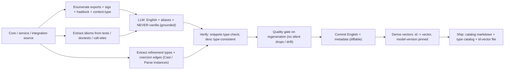
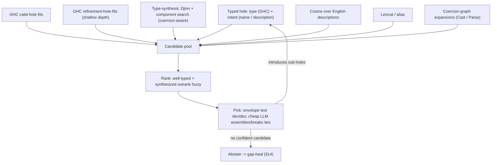
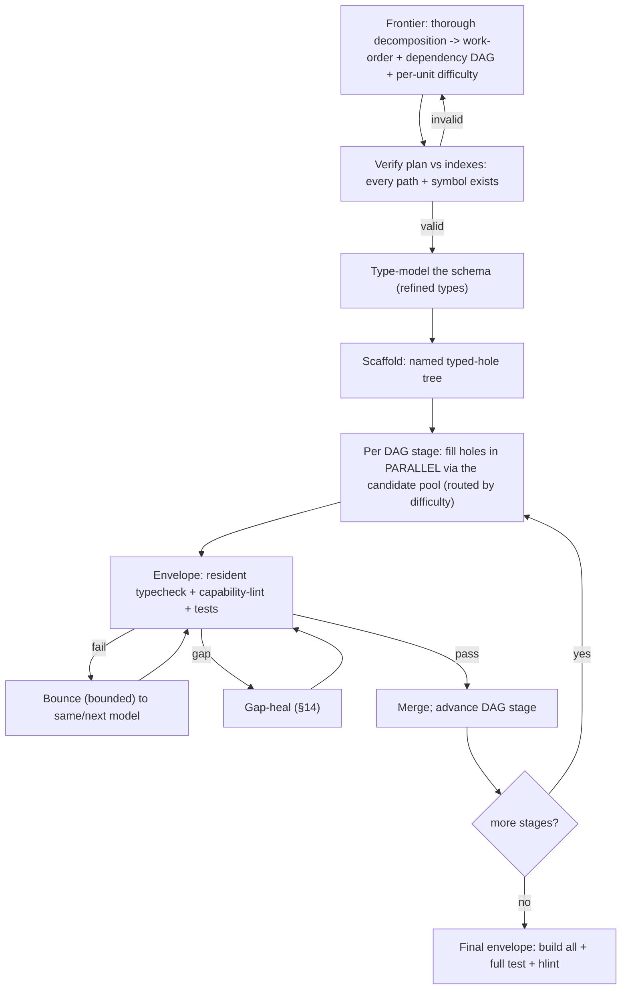
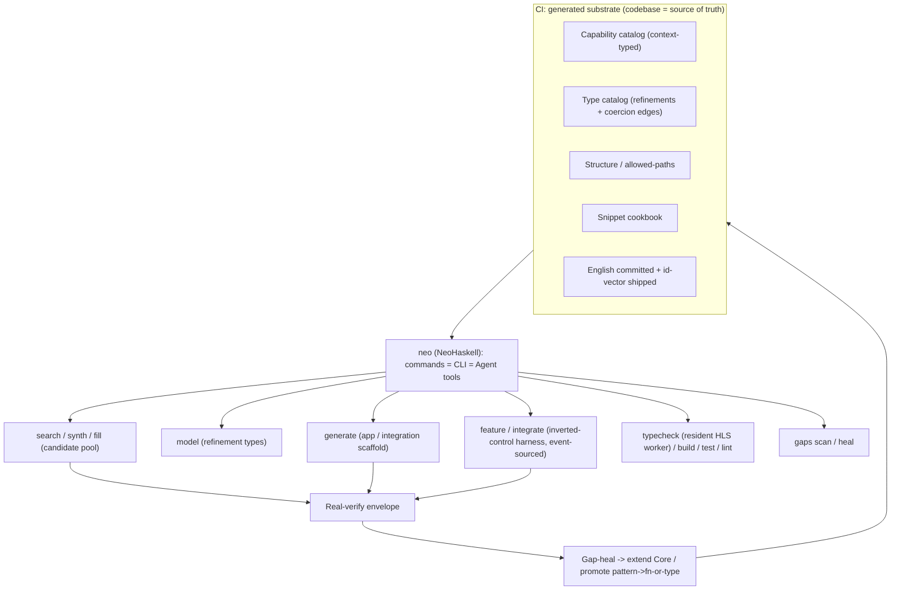

# `neo`: Deterministic Pipelines, Type-Modeling, Typed-Hole Fill & an Inverted-Control Harness

**Status:** Draft **v3** — supersedes v2 (git history). Consolidation of the full design conversation; for iteration.
**Date:** 2026-07-04
**Author:** Nick (with Claude)
**Related:** PR #708 (motivating failure), issue #711, `docs/plans/2026-07-03-onklaud-5-teardown.md`, `feature-pipeline-preview`, `integration-pipeline-preview`, `integrations/AGENTS.md`.

> `[DECIDED]` = settled. `⟡ OPEN` = unresolved. Repo facts verified 2026-07-03/04.
> **v3 adds:** principle **P8 (piggyback on GHC/Haskell standards)**; a **type-modeling / refinement-types** stage (using `refined`); the **typed-hole-driven fill engine** (GHC holes as oracle) reframed as a **ranked multi-source candidate pool**; the **coercion graph** (`Cast`/`Parse` + `Coercible` firewall); the **resident typechecker** (HLS/ghcide/hie-bios) as an async-worker integration; the decision to **use off-the-shelf models, not train**; and the **event-sourced harness** (free audit/replay/resume). Model rec: **Gemma 4 E4B / Qwen 3.x-Coder**.

---

## 0. TL;DR

**One tool, `neo`** (NeoHaskell): every capability is a **command exposed as both a CLI command and an Agent tool** (dogfooded). Commands are atomic and compose (a command may call an integration that calls commands). It serves *us* (NeoHaskell internals + integrations) and *users* (their pure event-sourced apps) from one binary.

The machine, per surface:

```
generated substrate  →  frontier plan (verified vs substrate)  →  TYPE-MODEL (refinement types)  →
scaffold (a tree of named typed holes)  →  FILL each hole from a ranked candidate pool
   [GHC hole-fits · type-synthesis · retrieval · cheap-LLM], recompiling in a resident session  →
real-verify envelope (compile · capability-lint · tests)  →  gap-heal loop
```

Principles: **codebase = source of truth**; **determinism from the envelope**; **invert control**; **escalating-cost cascade**; **miss-safe (evidence, not verdict)**; and **P8 — piggyback maximally on GHC/Haskell standards, build only thin NeoHaskell glue.**

---

## 1. Motivation — #708's two costs

#708 was *"100% vanilla Haskell hallucination"* and took **>2 hours**. Wrong code (`Data.Char.isDigit` not `Char.isDigit`; `GhcFilePath.</>` not `Path.joinPaths`; `case True/False`, `let..in`) **and** slow (mostly the agent **exploring to decide**). Root cause: **the agent orchestrates itself by exploration, and its conclusions arrive late and are often wrong.** Two failure modes: *exists-in-Core-ignored* (fix: generated catalog hands the symbol) and *genuinely-absent* (fix: flag a gap, never silently go vanilla).

---

## 2. Prior art — Onklaud 5

Full study: `docs/plans/2026-07-03-onklaud-5-teardown.md`. **Keep:** escalating-cost cascade; pre-resolution; learned-failure memory. **Reject:** word-subset matching (false positives), hand-curated tables (drift), prose-grep gates (theater), inability to abstain. **Invariant:** *types and generated facts arbitrate; fuzzy search only widens recall; a miss routes to "verify," never a guess.*

---

## 3. Principles

- **P1** Codebase is the single source of truth; generate every fact. `[DECIDED]`
- **P2** Split authored judgment (rubrics/methodology/persona/style) from generated facts.
- **P3** Determinism is a property of the *envelope*, not the search/generation.
- **P4** Invert control: `neo` decides transitions; the LLM fills bounded holes.
- **P5** Escalating-cost cascade: type-synthesis → retrieval → cheap model → frontier.
- **P6** Miss-safe, evidence-not-verdict; abstain when unsure.
- **P7** Shrink improvisation to typed holes filled with grounded primitives.
- **P8** **Piggyback maximally on GHC/Haskell standards; build only the thin NeoHaskell-specific glue.** `[DECIDED]` — settles most build-vs-reuse calls in favor of reuse (HLS/hie-bios, `refined`, GHC hole-fits, local Hoogle, `Coercible`, off-the-shelf models).

---

## 4. The purity model per surface (load-bearing)

Purity determines how much of a surface is *deterministically synthesizable* — i.e. needs no LLM.

| Surface | Purity | Consequence |
|---|---|---|
| **User projects** | **100% pure** — no `Task`/`IO`; `decide` returns a **`Decide` free monad** interpreted purely | **Maximum** reach for refinement types + type-synthesis + GHC hole-fits. The effect barrier is gone; business logic is a pure free-monad AST from a small typed vocabulary. Determinism is highest exactly where users are least expert. |
| **Integrations** | **Impure by nature** (HTTP/CLI/FFI) | **Minimum** synthesis reach; retrieval + LLM dominate. |
| **NeoHaskell core** | **Mixed**, kept pure-as-possible | Synthesis on the pure parts; retrieval/LLM on the effectful parts. |

Nuance: purity removes the *effect* barrier, not the *specification* barrier — many valid `Decide` programs share a type; the **test / event-model intent selects** the right inhabitant. *Synthesis proposes; the test disposes.*

---

## 5. `neo` — the unifying tool

One CLI in NeoHaskell; every command is **CLI + Agent tool** — users run `neo …`; the harness's LLM steps call the same commands as tools. Commands are **atomic** and compose through integrations. `[DECIDED]`

| Command (illustrative) | Purpose |
|---|---|
| `neo search` / `neo suggest` | candidate retrieval over the catalog (§8/§10) |
| `neo model` | type-modeling: assign refinement types to schema fields (§7) |
| `neo synth` | type-directed synthesis (Djinn / component) (§8) |
| `neo fill` | the typed-hole fill loop (§8) |
| `neo generate <app\|integration>` | deterministic scaffolding (§11–12) |
| `neo build` / `neo test` / `neo lint` / `neo typecheck` | the envelope; `typecheck` is the resident worker (§9) |
| `neo feature` / `neo integrate` | the inverted-control harness (§13) |
| `neo gaps scan` / `neo gaps heal` | the gap-heal loop (§14) |

**Bootstrapping** `[DECIDED]`: the first `neo` is built manually (regular Claude prompting + the `NeoHaskell/skills` repo) until self-hosting.

**Harness = a `neo` program, not the Claude-Code Workflow tool** `[DECIDED]` — same orchestration shape, but only a `neo` program can drive cheap **local** models (Gemma 4 / Qwen-Coder via subprocess). The Workflow tool is a throwaway prototype to validate the shape/speedup first.

---

## 6. The generated substrate (CI)

### 6.1 Generated vs authored

| Artifact | Kind | Today | Target |
|---|---|---|---|
| Capability catalog (symbol → sig/module/desc/aliases/context-type) | generated | partial prose (`nhcore-context.md`) | generated from exports |
| **Type catalog** (refinement predicates, aliases, **coercion edges**) | generated | absent | generated (§7) |
| Structure map + per-phase allowed-paths | generated | hand-maintained | generated from packages/dirs |
| Snippet cookbook (context-typed) | generated | absent | extracted from tests/doctests/call-sites |
| Rubrics, methodology, persona, style, grounding-loop | **authored** | authored | **keep** |

### 6.2 Capability catalog — hard/soft split
- **Hard (from source, never invented):** name, signature, module, exported/internal, **audience**, **context type** (`Task err`, pure, `Command`, `Query`, `Outbound`, `Decide`).
- **Soft (LLM-authored, grounded, verified):** English what/when/when-not, aliases, `NEVER: vanilla X (even aliased)`. LLM writes with the real signature present; may not invent symbols; snippets must type-check; **commit the English (diffable), ship the vectors** (§10).

### 6.3 Snippet cookbook — type-aware `[DECIDED]`
Every pattern carries its **context type**; retrieval filters by the agent's current context (`Task.unless` only in `Task`) — restoring the snippet subset's type anchor.

### 6.4 Generation + quality gate



Trigger `[DECIDED]`: path-filtered PR checks + manual. Regeneration overwrites → the **quality gate is mandatory**.

### 6.5 Shipping `[DECIDED]`
English + metadata → git (review prose diffs). Vectors → shipped `id → vector` file (stable id = qualified symbol / snippet slug + description content-hash; **model-version pinned**; `neo` embeds queries with the same model). Audience-scoped (external users get the user-facing surface).

### 6.6 Gap loop — two outputs
Every abstention / vanilla-reach → **(a) extend Core** or **(b) promote a recurring pattern → a function *or a refined type*** (a hot `Text`+validation → a named refined type). Detail §14.

---

## 7. Type modeling & refinement types (new)

**"Parse, don't validate"** at every boundary, using **`refined`** (BSD-3; `[DECIDED]` piggyback per P8) with a thin NeoHaskell adaptation.

### 7.1 The predicate algebra
Atomic predicates (`Positive`, `NonEmpty`, `LessThan n`, `GreaterThan n`, format predicates `Email`, `NumericalText`) + combinators (`And`, `Or`, `Not`, `Range n m`) + **named aliases** (`Email`, `Age = Range 0 120 Int`). Combinations are *synthesized on demand*, not enumerated; the gap loop adds **atoms/aliases**, not combinations. Validators are **typeclass-derived** from the predicate structure (compose checks + errors) — not TH codegen. `[DECIDED]`

### 7.2 Numeric bounds — the *light* path `[DECIDED]`
- **Integer bounds:** `Nat` + **new predicate instances for negatives** (`data GreaterThanNeg (n :: Nat)` checking `x > negate (natVal n)`) — no custom type-level signed kind needed.
- **Decimal bounds:** a **type-level `Symbol`** (`LessThan "19.99"`); the runtime instance reads it via `symbolVal`, parses, compares. Back it with a **real fixed-point `Decimal`/`Money` value type — never `Double`.** `[DECIDED]`
- **Rationals:** dropped. `[DECIDED]`
- Because refinement checks run **at runtime (at the boundary)**, error messages are runtime values we **control per instance** → **friendly, domain-specific errors** ("Age must be 0–120, got 130") without owning type-level machinery or fighting GHC's type-level-nat error rendering. `[DECIDED]` (Optional compile-time `TypeError` if a decimal symbol doesn't parse.)

### 7.3 Automatic validation at boundaries `[DECIDED]`
`refined` ships `instance (FromJSON x, Predicate p x) => FromJSON (Refined p x)`, so **`Json.decode` into a schema with refined fields validates during decode**. Commands arriving as JSON are parsed-and-refined *before* reaching `decide`; **the user never calls `validate`** — they receive valid data, and a bad payload is a decode error with a friendly message. (`Either → Result` is a trivial boundary wrap.)

### 7.4 Anti-primitive-obsession, not over-modeling `[DECIDED]`
Model when a type carries an invariant or domain identity (`Email`, `OrderId`); stay primitive when genuinely unstructured (`Note`). `neo model` proposes domain/refined types (retrieval-guided); the gap loop crystallizes recurring ones (promote to a named refined type).

### 7.5 The coercion graph (`Cast` / `Parse` + the `Coercible` firewall)
Refined types are zero-cost newtypes over their base, but **plain type search misses them** (a `-> Int` query won't surface `Positive Int`). Fix:
- **`class Cast from to where cast :: from -> to`** — total downcasts/weakenings (`Range 0 100 → Positive`, `Refined p a → a`).
- **`class Parse from to where parse :: from -> Result RefineError to`** — partial upcasts (smart constructors).
- These instances **double as runtime coercions AND search edges**; the synthesis/retrieval engine enumerates them.
- **Downcast is free via `Coercible`** — **but `Coercible` is bidirectional**, so **hide the constructor + give the type a `nominal` role** (the **firewall**), or `coerce :: Int -> Positive Int` would bypass validation. This is a **correctness/security invariant**, not an optimization. `[DECIDED]`
- **Don't reimplement Hoogle**: use **local Hoogle** for base type-matching, then a **coercion-expansion pass** over `Cast`/`Parse` instances. `[DECIDED per P8]`

### 7.6 Placement
A distinct **type-modeling phase before scaffolding** (`neo model`): enrich each schema field with a refined type. This is where illegal states become unrepresentable and where the `Char.isDigit`-class of holes is *deleted* — validation lives in the type, run once at the boundary.

---

## 8. The fill-in engine: typed-hole-driven + a ranked candidate pool (new)

### 8.1 GHC typed holes as the oracle `[DECIDED: real `_name` holes]`
The scaffold is a tree of **named GHC typed holes** (`_ten_percent_off_when_subtotal_gt_100`). GHC gives, for free: the **exact type**, **valid-hole-fits** (in-scope terms that fit), and **refinement-level hole-fits** (`-frefinement-level-hole-fits`, suggests `f _ _` — a layer of the induction). Intent rides in the **long hole name**; a **key→description store is a preventive fallback** for intent that won't fit an identifier.

### 8.2 The loop
Fill a hole → **recompile in a resident session (§9)** → GHC reports the *remaining* holes with *now-refined* types → fill the next. The **envelope is intrinsic**: every state compiles or the fill is rejected. GHC reports all holes at once ⇒ **fill each level's holes in parallel, recompile, next level** (level-parallel, depth-sequential) inside plan-independent units — preserving the parallelism win.

### 8.3 The candidate pool (not sequential rungs)
Each hole draws candidates from **multiple sources, ranked deterministic-first**:



**Division of labor:** GHC hole-fits + synthesis solve the **plumbing**; the LLM / synthesis-from-spec solves the **business logic** the compiler can't suggest. Reach follows purity (§4) — on the pure user surface, plumbing is most of it.

### 8.4 Refinement-hole-fits — pros/cons (why it's *one source*, not the engine)
*Pros:* free; every suggestion type-checks by construction (zero hallucination); does a layer of induction; compiler-ranked. *Cons:* searches in-scope only (won't discover unimported functions or write novel logic); slow on large scopes → shallow depth + `-fmax-refinement-hole-fits`; **type-driven, not intent-driven** (well-typed-but-wrong is possible — same multiply-inhabited caveat as Djinn). **Conclusion:** a **high-weight source in the pool at shallow depth; never the sole decider** — the test + intent break ties. `[DECIDED]`

### 8.5 Type-synthesis (the deterministic floor)
Djinn (pure, non-recursive; multiply-inhabited → test-gate; unique inhabitant → trust) + **component synthesis** (compose catalog functions to inhabit the target type, coercion-graph-aware). Every synthesized term is **gated by its unit test**. Reach: high on the pure user surface.

### 8.6 Termination `[DECIDED-direction]`
Two concerns: the **induction loop** (bounded by **fuel/depth**) and the **generated code** (a recursive fit can loop — caught by the **test timeout**). Recursion is *often correct* → don't forbid it; **prefer fits that recurse on a structurally-smaller argument** (a decrease heuristic). Full totality checking is out of scope; fuel + timeout + decrease suffices.

### 8.7 Model routing & thrash-bounding `[DECIDED-direction]`
Route **per unit by difficulty**: trivial → synthesis / tiny local; medium → mid; hard → frontier. Cheap models + the bounce loop can **thrash** (many recompiles) → **bounded retries + fast escalation**. The envelope makes weak models tolerable (they propose; compiler/test dispose).

---

## 9. The resident typechecker (new, small, load-bearing)

The §8 loop's speed hinges entirely on **fast incremental typechecking** — `cabal build` per hole would be *slower* than a one-shot LLM and kill the 2–4×. So: a **warm `ghc`-API session** answering typecheck + hole/fit queries, built on **HLS/ghcide + hie-bios cradles** (per P8) — which already solve the "pick up the project's dependencies correctly" problem. It runs as an **async-worker integration** (`neo typecheck`): receives a trigger, reloads incrementally (typecheck-only, `-fno-code`), returns holes + types + fits. `[DECIDED]`

---

## 10. Retrieval (one source in the pool) + the model

- **Embed English, not Haskell** `[DECIDED]` (Haskell is low-resource; asymmetric query/passage).
- **Consumer is a cheap model** → retrieval must be **precise, few high-confidence candidates**; Hoogle/types as hard pre-filter matter more.
- **Brute-force cosine** `[DECIDED]`: exactness, no ANN staleness, and single-pass hybrid scoring (cosine + lexical + type-context filter) enabling abstention. Normalize → dot. Storage: plain SQLite / flat file — **not `sqlite-vector`** (production-restricted license).
- **Embedder = nix-bundled MIT binary via subprocess** (`onnxruntime`/`llama.cpp`) — sidesteps the AGPL `hs-onnxruntime-capi`. Model: `bge-small-en-v1.5` (Apache, ~34 MB int8). `[DECIDED]`
- **Hoogle** = hard arbiter for the symbol subset (exact name/type; "nothing unifies" = safe abstention).
- **Abstention:** prefer top-1/top-2 **margin** over an absolute cosine floor; calibrate with synthetic pairs. `⟡ OPEN: tuning for a 3B consumer.`

### 10.1 The fill/agent model `[DECIDED-direction]` — off-the-shelf, not bespoke
**Do not train our own** — the Copilot Codex→GPT lesson holds; NeoHaskell's corpus is tiny, infra/serving/rot aren't free, and the envelope already gives correctness (a fine-tune only reduces bounce iterations). This also follows from P8. **Log the self-labeled `(hole, type, pool) → fill` pairs** (nearly free; the compiler labels them) so a future LoRA is *possible* if telemetry ever proves a persistent failure — evidence-gated, not a plan.

Picks (July 2026, both Apache-2.0, nix-bundled GGUF via subprocess):
- **Gemma 4 E4B / E2B** — on-device, function-calling, improved coding → the **agentic/tool-calling** steps (E2B for the "old computer" tier).
- **Qwen 3.x-Coder (1.5–7B)** — coding specialist with **FIM (fill-in-the-middle)**, which *is* code-insertion-at-a-cursor → the **raw hole-fill** step.

---

## 11. Scaffolding — deterministic codegen (`neo generate`)

Ladder: **spec → type-model (§7) → deterministic scaffold (a named-typed-hole tree) → fill (§8)**. Event model = **types + TH** `[DECIDED]` (spec = source of truth, no drift); `decide` returns a `Decide` free monad (pure). Scaffolder = a **`neo generate` command, not a prose skill** `[DECIDED]`; every hole has a known signature, tightened by the field's refined types.

---

## 12. Integrations — modality-pluggable scaffolding

Two-persona shell (Facade + `Request` + `Response` + `Internal`) is **modality-invariant**; only `Internal.hs`'s `ToAction` is transport-specific. Integrations are **impure** → the fill pool leans on retrieval + LLM, not synthesis. **Reality:** all current integrations route through AI/HTTP; `core/system/Subprocess.hs` is unused; zero inline-c/python/java — **CLI/FFI are greenfield**. **Build transport layers first** (`Integration.Subprocess`, then `Integration.Foreign`) `[DECIDED order]`. `neo generate integration --transport http|cli|ffi-c|ffi-python|ffi-java --spec`. Templateable fraction: HTTP ~80% > CLI ~55% > FFI (shell only; marshalling is the hole). `⟡ OPEN`: restore the integration pipeline's dropped deep-review phase (secrets/auth/network).

---

## 13. The inverted-control harness (`neo feature` / `neo integrate`)

### 13.1 Diagnosis
Current pipeline is **LLM-orchestrated** (reads `SKILL.md`, **explores to decide**, acts) — the source of both the runtime and the BS. Good bones to reuse: allowed-paths gate, `lint-imports.py`, `verify-leaf.py`, rubric gates, tiering.

### 13.2 The flow



### 13.3 Commands all the way down → an **event-sourced harness** `[DECIDED]`
Each step is an **atomic command**; the typecheck worker, the LLM fill, and the embedder are **integrations**; the harness is a command composing commands + integrations. Because NeoHaskell is event-sourced, **the harness run is itself event-sourced** → **free audit, replay, and *resume*** (a run that dies at unit 7/12 resumes from the event log; you can inspect every decision and re-run with a different model). `⟡ OPEN: resume semantics — re-validating prior steps against a possibly-changed codebase.`

### 13.4 Why 2–4× / why no BS
*Faster:* exploration eliminated; units parallel; plan once; synthesis + cheap models. *No BS:* the LLM never decides control-flow or structure; every unit bounded + verified; vanilla caught by the capability-aware lint; plan verified vs real code.

### 13.5 Failure modes (honest)
The **plan is the single bottleneck** (verify it hard before fan-out; don't cheap out); **dependency DAG** (parallel within a stage, serial across); **non-decomposable cores** (escape hatch to a frontier model); **determinism ceiling** (business logic irreducible — box + test it); **keep verification real** (never keyword-grep gates).

---

## 14. The gap-heal loop

### 14.1 Two contexts `[DECIDED]`
- **Internal:** a frontier agent reviews + thoroughly searches; a genuine *small* gap (a function/datatype) is **implemented directly** as a **recursive harness run (with its own tests**; recursion-depth-guarded). Large gaps escalate to a normal feature.
- **External:** the harness detects the gap → frontier agent searches → if absent, **writes a markdown file for the user + autonomously files a GitHub issue**, and **continues with vanilla in parallel**, leaving a **comment marker**.

### 14.2 The marker mechanism `[DECIDED]`
`-- NEO-GAP(#123): GhcFilePath.normalise pending Core Path.normalise`. `neo gaps scan` finds markers; `neo gaps heal` checks whether the issue is closed / the symbol now exists → swaps vanilla → Core → runs the test.

### 14.3 Outputs
`(a) extend Core` (eagerly for anything reusable) or `(b) promote a recurring pattern → a function or refined type`; ring-fence controlled vanilla only for one-off/exotic. `⟡ OPEN: extend-vs-ring-fence thresholds.`

---

## 15. Migration — full, shadow-then-retire `[DECIDED]`

**Replace the orchestration, preserve the judgment.** Retire the LLM-driven state machine; **port the authored judgment** (rubrics, security/perf methodology, grounding loop, persona, allowed-paths) as content the harness reads. **Shadow scoreboard:** run `neo` and the existing pipeline on the same features; compare **wall-clock, token cost, review-finding delta, BS-rate**, plus the **#708 replay** (Appendix A). Retire scripts once `neo` wins for N consecutive real features. Concrete fixes meanwhile: `lint-imports` blocklist → **capability-aware allowlist**; generate `phase-allowed-paths` + the symbol facts of `nhcore-context`; raise the phase-7 planner tier + verify its plan vs indexes.

---

## 16. Unifying architecture



---

## 17. Decisions & open questions

**Decided (this round adds):** P8 (piggyback on GHC/Haskell standards); use **`refined`** (not a bespoke lib), `Either→Result` wrap; **`Nat` + negative-predicate-instances + `Symbol`-decimals + fixed-point `Decimal`** (no custom numeric kind); friendly **runtime** error messages per instance; auto-validation at JSON/command boundaries; **`Cast`/`Parse` coercion graph + `Coercible` firewall + local-Hoogle expansion**; **real GHC typed holes** as the fill oracle; **ranked multi-source candidate pool**; refinement-hole-fits as one shallow source; **resident typechecker on HLS/ghcide/hie-bios**; **off-the-shelf models, log self-labels, no training**; **Gemma 4 E4B / Qwen-Coder**; long-hole-name intent (+ preventive key→description store); **event-sourced harness with resume**. (Plus all v2 decisions.)

**Open (`⟡`):**
1. Abstention tuning for a cheap consumer.
2. Does the external CLI need the neural index, or Hoogle + component-synthesis + lexical for v1?
3. Internal retrieval at thousands of entries (scoped lexical/Hoogle vs neural).
4. Restore the integration deep-review phase.
5. Extend-vs-ring-fence thresholds; recursion-depth guard value.
6. Harness **resume** re-validation against a changed codebase.
7. Coercion-graph engine scope (how much subtyping to support in v1).

---

## 18. Rollout — highest value first

- **Phase 0 — `neo` skeleton + capability-catalog generator** (context-typed, hot modules). Acceptance: **replay #708** (Appendix A).
- **Phase 1 — type catalog + `refined` integration + `neo model`** (predicate algebra, JSON-boundary auto-validation, `Cast`/`Parse` + firewall) and **capability-aware lint**.
- **Phase 2 — the fill engine**: resident typechecker (HLS/hie-bios) + `neo fill` (GHC hole-fits + Djinn/component synth + retrieval); measure synthesis/hole-fit reach on a pure user sample vs integrations.
- **Phase 3 — harness prototype** (throwaway Workflow) → then `neo feature` for real (event-sourced, cheap local executors, per-unit routing).
- **Phase 4 — `neo generate integration --transport http`**, then `Subprocess`/`Foreign` transports → `cli`/`ffi`.
- **Phase 5 — shadow-migrate** the pipelines onto `neo`; retire on the scoreboard.
- **Phase 6 — external CLI** (ship catalog + vectors) — after the internal loop proves out.

---

## Appendix A — the #708 acceptance test
Replaying static-assets, `neo` must — before a line is written, blocking otherwise — surface `Char.isDigit`/`isHexDigit` (not `Data.Char.*`, even aliased), `File.exists`/`readText`, `Array.takeIf`/`map`, `Path.joinPaths` (not `GhcFilePath.</>`), **and flag** `Path.normalise`/`isAbsolute`/`splitDirectories` as **Core gaps** — where the traversal bug entered. (Type-modeling should additionally push path inputs toward a refined `SafePath`.)

## Appendix B — Onklaud 5 cross-reference
Mechanics adopted/rejected are detailed in `docs/plans/2026-07-03-onklaud-5-teardown.md`.

## Appendix C — glossary
- **`neo`** — the unifying NeoHaskell CLI; commands = Agent tools = CLI.
- **Substrate** — generated capability catalog + type catalog + structure map + cookbook + vectors.
- **Refinement type** — `Refined p a` (via `refined`); validation runs at the boundary; zero-cost newtype over `a`.
- **Coercion graph** — `Cast` (total downcast) + `Parse` (partial upcast) instances = runtime coercions and search edges; `Coercible` gives the free downcast behind a hidden-constructor **firewall**.
- **Fill engine / candidate pool** — per typed hole, a ranked multi-source pool (GHC valid + refinement hole-fits · Djinn/component synthesis · cosine · lexical · coercion expansions); test/LLM picks; abstain otherwise.
- **Typed-hole loop** — fill → recompile (resident session) → new holes → repeat until none; envelope intrinsic; level-parallel, depth-sequential.
- **Resident typechecker** — a warm `ghc`-API/HLS session (hie-bios cradle) answering typecheck + hole/fit queries; a `neo` integration.
- **`Decide` free monad** — the pure representation of user business logic; makes user code broadly synthesizable.
- **Envelope** — compile + capability-lint + allowed-paths + tests.
- **Event-sourced harness** — atomic commands → every step an event → free audit/replay/resume.
- **Comment-marker** — `-- NEO-GAP(#issue): …` on a vanilla fallback; healed when fixed upstream.
