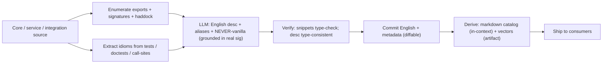
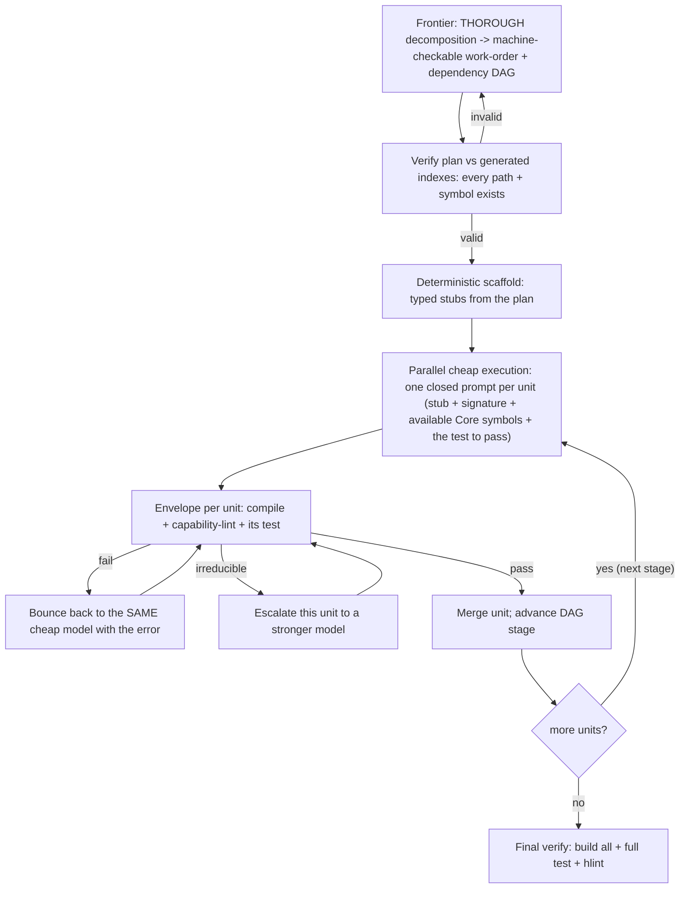
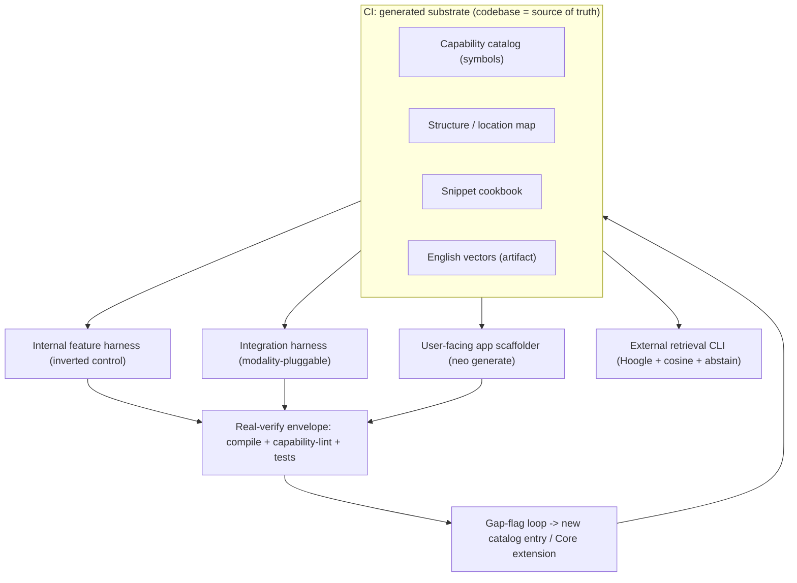

# Deterministic Pipelines: Generated Indexes, Scaffolders & an Inverted-Control Harness

**Status:** Draft (v1 — consolidation of the design conversation; for iteration)
**Date:** 2026-07-03
**Author:** Nick (with Claude)
**Related:** PR #708 (the motivating failure), issue #711 (skill-infrastructure RFC), `docs/plans/2026-07-03-onklaud-5-teardown.md` (prior-art study), `feature-pipeline-preview`, `integration-pipeline-preview`, `integrations/AGENTS.md` (two-persona model)

> This document consolidates a long design conversation. It captures both the
> **decisions already made** (`[DECIDED]`) and the **still-open questions**
> (`⟡ OPEN`). It is a proposal to iterate on, not a committed spec. Where it
> describes the current codebase, those facts were verified against the repo on
> 2026-07-03.

---

## 0. TL;DR

We want three things to become **deterministic and fast**: (a) the internal
feature pipeline, (b) the integration pipeline, (c) the user-facing app-building
flow — plus (d) an external retrieval CLI for users. All four are the *same
machine* viewed from different ends:

```
generated substrate  →  frontier plan (verified against the substrate)  →
deterministic scaffold  →  parallel cheap "fill the typed hole" execution  →
real-verify envelope (compile · capability-lint · tests)
```

The load-bearing ideas:

1. **The codebase is the single source of truth.** Everything factual (paths,
   symbols, structure, conventions) is *generated* from it in CI. We stop
   hand-maintaining facts (that drift is part of what caused #708).
2. **Determinism comes from the verification envelope, not from exact
   search/generation.** A fuzzy suggestion is safe if a wrong one physically
   can't ship (won't compile, or trips a lint).
3. **Invert control.** A deterministic harness owns *what happens next*; the LLM
   only *fills bounded holes* with closed prompts. We stop letting the agent
   explore-to-decide — that is where both the 2-hour runtimes and the
   hallucinated ("BS") code come from.
4. **Escalating-cost cascade.** Cheapest layer that can resolve, wins. Frontier
   model plans *once*; cheap models execute *many* bounded units in parallel.
5. **Miss-safe.** Return *evidence*, not a verdict; a miss is "verify," never a
   confident guess.

---

## 1. Motivation — the #708 failure and its two costs

PR #708 (static-assets, issue #707) was, in Nick's words, *"100% vanilla Haskell
hallucination — absolutely no use of nhcore,"* and it took **>2 hours** to
autonomously produce. Two distinct costs, from one root cause:

- **Wrong code (BS):** `Data.Char.isDigit` instead of `Char.isDigit` (which
  Core defines at `core/core/Char.hs`); `GhcFilePath.</>` instead of
  `Path.joinPaths`; `case cond of True/False`, `let..in`, pyramid-of-doom.
- **Slow:** the agent spent most of the time **exploring the codebase to decide
  what to do**, re-deriving structure it should have been handed.

Both trace to the same thing: **the agent orchestrates itself by exploration,
and its exploration conclusions are delivered too late and are often wrong.**

Two failure modes to distinguish, because they need different fixes:

| Failure mode | Example | Fix |
|---|---|---|
| **Exists-in-Core, ignored** | `Char.isDigit`, `File.exists`, `Array.takeIf` | A *generated* catalog that hands the agent the Core symbol before it writes |
| **Genuinely absent from Core** | `Path.normalise`, `Directory.list` | Flag as a Core-extension gap; **never** silently go vanilla |

---

## 2. Prior art — Onklaud 5 (what we keep, what we reject)

Full study: `docs/plans/2026-07-03-onklaud-5-teardown.md`. Distilled:

**Keep:**
- **Escalating-cost cascade** — resolve deterministically ($0) before spending a
  model call (their "Ponytail ladder → council").
- **Pre-resolution / known-answer lookup** — a capability→solution map matched
  *before* generation.
- **Learned-failure memory loop** — every caught failure crystallized and
  re-injected (their immune memory; our gap-flag loop).

**Reject (these are why their JS hit rate was 30% and produced confident-wrong
answers):**
- **Word-subset / literal matching** — `"read file"` falsely matched `"read all
  lines"` → returned `readFileSync`. False positives are worse than misses.
- **Hand-curated tables** — 14 JS entries with obvious gaps; coverage decays the
  moment it's manual. We *generate* from the real surface.
- **Prose-grepping "quality gates"** — keyword matching dressed as analysis;
  theater. We keep *real* gates (compile/test).
- **Cannot say "this doesn't exist"** — vector/keyword search always returns a
  nearest neighbor. Our design must be able to abstain.

**Invariant we carry everywhere:** *types and generated facts arbitrate; fuzzy
search only widens recall; a miss routes to "verify," never to a confident
guess.*

---

## 3. Core principles (the spine)

- **P1 — Codebase is the single source of truth.** Generate every *fact*
  (paths, symbols, signatures, structure, conventions) from the code in CI.
  Never hand-maintain a fact. `[DECIDED]`
- **P2 — Split authored judgment from generated facts.** *Authored* (timeless
  how/why): rubrics, methodology, persona, style rules. *Generated* (what/where):
  the capability catalog, structure map, allowed-paths, snippet cookbook.
- **P3 — Determinism is a property of the envelope, not the search.** Compile +
  capability-lint + allowed-paths + tests make fuzzy retrieval and cheap
  generation *safe*: a wrong suggestion can't silently ship.
- **P4 — Invert control.** The harness decides transitions; the LLM fills
  bounded holes. Never let the LLM explore to decide the next step.
- **P5 — Escalating-cost cascade.** Cheapest resolving layer wins; frontier
  plans once, cheap executes many.
- **P6 — Miss-safe, evidence-not-verdict.** Return ranked candidates with
  provenance; abstain when unsure. The consumer (an LLM agent) arbitrates.
- **P7 — Shrink the improvisation surface** to typed holes filled with grounded
  primitives, everything around them deterministic.

---

## 4. The shared substrate — generated from the codebase in CI

One CI-generated knowledge base underlies all four surfaces.

### 4.1 What's generated vs authored

| Artifact | Kind | Today | Target |
|---|---|---|---|
| Capability catalog (symbol → sig/module/desc/aliases) | **generated** | absent (partial prose in `nhcore-context.md`) | generated from exports |
| Structure/location map (module tree, extension points) | **generated** | hand-maintained prose | generated from packages/dirs |
| Per-phase allowed paths | **generated** | hand-maintained (`references/phase-allowed-paths.md`) | generated from structure |
| Snippet/idiom cookbook | **generated** | absent | extracted from real call-sites/tests |
| Rubrics, methodology, persona, style rules | **authored** | authored (keep) | authored (keep) |

### 4.2 The capability catalog (the #708 antidote)

Per symbol, split **hard** (from real source, never invented) vs **soft**
(LLM-authored, grounded, verified):

- **Hard:** name, signature, module/path, exported-or-internal, audience
  (user-facing vs internal).
- **Soft:** an English "what it does / when to use / when *not*", an alias set,
  and the `NEVER: vanilla X (even aliased)` note (e.g. `Char.isDigit` ⇒ *never*
  `Data.Char.isDigit`, even as `GhcChar`).

Rules: the LLM writes English/aliases **with the real signature in front of it**
and may **not** invent symbols; snippets must **type-check**; **commit the
English (diffable, reviewable), regenerate the vectors** as a build artifact.
This resolves the "embeddings are opaque" objection: humans review prose, CI
derives the blobs.

### 4.3 The structure/location map

Generated from the package layout (`.cabal` exposed-modules, directory
conventions): the module tree, each module's responsibility, the extension
points ("to add a web-transport combinator, touch these files"), and the
**per-phase allowed-paths** table (which is *currently hand-maintained* at
`feature-pipeline-preview/references/phase-allowed-paths.md` and drifts).

### 4.4 The snippet / idiom cookbook

For patterns Hoogle can't address (they're not single exported symbols):
early-exit validation with `Task.unless`, content-addressed `Cache-Control`,
the two-persona integration shell, path-traversal guards. Extracted from **real
call-sites, tests, and doctests** (not invented) and verified to compile. The
retrieval payload is *real code*; only the English index around it is generated.

### 4.5 Generation pipeline (CI)



Trigger: regenerate when the surface changes (path filter on `core/**`,
`integrations/**`), not every commit. Deterministic: same surface → same
artifacts. `⟡ OPEN`: exact trigger; committed-vs-artifact boundary for vectors.

### 4.6 The gap-flag loop (compound interest)

Any query that **abstains** or any fill-in that **reaches for vanilla** →
logged → becomes a candidate for a new catalog entry, a new snippet, or a
**Core extension**. This is Onklaud's immune memory, typed and grounded: we
store *capability→symbol resolutions* and *confirmed gaps*, not truncated prose.
`⟡ OPEN`: where the gap sink lives and how it re-enters generation.

---

## 5. Two consumption modes

- **Retrieval (lookup)** — external CLI + the executor's fill-in helper (§6).
- **Scaffolding (generation)** — deterministic codegen from specs (§7–8).

Both read the same substrate; the harness (§9) orchestrates the generation side.

---

## 6. The retrieval index (external CLI + fill-in helper)

**Consumer is an LLM agent** `[DECIDED]` → return top-k **evidence** (candidate +
English + signature + module + kind tag), let the agent arbitrate. Never a
single verdict — that was Ponytail's original sin.

### 6.1 Embed English, not Haskell `[DECIDED]`
Haskell is a **low-resource language** for every code-embedding model. We embed
the *English explanation* (query = NL intent, document = English description) —
an asymmetric English→English retrieval, the most mature/smallest model
category. Use the model's `query:`/`passage:` asymmetry.

### 6.2 Brute-force cosine `[DECIDED]`
Justified by **exactness** (no ANN recall loss where every miss matters), **no
index staleness**, **simplicity**, and — the real reason — **you can fuse cosine
+ lexical + type signals in one pass**, which is what makes abstention possible.
NeoHaskell's parallelism is a *bonus that ages well*, not the justification (at a
few-thousand vectors a full scan is sub-millisecond single-threaded). Normalize
vectors at CI so query-time is a dot product.

- **Storage:** plain SQLite or a packed flat file. **Not `sqlite-vector`** — its
  license is production-restricted (Elastic 2.0 / commercial). At this scale you
  need no ANN extension at all. `[DECIDED: avoid sqlite-vector]`

### 6.3 Hybrid scoring + abstention + Hoogle
- **Hybrid score:** `cosine(query, english)` + lexical/BM25 + (for typed
  symbols) a type-compatibility bonus.
- **Type-directed local Hoogle** over Core is the **hard arbiter for the symbol
  subset** — exact name/type search, and crucially it can return *"nothing
  unifies"* (safe abstention, the #708 guard). Keep it even though it can't cover
  snippets.
- **Abstain** when the top score is below a calibrated floor **or** the top-1/top-2
  margin is tiny. Calibrate at CI with synthetic query→known-symbol pairs; margin
  is often a better confidence proxy than raw cosine.
- **The snippet subset has no type anchor** — it's the dangerous part, where
  cosine is the only signal. **Abstention there is the whole ballgame.**

### 6.4 The bundled model
You must embed the *live* query at runtime → the CLI bundles a model.
- **Pick (if bundling):** `bge-small-en-v1.5` (Apache-2.0, ~34 MB int8), run via
  **`fastembed-rs`** (the installer is already Rust). Pin the ONNX runtime for
  cross-machine determinism. Corpus↔model **version lock**: change model →
  re-embed corpus.
- **But:** for the *internal* pipeline planner (§9), a **generated markdown
  catalog read in-context** beats embeddings (small closed corpus, diffable, no
  model to ship). **Reserve embeddings for the external CLI**, where queries are
  unbounded and the corpus may not fit a cheap model's context.
  `⟡ OPEN: does the external CLI even need embeddings, or does Hoogle + a
  generated alias index suffice?`

---

## 7. Scaffolding — deterministic codegen (`neo generate`)

### 7.1 The determinism ladder
```
spec (declarative)  →  deterministic scaffold (pure codegen, no LLM)  →
boxed fill-in (LLM, constrained by signatures + capability index + envelope)
```
Push as much as possible up the ladder. The scaffold step is where hallucination
is *eliminated*, not mitigated.

### 7.2 Event model = types + TH `[DECIDED]`
The user-facing app's domain (events, commands, aggregate state, projections,
policies) is expressed as **Haskell types + TH**, so the spec and the source of
truth are the same artifact — no model-vs-code drift, compiler-enforced.

### 7.3 Scaffolder = a CLI command, NOT a skill `[DECIDED]`
If scaffolding is an LLM following a prose skill, it is **not deterministic**.
It must be a `neo generate` binary (and/or TH build step): `eventModel →
fileTree + typed handler stubs`, a pure function with zero degrees of freedom.
Every emitted hole has a *known signature* (`decide :: Command -> State ->
Result Error [Event]`, `apply :: Event -> ReadModel -> ReadModel`).

### 7.4 The fill-in is the only LLM step, and it's boxed
Constrained by the surrounding types **and** the capability index (uses Core, not
vanilla), and made safe by the **compile + capability-lint** envelope. Business
logic inside `decide`/`apply` is the **irreducible residue** — you can't make it
deterministic, only maximally constrained and grounded. Be honest about that
ceiling.

---

## 8. Integrations — modality-pluggable scaffolding

### 8.1 The two-persona shell is modality-invariant
Per `integrations/AGENTS.md`: **Facade** (Jess's pure API) + `Request` +
`Response` are identical regardless of transport. Only **`Internal.hs`'s
`ToAction`** is modality-specific — today it builds a `Http.Request` and hands it
to `Integration.Http`. That is the seam.

### 8.2 Reality check (verified 2026-07-03)
All current integrations — including the "non-HTTP"-sounding Ocr/Pdf/Audio —
**route through AI/HTTP**. There is a `core/system/Subprocess.hs` primitive that
**no integration uses**, and **zero** `inline-c`/`inline-python`/`inline-java`
anywhere. So **CLI-wrapper and FFI integrations are greenfield.**

### 8.3 Build the transport layers before scaffolding onto them
`Integration.Http` exists; `Integration.Subprocess` (on `core/system/
Subprocess.hs`) and `Integration.Foreign` (inline-c/python/java) **do not**.
Scaffolding onto a non-existent layer is the "reach for vanilla because Core
lacks it" trap one level up. **Build the transport primitives as real library
layers first.**

### 8.4 The scaffolder
```
neo generate integration --name Foo --transport http|cli|ffi-c|ffi-python|ffi-java --spec <spec>
```
Generates the invariant shell (4 files + `Redacted` config + cabal reg + test
skeleton) deterministically; `--transport` selects the `Internal.hs` skeleton and
typed seam.

### 8.5 Templateable fraction by modality

| Transport | "Spec" | Generated fraction | The typed hole |
|---|---|---|---|
| HTTP | OpenAPI / endpoints | ~80% (types from schema) | request mapping edge cases |
| CLI-wrapper | arg/flag grammar + output format | ~50–60% | stdout/exit-code parsing |
| FFI (inline-c/python/java) | foreign signatures | shell only | the **marshalling boundary** (Haskell ↔ foreign types, memory/lifetime/exceptions) |

**Known-answer:** the *first* real example of each modality becomes the extracted
template for the next.

### 8.6 Flag: the integration pipeline dropped the deep review
`feature-pipeline-preview` has 18 phases incl. `17-opus-pr-review`;
`integration-pipeline-preview` has 17 and **no opus review**. Integrations touch
**secrets, auth, and outbound network** — *more* attack surface, not less.
Cutting the deepest review from the security-sensitive pipeline is the wrong
asymmetry. `⟡ OPEN: add it back or justify.`

---

## 9. The inverted-control harness (internal features) — the main event

### 9.1 Diagnosis
The current `feature-pipeline-preview` is **LLM-orchestrated**: an agent reads
`SKILL.md`, **explores to decide what to do**, then acts. Exploration is where
*both* the 2-hour runtime **and** the hallucination live. Compounding it: the
plan (phase 7 architecture) runs on **haiku, in prose**, and the executor writes
**whole modules cold**. `pipeline.py` is a *state tracker the LLM drives.*

The pipeline *does* already have the determinism skeleton — reuse it:
- location enforcement (`git diff` vs `phase-allowed-paths.md`),
- a vanilla-lint envelope (`scripts/lint-imports.py`, refuses un-aliased
  `Data.*`/`Control.*` and the `Task.fromIO` escape hatch),
- trust-but-verify (`verify-leaf.py`), rubric gates, and model tiering.

Two structural bugs (see §10) let #708 through despite all that.

### 9.2 The inversion
A **deterministic program owns transitions**; the LLM is demoted to *fill one
bounded hole with a closed prompt and a structured-output schema*. This is
**literally a Workflow** (control flow in code, `agent()` calls with schemas,
parallel fan-out, verify-then-advance).

### 9.3 The flow


Each unit = `{target file, exact signature, Core symbols to use, the test it must
satisfy, dependencies}`. The harness runs **parallel within a DAG stage, serial
across dependencies**.

### 9.4 Why 2–4× faster
Exploration is **eliminated** (the harness *hands* the agent its context);
independent units run **in parallel** instead of one serial agent; the plan is
computed **once** by the frontier model instead of re-derived; cheap models are
faster. A 2-hour serial exploratory run becomes `frontier-plan (minutes) + N
parallel bounded executions (minutes) + verify`.

### 9.5 Why no BS
The LLM **never decides control-flow or structure** (harness + scaffolder do);
every unit is **bounded and verified**; vanilla-hallucination is caught by the
**capability-aware lint**; the plan was **verified against real code**. A cheap
model in a tight verify loop beats an expensive model with no envelope.

### 9.6 Critical failure modes (be honest)
- **The plan is now the single bottleneck.** A bad decomposition fans out into
  parallel garbage. Spend frontier tokens *here*, and **verify the plan hard**
  (against indexes + a review pass) before fan-out. Do **not** cheap out on
  planning.
- **Inter-unit dependencies.** Units aren't independent; the plan must express a
  **DAG**. Parallel within a stage, serial across.
- **Non-decomposable cores.** Cross-cutting logic that won't reduce to typed
  holes needs an **escape hatch to a strong model** while cheap-executing the
  boilerplate around it. Not every feature gets 4× — the *templateable fraction*
  sets the ceiling.
- **Determinism ceiling.** Business logic (`decide`) is irreducible; box it,
  don't pretend to eliminate it.
- **Keep verification real.** Reuse the existing `cabal build`/`test`/lint gates
  — never regress to Onklaud-style keyword-grep gates.

`⟡ OPEN: harness as a Workflow script vs a standalone NeoHaskell program.`

---

## 10. Concrete changes to the existing pipelines

Two structural bugs let #708 through; both are fixable without rebuilding:

1. **Guards are a blocklist + hand-maintained prose, not a generated allowlist.**
   `lint-imports.py` refuses `import Data.Char` but *permits* `Data.Char
   qualified as GhcChar` — even though `Char.isDigit` exists. `nhcore-context.md`
   lists conventions but not the symbol surface. **Fix:** generate the capability
   catalog (§4.2); **upgrade the lint blocklist → capability-aware** (flag
   aliased-vanilla when a Core equivalent exists).
2. **The location-critical planner is under-powered and ungrounded.** Phase 7
   (architecture — the plan everything follows) is haiku + prose, and
   `phase-allowed-paths.md` is hand-maintained. **Fix:** generate the
   structure/location index; **verify the plan against it** before execution;
   reconsider the planner tier.

**Migration summary:**

| Artifact | Now | Change |
|---|---|---|
| `phase-allowed-paths.md` | hand-maintained | **generate** from structure |
| `nhcore-context.md` (symbol facts) | prose | **generate** the catalog; keep the *conventions* prose authored |
| `lint-imports.py` | blocklist | **capability-aware allowlist** |
| Phase 7 plan | haiku prose | machine-checkable work-order, **verified vs indexes**, stronger tier |
| Phases 9–10 (both pipelines) | write modules cold | **scaffold typed stubs**, fill boxed holes |
| Rubrics / methodology / persona | authored | **keep authored** |

---

## 11. Unifying architecture



One generation substrate, four consumers, one envelope, one learning loop.

---

## 12. Decisions & open questions

**Decided:**
- Codebase is the single source of truth; generate all facts. `[DECIDED]`
- Event model = Haskell types + TH. `[DECIDED]`
- Scaffolder = a `neo generate` CLI command (not a prose skill). `[DECIDED]`
- Primary consumer of retrieval is an LLM agent → return evidence, not verdict. `[DECIDED]`
- Embed English explanations, not Haskell. `[DECIDED]`
- Brute-force cosine; plain SQLite/flat-file storage; **not** sqlite-vector. `[DECIDED]`
- CI-generated grounding is mandatory. `[DECIDED]`
- Internal planner uses an in-context generated markdown catalog; embeddings are for the external CLI. `[DECIDED]`

**Open (`⟡`):**
1. Does the external CLI even need embeddings, or do Hoogle + a generated alias index suffice?
2. Embedding model final pick if bundled (leaning `bge-small-en-v1.5` int8 / `fastembed-rs`).
3. Committed-vs-artifact boundary for vectors (English committed; vectors derived).
4. Gap-sink location and re-entry into generation.
5. Core-gap policy: extend Core eagerly vs ring-fence.
6. Regeneration trigger (path-filtered PR check vs scheduled vs manual).
7. Harness implementation: Workflow script vs standalone NeoHaskell program.
8. Transport-layer build order (`Integration.Subprocess`, `Integration.Foreign`).
9. Whether to restore the integration pipeline's deep review (§8.6).
10. Abstention calibration method (score floor vs top1–top2 margin).

---

## 13. Rollout — first targets, highest value first

- **Phase 0 — Capability catalog generator.** Generate the symbol catalog
  (hard facts + grounded English + `NEVER-vanilla`) for the highest-traffic
  modules (Char, Text, Array, File, Path, LinkedList, EventStore).
  **Acceptance test:** replay #708 — would it have surfaced `Char.isDigit` /
  `Path.joinPaths` and *flagged* `Path.normalise` as a gap, before a line was
  written? (Appendix A.)
- **Phase 1 — Capability-aware lint.** Upgrade `lint-imports.py` from blocklist
  to catalog-driven allowlist.
- **Phase 2 — Harness prototype (Workflow) over one real feature.** Measure the
  actual speedup vs the ~2-hour baseline and the BS-rate vs #708. This is the
  experiment that validates or kills the thesis.
- **Phase 3 — `neo generate integration --transport http`.** Templatable today;
  ships the scaffolder skeleton and the two-persona shell generator.
- **Phase 4 — Transport layers** (`Integration.Subprocess`, then `Integration.
  Foreign`) → then `--transport cli|ffi-*` scaffolds.
- **Phase 5 — External retrieval CLI** (Hoogle + cosine + abstain) — **only if**
  the internal in-context catalog proves insufficient for the external audience.

---

## Appendix A — the #708 acceptance test

The design succeeds if, replaying the static-assets task, the harness surfaces —
*before* the agent writes a line, and blocks anything otherwise:

- `Char.isDigit` / `Char.isHexDigit` (not `Data.Char.*`, even aliased)
- `File.exists` / `File.readText` (not `GhcDir.*`)
- `Array.takeIf` / `Array.map` (not `filter` / `GhcList.*`)
- `Path.joinPaths` (not `GhcFilePath.</>`), **and** flags `Path.normalise` /
  `Path.isAbsolute` / `splitDirectories` as **genuine Core gaps** rather than
  letting the agent reach for `GhcFilePath.*` — which is exactly where the
  traversal bug entered.

## Appendix B — Onklaud 5 cross-reference

The mechanics we adopt (cascade, pre-resolution, learned-failure memory) and the
ones we reject (word-subset matching, hand-curated tables, prose-grep gates,
inability to abstain) are documented in depth in
`docs/plans/2026-07-03-onklaud-5-teardown.md` (Parts II–III especially: the
reusable blueprint and the algorithm catalogue).

## Appendix C — glossary

- **Substrate** — the CI-generated knowledge base (catalog + map + cookbook +
  vectors).
- **Capability catalog** — symbol → {signature, module, English description,
  aliases, NEVER-vanilla note}.
- **Envelope** — the deterministic verification wrapper (compile +
  capability-lint + allowed-paths + tests) that makes fuzzy/cheap steps safe.
- **Work-order** — the frontier plan as a machine-checkable unit list + DAG.
- **Two-persona model** — the integration Facade (user-facing) / Internal
  (developer) split; the shell is modality-invariant.
- **Boxed hole** — a typed stub whose signature is fixed by the scaffold, filled
  by a cheap model under the envelope.
- **Gap-flag loop** — abstentions/misses/vanilla-reaches logged and fed back into
  generation or Core extension (compound interest).
