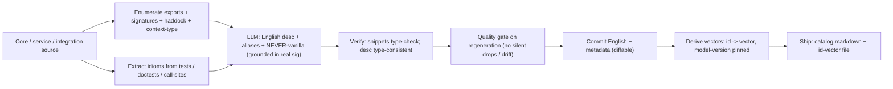
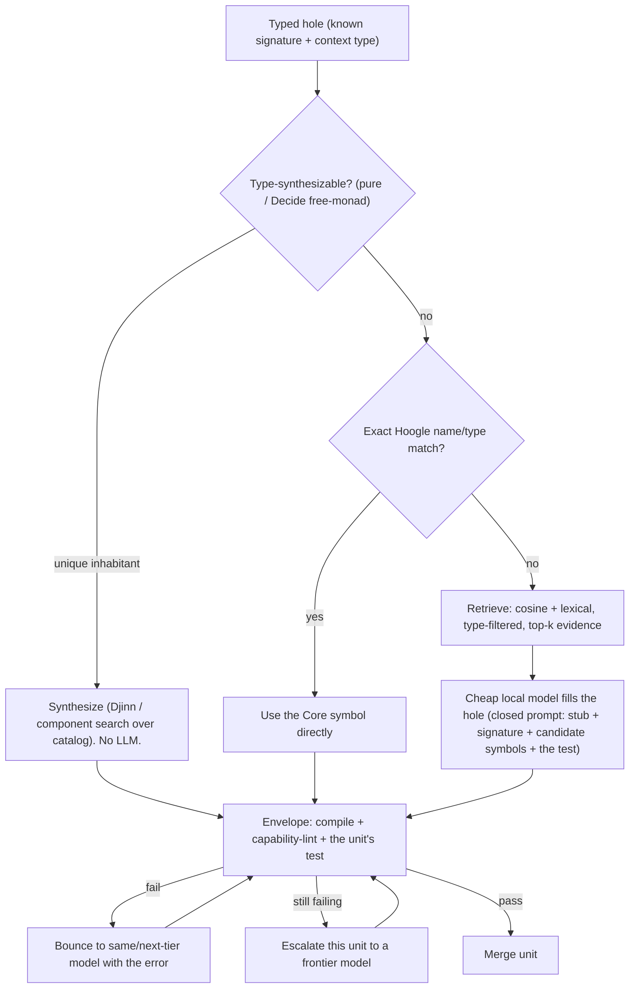
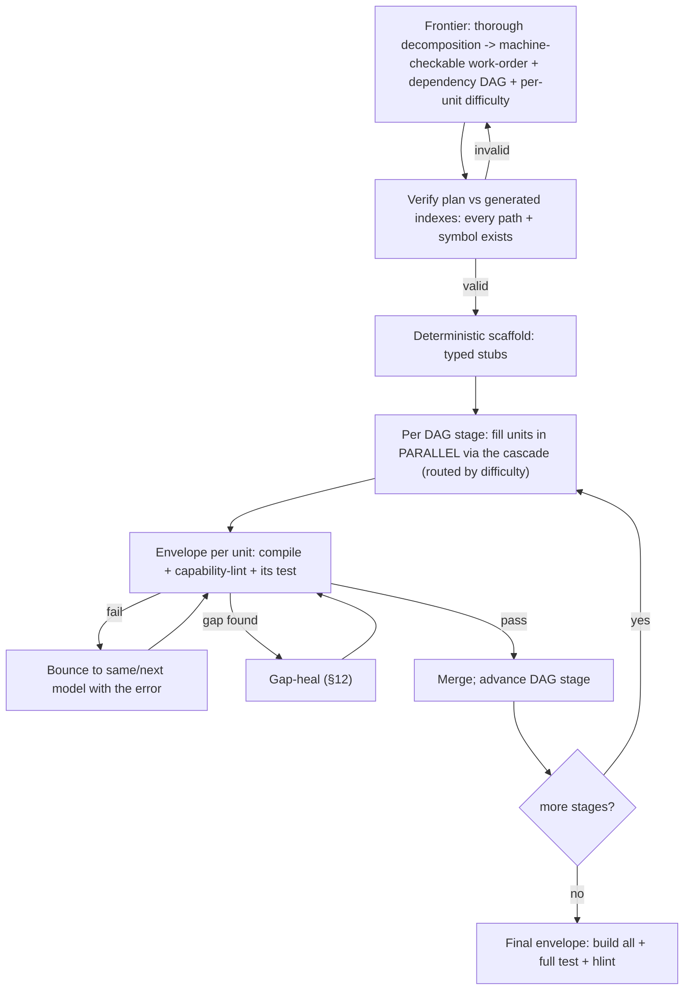
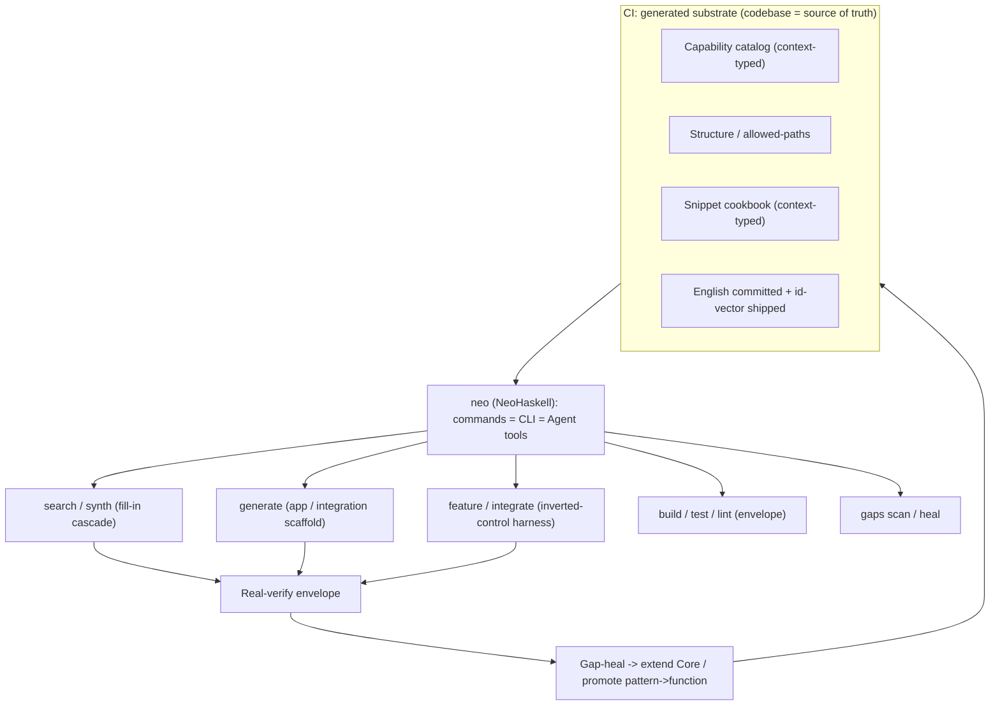

# `neo`: Deterministic Pipelines, Generated Indexes & an Inverted-Control Harness

**Status:** Draft **v2** — supersedes v1 (git history). Consolidation of the full design conversation; for iteration.
**Date:** 2026-07-03
**Author:** Nick (with Claude)
**Related:** PR #708 (motivating failure), issue #711 (skill-infra RFC), `docs/plans/2026-07-03-onklaud-5-teardown.md` (prior-art study), `feature-pipeline-preview`, `integration-pipeline-preview`, `integrations/AGENTS.md` (two-persona model).

> `[DECIDED]` = settled in conversation. `⟡ OPEN` = unresolved. Repo facts verified 2026-07-03.
> **v2 changes:** restructured around a single `neo` tool; adds the purity-per-surface model, the type-directed **fill-in cascade** (synthesis → Hoogle → retrieval → cheap-LLM → escalate), the nix-bundled embedder + shipped vectors, the comment-marker **gap-heal** loop, per-unit model routing, and shadow-migration.

---

## 0. TL;DR

**One tool, `neo`**, written in NeoHaskell, where every capability is a NeoHaskell **command exposed simultaneously as a CLI command and as an Agent tool** (the dogfooded trinity). It serves *us* (developing NeoHaskell internals + integrations) and *users* (building their own pure event-sourced apps) from the same binary.

The machine, once, for every surface:

```
generated substrate  →  frontier plan (verified against the substrate)  →
deterministic scaffold  →  fill-in CASCADE (synthesize → Hoogle → retrieve → cheap-LLM → escalate)  →
real-verify envelope (compile · capability-lint · tests)  →  gap-heal loop
```

Five load-bearing ideas:

1. **Codebase is the single source of truth.** Every fact (paths, symbols, signatures, structure) is *generated* from it in CI; nothing factual is hand-maintained. `[DECIDED]`
2. **Determinism comes from the verification envelope, not from exact search.** A fuzzy or cheap suggestion is safe iff a wrong one can't ship (won't compile / trips a lint / fails its test).
3. **Invert control.** `neo` owns *what happens next*; the LLM only *fills bounded holes* with closed prompts. No explore-to-decide — that is where both the 2-hour runtimes and the BS code came from.
4. **Escalating-cost cascade.** Cheapest resolving layer wins: **type-directed synthesis before retrieval before any model**; frontier plans once, cheap local models (Gemma 3B / GPT-OSS) execute many bounded units in parallel.
5. **Miss-safe.** Return *evidence*, not a verdict; a miss is "verify / file a gap," never a confident guess.

---

## 1. Motivation — #708's two costs

PR #708 was *"100% vanilla Haskell hallucination"* and took **>2 hours**. Two costs, one root cause:

- **Wrong code:** `Data.Char.isDigit` not `Char.isDigit`; `GhcFilePath.</>` not `Path.joinPaths`; `case cond of True/False`, `let..in`, pyramid-of-doom.
- **Slow:** most of the time was the agent **exploring to decide what to do**, re-deriving structure it should have been handed.

Both: **the agent orchestrates itself by exploration, and its conclusions arrive late and are often wrong.** Two failure modes, different fixes:

| Mode | Example | Fix |
|---|---|---|
| Exists-in-Core, ignored | `Char.isDigit`, `File.exists`, `Array.takeIf` | Generated catalog hands the agent the symbol first |
| Genuinely absent from Core | `Path.normalise`, `Directory.list` | Flag as a gap; **never** silently go vanilla |

---

## 2. Prior art — Onklaud 5 (keep / reject)

Full study: `docs/plans/2026-07-03-onklaud-5-teardown.md`.

**Keep:** the escalating-cost cascade; pre-resolution / known-answer lookup; the learned-failure memory loop. **Reject:** word-subset matching (false positives — `"read file"` matched `"read all lines"` → wrong `readFileSync`); hand-curated tables (drift); prose-grep "quality gates" (theater); inability to abstain. **Invariant we carry:** *types and generated facts arbitrate; fuzzy search only widens recall; a miss routes to "verify," never a guess.*

---

## 3. Principles

- **P1** Codebase is the single source of truth; generate every fact. `[DECIDED]`
- **P2** Split *authored judgment* (rubrics, methodology, persona, style) from *generated facts* (catalog, structure map, allowed-paths, cookbook).
- **P3** Determinism is a property of the *envelope*, not the search/generation.
- **P4** Invert control: `neo` decides transitions; the LLM fills bounded holes.
- **P5** Escalating-cost cascade: type-synthesis → retrieval → cheap model → frontier.
- **P6** Miss-safe, evidence-not-verdict; abstain when unsure.
- **P7** Shrink improvisation to typed holes filled with grounded primitives.

---

## 4. The purity model per surface (load-bearing)

How pure each surface is *determines how much of it is deterministically synthesizable* — and therefore how much needs an LLM at all.

| Surface | Purity | Consequence |
|---|---|---|
| **User projects** | **100% pure — no `Task`, no `IO`.** `decide` returns a `Decide` **free monad** interpreted purely. | **Maximum** synthesis reach. The effect barrier that limits Djinn is *gone*; business logic is a pure value (a free-monad AST) built from a small typed constructor vocabulary — ideal for type-directed synthesis and component search. This is exactly where we most want determinism (users are non-experts). |
| **Integrations** | **Impure by nature** (HTTP/CLI/FFI). | **Minimum** synthesis reach; retrieval + LLM fill dominate. |
| **NeoHaskell core** | **Mixed**, kept as pure as possible. | Synthesis applies to the pure parts; retrieval/LLM to the effectful parts. |

**The nuance:** purity removes the *effect* barrier to synthesis, not the *specification* barrier. Many valid `Decide` programs inhabit the same type; the **spec (the test / the event model's intent) selects the right inhabitant**. So on the user surface: *synthesis proposes candidates cheaply and mechanically; the test disposes.* Purity makes the mechanical part clean; the business intent still needs a spec.

---

## 5. `neo` — the unifying tool

**One CLI, written in NeoHaskell.** Because NeoHaskell exposes every command as **both a CLI command and an Agent tool**, the same commands are:
- invoked by **users** as `neo …` on the terminal, and
- invoked by the **harness's LLM steps** as registered tools.

This is the dogfooded win: the harness orchestrates the *same* commands users run, and building `neo` exercises NeoHaskell's own command/agent/CLI abstractions. `[DECIDED]`

Capability map (each a command = tool = CLI):

| Command (illustrative) | Purpose | Consumers |
|---|---|---|
| `neo search` / `neo suggest` | capability retrieval over the catalog (cascade §7) | user, harness fill-in |
| `neo synth` | type-directed synthesis (Djinn / component) | user, harness fill-in |
| `neo generate <app\|integration\|…>` | deterministic scaffolding | user, harness |
| `neo build` / `neo test` / `neo lint` | the verification envelope | user, harness |
| `neo feature` / `neo integrate` | the inverted-control harness (§11) | us (internal) |
| `neo gaps scan` / `neo gaps heal` | the gap-heal loop (§12) | user, harness |

**Bootstrapping** `[DECIDED]`: the *first* `neo` can't be built by `neo`; we build it manually with regular Claude prompting (and the existing `NeoHaskell/skills` repo — good, if slow) until it's self-hosting.

**Harness = a `neo` NeoHaskell program**, not a Workflow script `[DECIDED]`. There is no architectural difference between "a Workflow" and "a program that orchestrates bounded agent steps" — a `neo` command *is* such an orchestration. The reason it must be `neo` (not the Claude-Code Workflow tool) is **model choice**: only a `neo` program can drive cheap local executors (Gemma 3B, GPT-OSS) via subprocess, which the cost thesis depends on. The Claude-Code Workflow tool is useful *only* as a throwaway prototype to validate the orchestration shape + rough speedup before investing (§13).

---

## 6. The generated substrate (CI)

### 6.1 Generated vs authored

| Artifact | Kind | Today | Target |
|---|---|---|---|
| Capability catalog (symbol → sig/module/desc/aliases/context-type) | generated | partial prose (`nhcore-context.md`) | generated from exports |
| Structure/location map + per-phase allowed-paths | generated | hand-maintained (`references/phase-allowed-paths.md`) | generated from packages/dirs |
| Snippet/idiom cookbook (context-typed) | generated | absent | extracted from tests/doctests/call-sites |
| Rubrics, methodology, persona, style, grounding-loop | **authored** | authored | **keep** |

### 6.2 Capability catalog — hard/soft split
- **Hard (from real source, never invented):** name, signature, module/path, exported-vs-internal, **audience** (user-facing vs internal), and **context type** (`Task err`, pure, `Command`, `Query`, `Outbound`, `Decide`).
- **Soft (LLM-authored, grounded, verified):** English "what/when/when-not", alias set, `NEVER: vanilla X (even aliased)`.
- Rules: LLM writes English/aliases **with the real signature present** and may not invent symbols; snippets must **type-check**; **commit the English (diffable), ship the vectors** (§6.5).

### 6.3 Snippet cookbook — **type-aware** `[DECIDED]`
Every pattern carries its **context type** (`Task.unless cond err` is valid only in `Task`; a pure filter only in pure code). Retrieval **filters by the context the agent is currently in** — so the snippet subset gets the type anchor it was missing, restoring miss-safety (types filter, cosine ranks).

### 6.4 Generation pipeline



Trigger `[DECIDED]`: **path-filtered PR checks + manual runs**. Regeneration **overwrites**, so a **quality gate is mandatory** (snippets compile, descriptions type-consistent, no unexplained dropped entries, English diff reviewed).

### 6.5 Shipping the index `[DECIDED]`
- **English descriptions + metadata → committed to git** (humans review prose diffs).
- **Vectors → shipped as an `id → vector` file** so users don't re-embed. Requirements (N1/N2):
  - **Stable IDs**: id = qualified symbol name / snippet slug, plus a **description content-hash** so only changed entries re-embed.
  - **Model-version pin**: the file carries `model-id@version`; `neo` must embed *queries* with the exact same model, or re-embed on mismatch.
- **Audience-scoped**: external users receive the **user-facing** surface's vectors (their project + NeoHaskell's public API), not internal Core.

### 6.6 The gap loop — two outputs
Every abstention / vanilla-reach is logged and produces one of: **(a) extend Core** (add the missing primitive) or **(b) promote a recurring pattern → a function** (a hot snippet graduates into a real Core function, which then becomes a catalog entry). Detail in §12.

---

## 7. The fill-in cascade (centerpiece)

Each typed hole (from the scaffold, §9) is resolved by the **cheapest rung that works**, gated by the envelope:



### 7.1 Type-directed synthesis (the deterministic floor)
- **Djinn** (Augustsson): synthesizes a term from a type by intuitionistic proof search — free, exact, no LLM. **Caveats:** no recursion / type classes / effects; and for **multiply-inhabited** types it returns *some* well-typed term that may be **wrong** → **every synthesized term is gated by its unit test**; only *uniquely-inhabited* types are trusted without one.
- **Component synthesis (Hoogle+-style):** synthesize a *composition of existing catalog functions* that inhabits the target type — directly leverages the capability catalog, covers more than Djinn, and every component is a real Core symbol.
- **Reach follows purity (§4):** *high* on user projects (pure, `Decide` free monad), *low* on integrations (impure), *medium* on Core. On the user surface, synthesis proposes; the test disposes.

### 7.2 Per-unit model routing `[DECIDED-direction]`
Route **by estimated unit difficulty**, not only per phase: trivial → synthesis / 3B; medium → mid-tier; hard → frontier. The plan (work-order) carries a difficulty estimate per unit. (Cheap 3B executors thrash on subtle holes; the envelope catches wrong code but retries cost time — route to avoid the thrash.)

---

## 8. Retrieval (the cosine rung + external CLI)

- **Embed English, not Haskell** `[DECIDED]` (Haskell is low-resource for embedding models; query = NL intent, doc = English description; asymmetric `query:`/`passage:`).
- **Consumer is a cheap model** (Gemma 3B / GPT-OSS) `[DECIDED]` → retrieval must be **more precise and give fewer, higher-confidence candidates** (a weak model trusts a wrong top-1 and has a small context window). Types/Hoogle as hard pre-filter matter *more* here.
- **Brute-force cosine** `[DECIDED]`: exactness, no ANN staleness, and — the real reason — you can **fuse cosine + lexical + type-context filter in one pass** (enables abstention). Normalize vectors at CI → query-time dot product. Storage: plain SQLite / flat file — **not `sqlite-vector`** (production-restricted license; no ANN needed at this scale).
- **Embedder runtime** `[DECIDED]`: a **nix-bundled native binary invoked via subprocess** (`onnxruntime` / `llama.cpp`, both **MIT**). This sidesteps the **AGPL** `hs-onnxruntime-capi` — we never link it, we pipe to an MIT binary. Model: **`bge-small-en-v1.5`** (Apache-2.0, ~34 MB int8) unless a better small English retriever wins.
- **Hoogle** stays the **hard arbiter** for the symbol subset (exact name/type; can return "nothing unifies" = safe abstention).
- **Abstention:** prefer the **top-1/top-2 margin** over an absolute cosine floor (cosine isn't comparable across queries); calibrate with synthetic query→known pairs. `⟡ OPEN: tuning for a 3B consumer — how conservative, how many candidates.`

---

## 9. Scaffolding — deterministic codegen (`neo generate`)

Ladder: **spec → deterministic scaffold (no LLM) → boxed fill-in (cascade §7)**.

- **Event model = Haskell types + TH** `[DECIDED]` — spec and source of truth are the same artifact (no drift, compiler-enforced). User `decide` returns a `Decide` free monad (pure).
- **Scaffolder = a `neo generate` command, not a prose skill** `[DECIDED]` — `eventModel → fileTree + typed handler stubs`, a pure function; every hole has a known signature (`decide :: Command -> State -> Decide [Event]`, `apply :: Event -> ReadModel -> ReadModel`).
- The fill-in is the only non-deterministic step, and it's boxed by the surrounding types + capability index + envelope. On the pure user surface, much of it is **synthesizable** before any LLM runs (§7).

---

## 10. Integrations — modality-pluggable scaffolding

- **The two-persona shell is modality-invariant** (`integrations/AGENTS.md`): Facade + `Request` + `Response` identical regardless of transport; only `Internal.hs`'s `ToAction` is modality-specific. Integrations are **impure** → the fill-in cascade leans on retrieval + LLM, not synthesis.
- **Reality (verified):** all current integrations route through AI/HTTP; `core/system/Subprocess.hs` exists but is unused; **zero** inline-c/python/java. CLI-wrapper and FFI integrations are **greenfield**.
- **Build the transport layers first** `[DECIDED order: Subprocess, then Foreign]` — `Integration.Http` exists; `Integration.Subprocess` (on `core/system/Subprocess.hs`) and `Integration.Foreign` (inline-c/python/java) don't. Scaffolding onto a non-existent layer is the "go vanilla because Core lacks it" trap one level up.
- **Scaffolder:** `neo generate integration --name Foo --transport http|cli|ffi-c|ffi-python|ffi-java --spec <spec>`.

| Transport | "Spec" | Generated | The typed hole |
|---|---|---|---|
| HTTP | OpenAPI / endpoints | ~80% | request-mapping edge cases |
| CLI-wrapper | arg/flag grammar + output format | ~50–60% | stdout/exit-code parsing |
| FFI | foreign signatures | shell only | the marshalling boundary (memory/lifetime/exceptions) |

- **Known-answer:** the first real example per modality becomes the extracted template for the next.
- **Flag** `⟡ OPEN`: the integration pipeline dropped the deep review phase that `feature-pipeline-preview` has (`17-opus-pr-review`). Integrations touch **secrets/auth/network** — restore it or justify.

---

## 11. The inverted-control harness (`neo feature` / `neo integrate`)

### 11.1 Diagnosis
The current pipeline is **LLM-orchestrated**: an agent reads `SKILL.md`, **explores to decide**, then acts. Exploration = both the 2-hour runtime and the hallucination. The plan (phase 7) runs on **haiku, in prose**; the executor writes **modules cold**. `pipeline.py` is a *state tracker the LLM drives*. (It *does* have good bones — allowed-paths gate, `lint-imports.py`, `verify-leaf.py`, rubric gates, tiering — reuse them.)

### 11.2 The flow


- **Per-phase AND per-unit model assignment** (Onklaud-style, but real): frontier for planning + security-critical review; cheap local for mechanical fills; routed per unit by difficulty (§7.2). `[DECIDED-direction]`
- **Why 2–4×:** exploration eliminated (harness *hands* context); independent units run in parallel; plan computed once; synthesis + cheap models. A 2-hour serial run → `frontier-plan (minutes) + parallel bounded fills (minutes) + verify`.
- **Why no BS:** the LLM never decides control-flow or structure; every unit bounded + verified; vanilla caught by the capability-aware lint; plan verified against real code.

### 11.3 Failure modes (honest)
- **The plan is the single bottleneck** — a bad decomposition fans out into parallel garbage. Spend frontier tokens *there* and **verify the plan hard** before fan-out. Don't cheap out on planning.
- **Dependency DAG** — parallel within a stage, serial across; the plan must express it.
- **Non-decomposable cores** — an escape hatch to a frontier model for the irreducible logic while cheap-executing the boilerplate. Not every feature gets 4×.
- **Determinism ceiling** — business logic in `decide` is irreducible; box it (and on the pure surface, synthesize-then-test it).
- **Keep verification real** — reuse `cabal build`/`test`/lint; never regress to keyword-grep gates.

---

## 12. The gap-heal loop (concrete)

### 12.1 Two contexts `[DECIDED]`
- **Internal (inside the NeoHaskell codebase):** a **frontier agent takes over, reviews, and thoroughly searches** for an existing solution. If it's a genuine gap *and small* (a simple function / datatype — not a large feature like static-assets), it **implements the gap directly** — a **recursive harness run** (plan → scaffold → fill → verify **+ its own tests**, per the non-negotiable), bounded by a recursion-depth guard. Large gaps escalate to a normal feature.
- **External (a user's project):** the harness detects the gap → a frontier agent looks thoroughly → if not found, it **writes a markdown file for the user to edit and autonomously files a GitHub issue** from `neo`, and **in parallel continues implementation using vanilla**, leaving a **special comment marker** future sessions will act on.

### 12.2 The comment-marker mechanism `[DECIDED]`
- **Marker format:** e.g. `-- NEO-GAP(#123): GhcFilePath.normalise pending Core Path.normalise`.
- **`neo gaps scan`:** find all markers.
- **`neo gaps heal`:** for each marker, check whether the referenced issue is closed / the Core symbol now exists → swap vanilla → Core → run the unit's test. Without the issue-ref + heal command the markers only accumulate.

### 12.3 Gap outputs
`(a) extend Core` (eagerly for anything reusable) or `(b) promote a recurring pattern → a function` (hot snippet graduates; keeps the cookbook from growing unboundedly). Ring-fence (controlled documented vanilla) only for genuinely one-off/exotic. `⟡ OPEN: gap-sink storage + re-entry into generation (the markdown-file + issue flow is the sink for the external case).`

---

## 13. Migration — full, but shadow-then-retire `[DECIDED]`

**Replace the orchestration, preserve the judgment.** The wholesale move from `scripts/` + `SKILL.md` to `neo` retires the *LLM-driven state machine*, but **ports the authored judgment** (rubrics, `security-methodology.md`, `performance-methodology.md`, the grounding loop, `jess-persona.md`, allowed-paths) as content the harness reads. Losing those in a rewrite is a regression.

**Shadow scoreboard** (so "slowly retire" isn't vibes): run `neo`'s harness and the existing pipeline on the *same* real features and compare **wall-clock, token cost, review-finding delta, and BS-rate**, plus the **#708-replay acceptance test** (Appendix A). Retire the scripts once `neo` wins for N consecutive real features.

**Concrete existing-pipeline fixes** (the two bugs that let #708 through):
- **`lint-imports.py`: blocklist → capability-aware allowlist** (flag aliased-vanilla when a Core equivalent exists).
- **Phase-7 plan:** generate the structure index, **verify the plan against it**, and raise the planner tier (it's currently haiku + prose — the plan everything follows).
- **Generate** `phase-allowed-paths.md` and the symbol facts of `nhcore-context.md`; **keep** its conventions/methodology prose authored.

---

## 14. Unifying architecture



One substrate, one tool, one envelope, one learning loop — serving both us and users.

---

## 15. Decisions & open questions

**Decided:** single `neo` tool (commands = CLI = Agent tools); codebase = source of truth; authored-vs-generated split; determinism from the envelope; inverted control; event model = types+TH; scaffolder = `neo generate`; consumer = cheap local model (Gemma 3B / GPT-OSS); embed English not Haskell; brute-force cosine, not `sqlite-vector`; **embedder = nix-bundled MIT binary via subprocess** (avoid AGPL binding); **ship precomputed id→vector, model-version pinned**; commit English, ship vectors; type-aware snippets; **type-directed synthesis (Djinn + component) as the deterministic floor, gated by tests**; per-unit model routing; comment-marker gap-heal; two-context gap policy; transport order Subprocess→Foreign; full migration, shadow-then-retire.

**Open (`⟡`):**
1. Abstention tuning for a 3B consumer (how conservative, how many candidates).
2. Does the *external* CLI need the neural index at all, or do Hoogle + component-synthesis + lexical suffice for v1?
3. Internal retrieval at *thousands* of entries: scoped lexical/Hoogle vs the same neural index (the full catalog no longer fits in context).
4. Restore the integration pipeline's deep-review phase (§10).
5. Core-gap "extend vs ring-fence" thresholds (§12.3).
6. Recursion-depth guard value for internal gap-fixes (§12.1).
7. Which small English retriever if not `bge-small-en-v1.5`.

---

## 16. Rollout — highest value first

- **Phase 0 — `neo` skeleton + capability-catalog generator.** Generate the context-typed catalog (hard facts + grounded English + `NEVER-vanilla`) for the hot modules (Char, Text, Array, File, Path, LinkedList, EventStore). **Acceptance:** replay #708 (Appendix A).
- **Phase 1 — capability-aware lint** (`lint-imports` blocklist → catalog allowlist) + `neo search`.
- **Phase 2 — the fill-in cascade**: `neo synth` (Djinn + component search) + retrieval; measure synthesis reach on a pure user-project sample vs integrations.
- **Phase 3 — harness prototype** (Claude-Code Workflow, throwaway) over one real feature to validate the 2–4× shape; then build `neo feature` for real (cheap local executors).
- **Phase 4 — `neo generate integration --transport http`**, then the `Subprocess`/`Foreign` transport layers → `cli`/`ffi` scaffolds.
- **Phase 5 — shadow-migrate** the feature/integration pipelines onto `neo`; retire scripts on the scoreboard.
- **Phase 6 — external CLI** (ship catalog + vectors; `neo` for user projects) — only after the internal loop proves out.

---

## Appendix A — the #708 acceptance test
Replaying static-assets, `neo` must — *before* a line is written, blocking otherwise — surface `Char.isDigit`/`isHexDigit` (not `Data.Char.*`, even aliased), `File.exists`/`readText` (not `GhcDir.*`), `Array.takeIf`/`map` (not `filter`/`GhcList.*`), `Path.joinPaths` (not `GhcFilePath.</>`), **and flag** `Path.normalise`/`isAbsolute`/`splitDirectories` as **genuine Core gaps** — which is exactly where the traversal bug entered.

## Appendix B — Onklaud 5 cross-reference
Mechanics adopted (cascade, pre-resolution, learned-failure memory) and rejected (word-subset matching, hand-curated tables, prose-grep gates, no-abstention) are detailed in `docs/plans/2026-07-03-onklaud-5-teardown.md`.

## Appendix C — glossary
- **`neo`** — the unifying NeoHaskell CLI; every command is also an Agent tool.
- **Substrate** — CI-generated catalog + structure map + cookbook + vectors.
- **Fill-in cascade** — synthesize → Hoogle → retrieve → cheap-LLM → escalate, per typed hole.
- **Type-directed synthesis** — Djinn (from-scratch, pure) + component search (compose catalog functions); gated by the unit test.
- **`Decide` free monad** — the pure representation of user-project business logic (`decide`), interpreted purely; makes user code broadly synthesizable.
- **Envelope** — compile + capability-lint + allowed-paths + tests; makes fuzzy/cheap steps safe.
- **Work-order** — the frontier plan as a machine-checkable unit list + DAG + per-unit difficulty.
- **Two-persona model** — integration Facade (user) / Internal (developer); shell is modality-invariant.
- **Comment-marker** — `-- NEO-GAP(#issue): …` left on a vanilla fallback; healed when the gap is fixed upstream.
- **Gap-heal loop** — abstentions/misses/vanilla-reaches → extend Core or promote pattern→function.
