# Onklaud 5 — A Source-Verified Teardown & Mechanistic Study

**Status:** Research notes (v1 — for iteration)
**Date:** 2026-07-03
**Subject:** [KorroAi/onklaud-5](https://github.com/KorroAi/onklaud-5) @ `a7dbf3f`
**Scope:** the entire Onklaud 5 workflow and algorithm (the harness itself is 100% Python). **Part I** dissects the JavaScript flows (adversarial). **Part II** abstracts the whole machine — control/data flow, the round-loop state machine, algorithms in pseudocode, data contracts, prompt architecture, and a language-agnostic rebuild blueprint (concept-first; defects demoted to footnotes). **Part III** extends the per-language treatment to Python and Native CSS/HTML with a cross-language synthesis.
**Method:** every section was extracted from the cloned source, then independently re-verified against it by a second agent — cited `file:line` re-read and quantitative claims (hit rates, counts, pass/fail) re-run; the per-language hit rates were additionally re-confirmed by hand. **~69 corrections were applied across the three parts during verification.** Numbers are observed, not quoted from the project's marketing. Part I is adversarial; Parts II–III are explanatory.

> These are research notes studying Onklaud 5 as **prior art** for NeoHaskell's own
> skill/code-generation direction. They describe what Onklaud *does*, grounded in its
> code — not a proposal for NeoHaskell. Marketing claims are reported only where the
> code contradicts them.

---

## What Onklaud 5 is, and where JavaScript lives in it

Onklaud 5 v3.2 markets itself as "not a model" but a "fusion pipeline that orchestrates multiple models through a structured council process" (`README.md:27-28`; the subtitle and abstract call it a "multi-model fusion pipeline," `README.md:4`, `README.md:409`). Concretely, the repository is a small collection of Python CLI scripts that (a) try to short-circuit a coding task with deterministic offline pattern-matching, and (b) if that fails, fan the task out to two hosted LLMs (Kimi K2.7 + GLM 5.2 via OpenRouter) for generation, cross-review, and arbitration.

### The repo is 100% Python

Despite the marketing table advertising projects "Built With Onklaud 5" in TypeScript/React/Next.js/Three.js (`README.md:277-282`), **the tool itself contains no JavaScript or TypeScript source of any kind.** A recursive search for `*.js`, `*.ts`, `*.jsx`, `*.tsx`, `*.mjs`, `*.cjs`, `*.vue`, `*.svelte` (excluding `.git`) returns zero files. The tracked (non-`.git`) file inventory is 16 `.py`, 3 `.md`, 2 `.pdf`, and one each of `.yaml`, `.png`, `.mp4`, `.html`, `.gif`, `.gitignore`, `.example`, plus `LICENSE` — see the `measured` field. (The `.json`/`.jsonl`/`.pyc` files present on disk are gitignored, generated at runtime.) Every string of JavaScript in the repo lives *inside* Python: as pattern-dictionary values, as `subprocess` argv lists, or as prose in PDF/HTML generators.

So "JavaScript flows" in this teardown means **the JS/TS-handling code paths inside the Python harness** — the places where Python decides something is a JS/TS task, emits a JS snippet, or shells out to a Node toolchain.

### The 6-stage pipeline

The advertised pipeline (`README.md:70-115`; mirrored in `design-spec.md:9-33` and `nadirclaw/config.yaml:43-73`) is:

| Stage | Component | Cost | Where |
|---|---|---|---|
| 0 | **Ponytail Ladder** — stdlib → native → existing-dep → shortest | $0, offline | `ponytail_ladder.py` |
| 1 | **GLM 5.2 pre-design** — architecture sketch (touchpoint 1) | paid API | `council.py:407` (`do_glm_pre_design`) |
| 2 | **Kimi K2.7 generate** — primary code implementation | paid API | `council.py` / `config.yaml:54-57` |
| 3 | **Dual review** — Kimi + GLM both review, scores averaged (touchpoint 2) | paid API | `council.py:431` (`do_dual_review`) |
| 4 | **GLM 5.2 arbitration** — final synthesis (touchpoint 3) | paid API | `council.py:486` (`do_glm_arbitrate`) / `config.yaml:64-67` |
| 5 | **Quality gate 10/10 + verify** — 7-dimension scoring, then type-check + tests | $0, offline | `quality_gate.py`, `verify.py` |

The whole design turns on a **deterministic-offline ($0) vs paid-API split.** `config.yaml:121` sets `strategy: ladder_first`, and `run_ladder` in `ponytail_ladder.py:213-243` is the gatekeeper: if it returns `found: true` (exit 0), stages 1-4 are meant to be skipped entirely — the README's worked example says "Step 1-4 skipped — task resolved at Step 0" (`README.md:159`). Stages 0 and 5 make *zero* API calls (`config.yaml:47`, `design-spec.md:42-45`); stages 1-4 are the only ones that spend money, quoted at ~$0.003–0.025 per task (`README.md:257-263`).

### The four JS-touching flows this doc covers

Only four Python code paths actually reason about JavaScript/TypeScript. Everything else in the "JS" story is prose:

1. **Ponytail Ladder — JS knowledge base + JS detection + `package.json` dep-matching** (`ponytail_ladder.py`). The `STDLIB_PATTERNS["js"]` dict (`ponytail_ladder.py:56-71`) maps task phrases to Node one-liners; `detect_language` routes anything mentioning `javascript/typescript/node/react/...` (`ponytail_ladder.py:101-103`) or a `package.json` (`ponytail_ladder.py:108`) to the `js` branch; and `check_existing_dep` parses `package.json` `dependencies`/`devDependencies` against a `dep_mappings` table (`ponytail_ladder.py:152-180`). This is the only stage where a JS "solution" is *produced*.

2. **`fast_gate.py` — Node syntax gate.** `JS_EXTS = {".js", ".ts", ".jsx", ".tsx", ".mjs", ".cjs"}` (`fast_gate.py:11`); for those extensions `check_syntax` shells out to `node --check <file>` (`fast_gate.py:18-20`). This is the JS side of the tool the README calls the "Syntax Gate" — though the README's 100% (14/14) figure is measured via `py_compile` on the Python source, not via `node` (`README.md:225`).

3. **`verify.py` — Node/TS build-and-test verifier (stage 5).** It reads `package.json` to classify a project as `typescript` vs `javascript` (`verify.py:71-101`), runs `npx tsc --noEmit` for TS (`verify.py:130-149`) or walks the tree running `node --check` for JS (`verify.py:151-174`), detects the package manager from lockfiles (`verify.py:35-41`), and runs `package.json` scripts (`verify.py:43-62`).

4. **`pre_check.py` — immune-memory scan that accepts JS/TS files.** Its usage advertises `--file src/api.ts` (`pre_check.py:8`); the scan itself is language-agnostic — a category-keyword table (`pre_check.py:25-34`) plus a fuzzy word-overlap matcher (`pre_check.py:44-52`) run against stored failure patterns — but it is the fourth entry point that ingests a `.ts` path.

### Subtleties and defects worth flagging up front

- **Marketing/code mismatch on JS pattern count.** `generate_paper_pdf.py:387` (and the shipped paper) claim "20+ JavaScript patterns," but `STDLIB_PATTERNS["js"]` has only **14** entries (measured). Python has 23 (the same generator claims "50+"), native HTML/CSS has 16.
- **The JS hit-rate number is not reproducible.** The README's Ponytail breakdown claims JavaScript = **2/10 (20.0%)** (`README.md:235`). Re-running the ladder against the exact 10 JS benchmark tasks in `benchmark_full.py:36-45` yields **3/10 (30.0%)** — see `measured`. The extra hit is a **subset false-positive**: matching is `pattern_words.issubset(task_words)` on whitespace-split words (`ponytail_ladder.py:123-128`), so the pattern `read file` matches the task "Read all lines from a file" and returns `readFileSync` — a semantically wrong answer counted as a hit.
- **The README's worked example does not resolve.** The example claims Ponytail resolves "Build an HTTP client with retry logic" at Step 0 ($0) with a Python `requests.Session` one-liner (`README.md:151-166`), but running the ladder on that exact task returns `found: false` (it auto-detects `python` and still misses) — see `measured`.
- **A dead JS pattern.** `STDLIB_PATTERNS["js"]` includes the key `"sleep/delay"` (`ponytail_ladder.py:64`). Because matching splits on whitespace, `sleep/delay` is a single token; a natural task like "sleep delay in node" never matches it (only the literal string `sleep/delay` does). It is effectively unreachable from real task phrasing.
- **Duplicate dict key.** `dep_mappings` defines `"zod"` twice (`ponytail_ladder.py:171` shadowing `:165`) — harmless (second wins) but sloppy.
- **A referenced data file is missing as-cloned.** The benchmark-data file `research_benchmarks.json` that the PDF/HTML report generators load at import time (`generate_paper_pdf.py:9`, `generate_html_report.py:9`) is gitignored and **not present in the repo**, so those generators raise `FileNotFoundError` even on import as-cloned. (By contrast, `config.yaml`'s references to `immune_memory.json` storage (`config.yaml:118`) and a `verify.py --type-only` command (`config.yaml:73`) are *real*: `--type-only` is an implemented flag (`verify.py:300-301`, dispatched at `verify.py:113`), and `immune_memory.json` is generated runtime data present on disk that `pre_check.py` reads.)
- **Gated paths.** `verify.py` skips the TS type-check entirely if there is no `tsconfig.json` (`verify.py:132-135`), and its `_smoke_test` only runs under `mode == "smoke"` against an already-running server (`verify.py:120-122`).

---

# Part I — The JavaScript flows (adversarial teardown)

## Flow A — JS resolution: the Ponytail Ladder JS branch

The "Ponytail Ladder" (`ponytail_ladder.py`) is Onklaud 5's zero-API-call gate that tries to answer a coding task from three progressively-wider rungs — stdlib, native HTML/CSS, and existing project dependency — before any model is invoked. Its own module docstring frames it as "checks if a task can be solved with stdlib/native/existing-dep. Returns the shortest solution that works. Zero API calls. Instant." (`ponytail_ladder.py:3-4`). For JS/TS tasks the entire mechanism is a set-membership test over a tiny hand-maintained keyword table. Read closely, the JS branch resolves only 3 of the 10 JS benchmark tasks, and one of those three is a *wrong* answer.

### `detect_language()` — JS triggers and the Python-default trap

`detect_language(task, project_dir=None)` (`ponytail_ladder.py:94`) lowercases the task and runs two keyword sweeps followed by a project-file probe:

```python
if any(kw in task_lower for kw in ["python", ".py", "django", "flask", "fastapi"]):
    return "python"
if any(kw in task_lower for kw in ["javascript", "typescript", "node", "react", "next", "vue", "angular",
                                    ".js", ".ts", ".jsx", ".tsx", "npm", "vite", "express"]):
    return "js"
```
(`ponytail_ladder.py:99-103`)

The JS trigger set is 14 substrings (`ponytail_ladder.py:101-102`). Note these are raw `in` substring tests, not word matches — so `"next"` fires on any task containing the substring "next" and `"react"` on "reaction", etc. If no keyword hits and a `project_dir` is supplied, it falls back to file sniffing: a `package.json` returns `"js"`, while `requirements.txt`/`pyproject.toml`/`setup.py` return `"python"` (`ponytail_ladder.py:106-111`). If nothing matches, the function unconditionally returns `"python"`:

```python
    # Default
    return "python"
```
(`ponytail_ladder.py:113-114`)

This default is the reason the benchmark must pass `--lang js` explicitly. None of the 10 JS benchmark task strings (`benchmark_full.py:36-45`) contain a JS keyword — e.g. "Read a file synchronously", "Deep clone an object" — so with no project dir they auto-detect as **python** (verified: `detect_language('Read a file synchronously') -> python`, `detect_language('Deep clone an object') -> python`). The benchmark harness works around this by appending `--lang js` for any task whose language column isn't `native`/`""` (`benchmark_full.py:68-69`), which is exactly the invocation this section reproduces.

### `STDLIB_PATTERNS["js"]` — the 14-key table

The JS knowledge base is a flat `dict` of 14 `pattern -> solution` string pairs (`ponytail_ladder.py:56-71`). Enumerated in declaration order, the keys are:

| # | Pattern key | Solution (abbrev.) | Modern `node:`? |
|---|---|---|---|
| 1 | `read file` | `readFileSync(path,'utf-8')` from `node:fs` | yes (`node:fs`) |
| 2 | `write file` | `writeFileSync(path,data)` from `node:fs` | yes (`node:fs`) |
| 3 | `read json` | `JSON.parse(readFileSync(...))` from `node:fs` | yes (`node:fs`) |
| 4 | `parse url` | `new URL(input)` (WHATWG global) | n/a (global) |
| 5 | `http get` | `await fetch(url).then(r=>r.json())` | n/a (global) |
| 6 | `generate uuid` | `randomUUID()` from `node:crypto` | yes (`node:crypto`) |
| 7 | `hash string` | `createHash('sha256')...` from `node:crypto` | yes (`node:crypto`) |
| 8 | `sleep/delay` | `await new Promise(r=>setTimeout(r,ms))` | n/a (global) |
| 9 | `environment variable` | `process.env.KEY \|\| 'default'` | n/a (global) |
| 10 | `path join` | `join(dir,file)` from `node:path` | yes (`node:path`) |
| 11 | `temp dir` | `mkdtempSync(...)` from `node:fs`+`node:os` | yes (`node:fs`,`node:os`) |
| 12 | `parse date` | `new Date(isoString)` | n/a (global) |
| 13 | `regex match` | `/pattern/.exec(text)` | n/a (literal) |
| 14 | `base64 encode` | `Buffer.from(data).toString('base64')` | n/a (global) |

All seven solutions that need a runtime import use the modern `node:` protocol prefix — `node:fs` (keys 1,2,3,11), `node:crypto` (6,7), `node:path` (10), `node:os` (11) — quoted directly, e.g. `import { readFileSync } from 'node:fs'` (`ponytail_ladder.py:57`) and `import { randomUUID } from 'node:crypto'` (`ponytail_ladder.py:62`). The remaining seven solutions rely on runtime globals (`URL`, `fetch`, `process.env`, `Buffer`, `Date`, `setTimeout`) or a regex literal and need no import. So the table is stylistically modern; the problem is not the *solutions* but the *keys* used to reach them.

### `NATIVE_PATTERNS` — the shared CSS/HTML rung

The second rung is `NATIVE_PATTERNS` (`ponytail_ladder.py:75-92`), a 16-key table of HTML5/CSS answers that require no code — e.g. `"date picker": '<input type="date"> - native date picker, no JS needed'` (`ponytail_ladder.py:76`), `"dark mode"` → `@media (prefers-color-scheme: dark)` (`ponytail_ladder.py:84`), `"dialog/modal"` → `<dialog>` (`ponytail_ladder.py:91`). This rung is **language-agnostic**: `check_native()` (`ponytail_ladder.py:133`) takes no `lang` argument and is consulted for every task regardless of `--lang`. It is the CSS/HTML fallback shared by the Python and JS ladders alike. None of the 10 JS benchmark tasks touch this rung (they're all IO/data/async), but note `"dialog/modal"` carries the token `dialog/modal` — the same slash-token construction that neuters `sleep/delay` (below).

### `check_stdlib()` — the word-subset matching algorithm

The matcher (`ponytail_ladder.py:116-131`) is the heart of the flow, and its algorithm is crude:

```python
patterns = STDLIB_PATTERNS[lang]
task_lower = task.lower()
task_words = set(task_lower.split())

for pattern, solution in patterns.items():
    pattern_words = set(pattern.split())
    # All pattern words must appear in task words
    if pattern_words.issubset(task_words):
        return {"level": "stdlib", "solution": solution, "language": lang, "pattern_matched": pattern}
```
(`ponytail_ladder.py:121-129`)

Both the task and each pattern key are lowercased and split on whitespace into `set`s, and a pattern matches iff **every whitespace-delimited token in the pattern key is present somewhere in the task's token set** (`pattern_words.issubset(task_words)`, `ponytail_ladder.py:128`). It is an unordered, whitespace-tokenized, exact-token bag-of-words test. Consequences:

- **No stemming / no substring match.** "directory" ≠ "dir", so the `temp dir` key (`ponytail_ladder.py:67`) cannot match "Create a temporary directory" (verified: `set('temp dir'.split()).issubset({'directory','temporary','a','create'}) == False`). "ISO string" doesn't contain "parse", so `parse date` misses "Format a date as ISO string".
- **First match wins, in insertion order.** The loop returns on the first subset hit; Python 3.7+ dicts preserve insertion order, so `read file` (key #1) is tested before everything else.
- **Iteration order = declaration order,** which is why the false positive below resolves to `readFileSync` rather than any better key — `read file` is simply first.

`check_native()` (`ponytail_ladder.py:133-142`) uses the identical `issubset` algorithm on `NATIVE_PATTERNS`.

### `check_existing_dep()` — the JS half and the duplicate `zod` key

`check_existing_dep(task, project_dir=None)` (`ponytail_ladder.py:144`) is the third rung and is **gated on a project dir** — it returns `None` immediately if `project_dir` is falsy or not a directory (`ponytail_ladder.py:146-147`). For JS it parses `package.json`, merges `dependencies` and `devDependencies` into one `deps` dict (`ponytail_ladder.py:156-158`), and then keyword-matches the task against a `dep_mappings` table (`ponytail_ladder.py:161-172`):

```python
dep_mappings = {
    "lodash": ["filter", "map", "debounce", "throttle", "merge", "clone", "group"],
    "axios": ["http", "api call", "fetch", "request"],
    "date-fns": ["date format", "date parse", "date diff"],
    "zod": ["validate", "schema", "type check"],
    "express": ["server", "route", "middleware"],
    "react": ["component", "hook", "state"],
    "next": ["page", "route", "ssr"],
    "tailwind": ["style", "css", "layout"],
    "prisma": ["database", "query", "orm", "migrate"],
    "zod": ["validate", "schema", "type check"],
}
```
(`ponytail_ladder.py:161-172`)

The matching here is different from `check_stdlib`: it's a substring `any(kw in task_lower ...)` test, and the dep only counts if the package is actually present in `deps` (`ponytail_ladder.py:174-175`). Two things stand out:

1. **`"zod"` is declared twice** — at `ponytail_ladder.py:165` and again at `ponytail_ladder.py:171`, with identical value `["validate", "schema", "type check"]`. In a Python dict literal a repeated key is not an error; the later binding silently overwrites the earlier one, so the table collapses to **9 effective entries, not 10**. Because both values are identical it's a harmless no-op today, but it is dead source and a latent footgun (if someone edits one copy they'll be surprised the other wins). Verified: constructing the dict yields a single `zod` key.
2. This rung never fires in the benchmark at all — every benchmark invocation runs with **no** `--project-dir` (`benchmark_full.py:67`), so `check_existing_dep` short-circuits to `None` on line 146 before ever reading a `package.json`. `lodash`'s `clone` keyword (`ponytail_ladder.py:162`) *would* rescue "Deep clone an object" — but only in a repo that lists lodash, which the benchmark never provides.

The Python half (`py_dep_mappings`, `ponytail_ladder.py:191-200`) is analogous, matching against `requirements.txt` text.

### `run_ladder()` — rung order

`run_ladder(task, project_dir=None, lang=None)` (`ponytail_ladder.py:213`) fixes the climb order:

1. If no `lang`, call `detect_language` (`ponytail_ladder.py:215-216`).
2. **Stdlib** — `check_stdlib` (`ponytail_ladder.py:219-222`); on hit, set `found=True`, exit code 0.
3. **Native** — `check_native` (`ponytail_ladder.py:225-228`); on hit, exit 0.
4. **Existing dependency** — only `if project_dir` (`ponytail_ladder.py:231-235`).
5. **Not found** — returns `{"found": False, "reason": "Task requires custom implementation", ...}` and exit code 1 (`ponytail_ladder.py:238-243`).

So stdlib is tried before native before deps; the language-agnostic native rung sits *under* the language-specific stdlib rung, and the dep rung is unreachable without a project dir.

### The false positive: "Read all lines from a file" → whole-file `readFileSync`

Benchmark JS task #9 is "Read all lines from a file" (`benchmark_full.py:44`). The *intent* is line-wise reading (e.g. `readFileSync(path,'utf-8').split('\n')` or a `readline` stream). But the tokenized task is `{'all','from','lines','file','a','read'}`, and the pattern key `read file` tokenizes to `{'file','read'}`, which **is** a subset (verified: `subset? True`). The ladder therefore returns key #1's solution — `readFileSync(path, 'utf-8')` (`ponytail_ladder.py:57`) — which reads the **entire file as one string**, not its lines. The gate reports `found: true, level: stdlib, pattern_matched: "read file"` with full confidence and exit code 0, silently shipping a wrong answer. This is a direct artifact of the bag-of-words `issubset` design (`ponytail_ladder.py:128`): the extra tokens "all", "lines", "from" that change the semantics are simply ignored because supersets always satisfy `issubset`.

### The (practically) dead pattern: `sleep/delay`

Key #8 is `"sleep/delay"` (`ponytail_ladder.py:64`). Because the matcher tokenizes on whitespace via `.split()` (`ponytail_ladder.py:123,126`), `"sleep/delay".split()` produces the **single token** `['sleep/delay']` — the slash is not a delimiter (verified: `set('sleep/delay'.split()) == {'sleep/delay'}`). For this pattern to match, the task's whitespace-split token set must literally contain the token `sleep/delay` **with the embedded slash**. No natural-language task phrases it that way. The benchmark's async task, "Set a timeout that can be cancelled" (`benchmark_full.py:43`), contains neither "sleep" nor "delay" as tokens and misses entirely. I confirmed the pattern *can* fire only with an artificial slash-token input: `--task "sleep/delay execution"` matches (`pattern_matched: "sleep/delay"`, exit 0), whereas `--task "sleep delay execution for N seconds"` (slash replaced by space) **misses** — the two separate tokens `sleep`, `delay` are never a superset of the single token `sleep/delay`. So `sleep/delay` is not literally unmatchable, but it is a dead pattern for any realistic task phrasing: the only way to hit it is to type the slash. The same defect afflicts native key `dialog/modal` (`ponytail_ladder.py:91`).

### Net effect on the JS benchmark

Of the 10 JS benchmark tasks (`benchmark_full.py:36-45`), only three tokenize to a superset of a `STDLIB_PATTERNS["js"]` key: "Read a file synchronously" (→ `read file`), "Parse a URL and extract query parameters" (→ `parse url`), and — spuriously — "Read all lines from a file" (→ `read file` again, wrong solution). The other seven miss because the required token isn't present verbatim: the JS table has no `deep clone`/`random`/`http server`/date-`format`/path-`exists` keys (`http get` exists but needs both "http" and "get", and task #3 lacks "get"), `temp dir` loses to "directory", and `sleep/delay` needs the slash token. That yields a measured **30.0% JS hit rate — and only 20% *correct*, since one of the three "hits" is the readFileSync false positive.**

---

## Flow B — JS syntax gate (`fast_gate.py`)

`fast_gate.py` is Onklaud 5's "free, 0-API-cost" per-file check — the README lists it under *"Free Operations (0 API cost)"* alongside `ponytail_ladder.py` and `pre_check.py` (`README.md:309-315`). Its own docstring pitches it as *"Per-file code quality check - syntax (instant) + optional Kimi review (API)"* (`fast_gate.py:3`). In practice, only the syntax half of that promise works: the Kimi half is dead on arrival for any real (API-key-present) run, and even the syntax half is a fragile shell-out to `node --check` that produces guaranteed false positives on three of the extensions it advertises support for (`.ts`, `.tsx`, `.jsx`).

### The extension map

The file recognizes two families of source by extension (`fast_gate.py:11-12`):

```python
JS_EXTS = {".js", ".ts", ".jsx", ".tsx", ".mjs", ".cjs"}
PY_EXTS = {".py", ".pyw"}
```

Anything outside those two sets is silently waved through — `check_syntax` returns `True` with a comment that says exactly that: `return True, ""  # Unknown format, skip syntax check` (`fast_gate.py:24-25`). Verified: passing a `.txt` file prints `[SYNTAX] thing.txt: OK` and does not affect the exit code (see *measured*).

### `check_syntax()` — shelling to `node --check` / `py_compile`

The core is a `subprocess.run` dispatch on the lowercased extension (`fast_gate.py:16-27`):

```python
if ext in JS_EXTS:
    r = subprocess.run(["node", "--check", filepath], capture_output=True, text=True, timeout=10)
    return r.returncode == 0, r.stderr.strip() if r.stderr else ""
elif ext in PY_EXTS:
    r = subprocess.run(["python", "-m", "py_compile", filepath], capture_output=True, text=True, timeout=10)
    return r.returncode == 0, r.stderr.strip() if r.stderr else ""
else:
    return True, ""  # Unknown format, skip syntax check
```

- **JS family → `node --check <file>`** (`fast_gate.py:19`) with a 10s timeout. `node --check` parses the file and exits non-zero on a *parse* error only. The gate treats `returncode == 0` as "OK".
- **PY family → `python -m py_compile <file>`** (`fast_gate.py:22`), also 10s.
- Any exception (e.g. `node` not installed, timeout) is caught by the bare `except Exception as e:` at `fast_gate.py:26-27`, which returns `(False, str(e))` — i.e. an infrastructure failure is reported as a *syntax failure*.

#### What `node --check` actually catches — and its false positives

`node --check` only validates that the file is parseable JavaScript. Three consequences, all verified against the checked-out source with Node v24.15.0:

1. **Type/logic errors pass.** A `.js` file containing `const r = n * undefined;` and `u.foo()` on an undefined variable is perfectly valid *syntax*; it prints `[SYNTAX] logicbug.js: OK` and the gate exits 0. The gate catches nothing semantic — no type errors, no undefined references, no unused vars, no security issues.

2. **TypeScript type-annotation syntax is a hard false positive.** `.ts` is in `JS_EXTS`, but `node --check` parses `.ts` as CommonJS JavaScript. A perfectly valid TypeScript file `let s: string = "hi";` fails with `SyntaxError: Unexpected token ':'`. So *every* TS file that uses a type annotation is reported `FAIL`, regardless of correctness.

3. **`.jsx` and `.tsx` never even reach the parser.** In modern Node, `node --check` on those extensions throws `TypeError [ERR_UNKNOWN_FILE_EXTENSION]: Unknown file extension ".jsx"` before parsing. That non-zero exit is surfaced as a syntax `FAIL`. So the gate guarantees a false negative for two of the six extensions it claims to support.

Net: of the six `JS_EXTS`, only `.js`, `.mjs`, and `.cjs` behave sanely; `.ts`/`.jsx`/`.tsx` are broken by construction.

#### Hardcoded interpreter names (portability footgun)

Both branches invoke a bare literal — `"node"` (`fast_gate.py:19`) and `"python"` (`fast_gate.py:22`) — resolved via `PATH`, never `sys.executable`. Two failure modes, both verified:

- **`node` missing from `PATH`** → `FileNotFoundError` caught at `fast_gate.py:26` → `[SYNTAX] good.js: FAIL - [Errno 2] No such file or directory: 'node'`, exit 1. The tool has a hard, undocumented dependency on `node` being on `PATH`.
- **Only `python3` on `PATH`** (common on modern Linux/macOS) → *Python* files fail with `[Errno 2] No such file or directory: 'python'`, exit 1, even though the file is fine.

### `kimi_review()` — shelling into `council.py`, and why it never works

When not in syntax-only mode, `main()` calls `kimi_review()` (`fast_gate.py:29-46`), which shells into the sibling `council.py`:

```python
r = subprocess.run(
    ["python", COUNCIL, "review", "--type", "code", "--prompt", prompt, "--draft-file", filepath],
    capture_output=True, text=True, timeout=120, cwd=MY_DIR
)
# council review outputs JSON to stdout on success
try:
    result = json.loads(r.stdout)
    ...
except json.JSONDecodeError:
    return 0, False, [r.stdout[:300]], ""
```

The comment on `fast_gate.py:36` asserts *"council review outputs JSON to stdout on success"* — **this is false for the way `fast_gate` invokes it.** `council.py`'s `cmd_review` prints `format_trace(result, args.type, args.json_output)` (`council.py:608`). `format_trace` only emits JSON when `json_output` is true (`council.py:579-582`); otherwise it returns the emoji *trace line* (`council.py:594`):

```
[🎠→⚡K(9/10)→🔮G→gate(0/10)] = 9/10 PASS
```

`fast_gate` never passes `--json`, and the `review` subparser defaults `json_output=False` (`council.py:920`, `council.py:941`). So on a **successful** review, council prints that trace line, `json.loads` raises `JSONDecodeError`, and `kimi_review` hits the fallback at `fast_gate.py:44-46` → `return 0, False, [r.stdout[:300]], ""`. `main()` then prints `[KIMI] <file>: 0/10 FAIL` and sets `all_passed = False` (`fast_gate.py:88-97`) — **the file is failed even though the model passed it 9/10.** I reproduced the exact trace line (by calling `council.format_trace` directly) and the resulting fallback (see *measured*). The Kimi path is broken for every API-key-present run.

There is a single narrow branch where `json.loads` *succeeds*: if `OPENROUTER_API_KEY` is unset, `council.py` short-circuits and prints `{"error": "OPENROUTER_API_KEY not set in .env", "passed": false, "score": 0}` to stdout (`council.py:952`), which is valid JSON. `kimi_review` parses it to `score=0, passed=False, issues=[], critique=""` — so the *no-key* path yields a clean `0/10 FAIL` via the happy branch, while the *with-key* path yields a `0/10 FAIL` via the exception branch. Either way the answer is always FAIL. Verified both branches (see *measured*).

### `main()` — arg loop, modes, and exit codes

`main()` hand-rolls its argument parsing in a `while` loop (`fast_gate.py:54-67`) rather than using `argparse`. Flags recognized:

- `--syntax-only` → sets `syntax_only` (`fast_gate.py:58-59`)
- `--skip-kimi` → sets `skip_kimi` (`fast_gate.py:60-61`) — **undocumented**: it appears in neither the module docstring/usage (`fast_gate.py:4`) nor the `main()` usage string (`fast_gate.py:70`), and no caller or doc anywhere in the tree references it (only `fast_gate.py:50,60,61,84` mention it).
- `--prompt <val>` → consumes the next arg *only if* `i + 1 < len(args)` (`fast_gate.py:62-64`)
- anything else → appended to `files` (`fast_gate.py:65-66`)

Two arg-loop subtleties, both verified:

- **A dangling `--prompt` (last arg, no value)** fails the `i + 1 < len(args)` guard, falls through to the `else`, and is appended to `files`. It is then "syntax-checked" as a filename with empty extension (`os.path.splitext("--prompt")[1] == ""`) → unknown format → `[SYNTAX] --prompt: OK`, exit 0. A malformed invocation silently passes.
- **No files at all** → prints the usage string to stderr and `sys.exit(1)` (`fast_gate.py:69-71`).

The per-file loop (`fast_gate.py:74-97`):

1. Always runs `check_syntax`. On failure: `[SYNTAX] <bn>: FAIL - <err[:200]>`, sets `all_passed = False`, and `continue`s — the Kimi step is skipped for files that fail syntax (`fast_gate.py:77-81`).
2. On syntax OK, if `syntax_only or skip_kimi` → `continue` (`fast_gate.py:84-85`).
3. Otherwise run `kimi_review` and print `[KIMI] <bn>: <score>/10 <PASS|FAIL>` plus up to 5 issues; a non-passing review sets `all_passed = False` (`fast_gate.py:88-97`).

### Exit codes and callers

The single gating signal is the final line `sys.exit(0 if all_passed else 1)` (`fast_gate.py:99`): **0 = all files clean, 1 = any file failed** (syntax or Kimi). That exit code is the entire contract a caller can rely on. Verified: mixed good/bad fixtures → exit 1; all-good → exit 0.

Nothing in the repo wires `fast_gate.py` as a git hook or pre-commit gate — and the file itself makes no such claim. Every caller invokes it only in `--syntax-only` mode: the README documents solely `fast_gate.py ... --syntax-only` (`README.md:314`, `README.md:345`); the benchmark harnesses call it with `--syntax-only` (`research_paper_benchmark.py:124`, `benchmark_full.py:109`); and `test_pipeline.py`'s `test_fast_gate` only ever exercises `--syntax-only` (`test_pipeline.py:144-154`). The Kimi review path (`kimi_review`) has **zero callers and zero test coverage** anywhere in the tree — no code ever reaches the non-syntax-only branch — making it an unshipped, non-functional appendage.

### Summary of what this gate does NOT catch

- Any semantic defect in valid-syntax code: type errors, undefined references, null/undefined deref, logic bugs, security issues — all pass (empirically: `n * undefined; u.foo()` → OK).
- TypeScript entirely: type-annotated `.ts` is a false-positive FAIL; `.jsx`/`.tsx` are `ERR_UNKNOWN_FILE_EXTENSION` FAILs.
- It requires `node` on `PATH` (JS) and a binary literally named `python` on `PATH` (Py); absent either, clean files are reported as failures.
- The advertised Kimi review is a no-op-to-broken: it always resolves to `0/10 FAIL` because `fast_gate` reads `council.py` stdout as JSON while `council.py review` emits a human trace line by default.

---

*Measured — all runs on the checked-out `/tmp/onklaud-5` with Node v24.15.0, Python 3.13.13, a `python` on `PATH`, `OPENROUTER_API_KEY` present in env, no `.env` file:*

1. `python fast_gate.py good.js bad.js typeerr.ts good.py bad.py thing.txt --syntax-only`: `good.js: OK`; `bad.js: FAIL - SyntaxError: Unexpected token ';'`; `typeerr.ts: FAIL - SyntaxError: Unexpected token ':'`; `good.py: OK`; `bad.py: FAIL - SyntaxError: invalid syntax`; `thing.txt: OK`. Exit 1. (TS type annotation is a false-positive FAIL; unknown `.txt` passes.)
2. `logicbug.js` (`const n="not a number"; const r=n*undefined; let u; u.foo();`) → `OK`, exit 0. (Type/logic errors pass.)
3. `good.js good.py thing.txt --syntax-only` → all OK, exit 0.
4. `m.mjs` OK, `broken.cjs` FAIL (`Unexpected token ';'`), exit 1. (`.mjs`/`.cjs` handled by `node --check`.)
5. `comp.jsx --syntax-only` → FAIL, `ERR_UNKNOWN_FILE_EXTENSION` for `.jsx`, exit 1. Direct `node --check comp.tsx` → same error (rc 1). Direct `node --check plain.ts` → `SyntaxError: Unexpected token ':'` (rc 1).
6. `node` absent from `PATH` (PATH limited to a dir containing only `python`, fast_gate launched via absolute python): `good.js: FAIL - [Errno 2] No such file or directory: 'node'`, exit 1.
7. Only `python3` on `PATH` (no `python`): `good.py: FAIL - [Errno 2] No such file or directory: 'python'`, exit 1.
8. `env -u OPENROUTER_API_KEY -u OPENROUTER_API_KEY_BACKUP python council.py review --type code --prompt test --draft-file good.js` → stdout `{"error": "OPENROUTER_API_KEY not set in .env", "passed": false, "score": 0}`, exit 1. `fast_gate`'s `json.loads` parses it → score=0, passed=False.
9. Key-present path (a passing 9/10 review, `council.format_trace` invoked directly): council stdout = `[🎠→⚡K(9/10)→🔮G→gate(0/10)] = 9/10 PASS`. `json.loads(that)` → `JSONDecodeError` → fast_gate fallback returns `(0, False, [trace[:300]], "")` → prints `[KIMI] good.js: 0/10 FAIL` and sets `all_passed=False` even though the model PASSED. (`format_trace(..., json_output=True)` would emit valid JSON, but `fast_gate` never passes `--json`.)
10. `python fast_gate.py --syntax-only --prompt` (dangling `--prompt`) → `[SYNTAX] --prompt: OK`, exit 0 (treated as a filename with unknown extension).

---

## Flow C — JS/TS verification (`verify.py`)

`verify.py` is Onklaud 5's runtime-verification stage — the pipeline's "enforcement" step. Its docstring frames it as what makes the tool credible: *"Fable 5 beats Opus 4.8 because it ACTUALLY TESTS what it builds. This is the enforcement."* (`verify.py:5-6`). In practice, for the JavaScript path it can report a clean pass having executed no meaningful check at all.

Four modes are parsed in `main()`'s arg loop (`verify.py:293-312`): `--type-only`, `--full`, `--smoke`, and default `auto`. Exit codes are documented as `0 = pass, 1 = fail, 2 = partial (tests unavailable but type-check OK)` (`verify.py:17`) — but `2` is never returned (see below).

### Platform / package-manager plumbing

`_npm_cmd(*args)` (`verify.py:28-33`) just appends `.cmd` to the first arg on Windows:

```python
cmd = list(args)
if IS_WIN:
    cmd[0] = cmd[0] + ".cmd"
return cmd
```

`_detect_pm(project_dir)` (`verify.py:35-41`) picks a package manager purely from lockfile presence, in fixed priority — pnpm, then yarn, else npm:

```python
if os.path.exists(os.path.join(project_dir, "pnpm-lock.yaml")):
    return "pnpm"
if os.path.exists(os.path.join(project_dir, "yarn.lock")):
    return "yarn"
return "npm"
```

`_run_script(pm, script, cwd, timeout=120)` (`verify.py:43-62`) contains a real bug:

```python
if script.startswith(pm) or script.startswith("npm") or script.startswith("yarn") or \
   "&&" in script or "||" in script or ";" in script:
    return subprocess.run(script, cwd=cwd, ... shell=True)
...
return subprocess.run(f'{pm_cmd} run {script}', cwd=cwd, ... shell=True)
```

`script` is the *value* of the package.json test script, but the fallback branch treats it as a *script name* and prepends `npm run`. So `"test": "jest"` becomes `npm run jest` → npm looks for a script literally named `jest`, fails with `Missing script`. Only values beginning with `npm`/`yarn`/`pnpm` or containing `&&`/`||`/`;` run verbatim through the shell. Confirmed by capturing the constructed command: `'echo ok'` → `npm run echo ok`, `'jest'` → `npm run jest`, `'npm run test:unit'` → `npm run test:unit`, `'vitest run && tsc'` → `vitest run && tsc`, `'yarn jest'` → `yarn jest` (all `shell=True`). Running `--full` on a fixture whose `"test"` is `"echo ok"` produced a real false failure: `npm error Missing script: "echo"`, exit 1. This mangling breaks the most common test-script shape (verified in Measured).

### `detect_project_type()` — classification from package.json + tsconfig

`detect_project_type()` (`verify.py:71-101`) reads `package.json`, merges `dependencies`+`devDependencies`, and derives flags:

```python
has_ts = os.path.exists(os.path.join(self.project_dir, "tsconfig.json"))
has_react = "react" in deps
has_express = "express" in deps
has_vite = "vite" in deps
...
return {
    "lang": "typescript" if has_ts else "javascript",
    "is_ui": has_react or has_vite,
    "is_server": has_express,
    "is_fullstack": has_react and has_express,
    ...
    "dev_cmd": scripts.get("dev", None) or scripts.get("start", None),
    ...
}
```

Subtleties:
- **`lang` is decided by `tsconfig.json` presence, not file extensions or a `typescript` dependency** (`verify.py:83,91`). A project with `typescript` in devDependencies but no tsconfig is classified `javascript` (Measured: a react+express+vite fixture with no tsconfig detected as `"lang":"javascript"`) and routed into the whole-tree `node --check` path, not `tsc`.
- Detection is dependency-name membership only: `"react" in deps`, `"express" in deps`, `"vite" in deps` (`verify.py:84-86`). Non-Express servers (Fastify, Koa, Nest, raw `http`) → `is_server=False`; non-React/Vite UIs (Vue, Angular, Svelte, Next) → `is_ui=False`.
- `dev_cmd`/`test_cmd`/`build_cmd` hold script **values** (e.g. `"vite --port 4321"` — verified), not names. This mismatch breaks both `_run_script` and `_smoke_ui`.
- No `package.json` → `{"lang": "unknown"}` (`verify.py:101`), which skips every phase and still passes (Measured: `--project /tmp` → `Detected: unknown`, `TypeCheck=skipped`, exit 0).

### `_type_check()` — two radically different paths

`_type_check(pt)` (`verify.py:126-178`) branches on `lang`.

**TypeScript path** (`verify.py:130-149`):

```python
if lang == "typescript":
    tsconfig = os.path.join(self.project_dir, "tsconfig.json")
    if not os.path.exists(tsconfig):
        print("[VERIFY]   No tsconfig.json - skipping type-check")
        self.results["type_check"] = "skipped"
        return
    r = subprocess.run(_npm_cmd("npx", "tsc", "--noEmit"), ... timeout=60)
```

Because `lang == "typescript"` is set *only* when tsconfig exists (`verify.py:91`), the `if not os.path.exists(tsconfig)` guard at `verify.py:132` is **structurally unreachable** — the "skipped" branch here is dead code. Real TS projects do run `npx tsc --noEmit` (60s timeout), a genuine type check.

**JavaScript path** (`verify.py:151-174`): a whole-tree walk running `node --check` on every JS/TS-ish file, one subprocess per file:

```python
for root, _, files in os.walk(self.project_dir):
    if "node_modules" in root or ".git" in root:
        continue
    for f in files:
        if f.endswith((".js", ".ts", ".jsx", ".tsx", ".mjs")):
            fp = os.path.join(root, f)
            r = subprocess.run(["node", "--check", fp], ... timeout=5)
            if r.returncode != 0:
                errors_found += 1
```

- **O(files) subprocess spawns** — one `node --check` per source file.
- **Syntax-only.** `node --check` parses; it does not run, resolve imports, or type-check. It does catch true syntax errors (Measured: a file `const x = ;` → `syntax error`, `TypeCheck=fail`, exit 1). It also runs on `.ts`/`.tsx`, where TypeScript type syntax makes `node --check` fail on otherwise-valid TS (verified: `node --check` on `const x: number = 1;` returns 1) — but this branch is only reached when there is no tsconfig.
- **The exclusion is a substring test on `root`** (`verify.py:155`); `os.walk` still descends into `node_modules` (no `dirs` pruning), and any path containing the substring `node_modules`/`.git` anywhere is skipped.
- **Empty-tree false pass:** `errors_found` starts at 0; if the walk matches zero files the loop never runs, so `errors_found == 0` → prints `node --check: OK`, sets `type_check = "pass"` (`verify.py:168-170`). Checking nothing reports as a passing check.

### `_run_tests()`

`_run_tests(pt)` (`verify.py:180-202`) is gated by `has_tests` and mode `auto`/`full` (`verify.py:117`). It reads `test_cmd` and calls `_run_script`, inheriting the `npm run <value>` mangling bug. On non-zero exit it concatenates stdout+stderr, ASCII-sanitizes for Windows cp1252 (`verify.py:198`), truncates, and records `"fail"`.

### `_smoke_test()` / `_smoke_server()` / `_smoke_ui()` — probing already-running servers

Smoke testing fires only in `--smoke` mode (`verify.py:121`) and never starts anything — it curls **already-running** servers on hardcoded ports.

`_smoke_server(pt)` (`verify.py:211-229`) probes `[8790, 3000, 8080, 8000]` at `/api/health`, accepting `200/204/302`, else records `smoke = "skip"`.

`_smoke_ui(pt)` (`verify.py:237-262`) is meant to honor an explicit `--port` via `_extract_port` (`verify.py:231-235`, regex `--port\s+(\d+)`), but is wired wrong:

```python
dev_value = scripts.get(pt.get("dev_cmd", "dev"), "")
explicit_port = self._extract_port(dev_value)
ports = [explicit_port] if explicit_port else [8800, 5173, 3000, 3001]
```

`pt["dev_cmd"]` is the script *value* (`"vite --port 4321"`), so `scripts.get("vite --port 4321", "")` returns `""`, `explicit_port` is `None`, and it always falls back to hardcoded `[8800, 5173, 3000, 3001]`. Verified: `_extract_port("vite --port 4321")` alone returns `4321`, but the value actually fed to it is `""`, so the declared port `4321` is never used — the `--port` regex extraction is **effectively dead** for real projects (Measured). On no match: `smoke = "skip"` (Measured: `--smoke` with nothing running → `Smoke=skip`, `ALL PASS: TypeCheck=pass | Smoke=skip`, exit 0).

### `_summarize()` — where "skip" (and "nothing") is a pass

`_summarize()` (`verify.py:264-290`):

```python
failures = [v for v in [tc, tests, smoke] if v == "fail"]
skips = [v for v in [tc, tests, smoke] if v == "skip"]
if not failures:
    self.results["passed"] = True
    ...
    return 0
else:
    ...
    return 1
```

Only the exact string `"fail"` fails a run. `None` (phase never ran), `"skip"`, and `"skipped"` are all non-failing. Verified truth table (driving `results` directly): `('skipped', None, 'skip')`, `('pass', None, 'skip')`, `('pass', 'pass', None)`, `(None, None, None)`, and `(None, None, 'skip')` all → exit 0 / `passed=True`; only `('fail', None, None)` → exit 1 / `passed=False`. Two wrinkles:
- `skips` is computed but never used, and matches only `"skip"` (`verify.py:279`) — whereas the type-check phase writes `"skipped"` (`verify.py:134,178`), so skipped type-checks aren't even counted as skips.
- **Exit code 2 is never returned.** The docstring promises "2 = partial" (`verify.py:17`), but `_summarize` returns only 0/1 (`verify.py:284,290`) and `main` does `sys.exit(verifier.run())` (`verify.py:312`). A grep confirms only `return 0` and `return 1` exist — no `return 2` anywhere — so the documented partial contract is never honored.

### The headline failure: a JS project that passes having checked nothing

A directory with a `package.json` (no `tsconfig.json`, empty/absent `scripts`, no test script, no Express/React, and no `.js`/`.ts` files — or files only under `node_modules`) under default `auto` mode:
1. `detect_project_type` → `lang="javascript"`, `has_tests=False`, `is_server=False`, `is_ui=False` (verified).
2. `_type_check` JS branch walks the tree, matches zero files, `errors_found==0` → `type_check="pass"`.
3. Tests skipped (`has_tests` false); smoke skipped (not `--smoke`).
4. `_summarize`: no `"fail"` → `passed=True`, prints `ALL PASS: TypeCheck=pass`, exit 0.

Nothing was compiled, parsed, executed, or requested. Verify's "enforcement" reports a green pass. Reproduced end-to-end against a fixture (package.json only, zero JS files): under both `auto` and `--type-only`, `node --check: OK`, `ALL PASS: TypeCheck=pass`, exit 0 (Measured, Fixture A).

---

## Flow D — a JS task that misses the ladder: the model council

When the Ponytail ladder returns `found: false` for a JavaScript task (Flow D's entry condition), control passes to `council.py`. The critical thing to understand up front: **the council never looks at the draft as JavaScript.** It routes a `--type code` job to Kimi, splices the draft into a text prompt, and scores whatever comes back with regex/substring greps that don't know or care that the payload is JS. There is no JS parser, no AST, no `node --check`, nothing language-aware anywhere in `council.py`. "Code" is just a routing keyword and a domain label for a prose grader.

### How a JS task reaches the council

The ladder itself is pure keyword set-subset matching (`ponytail_ladder.py:128`, inside `check_stdlib`: `if pattern_words.issubset(task_words)`), so any JS task whose words don't exactly cover a canned pattern like `"read file"` falls straight through to `found: false` (`ponytail_ladder.py:238`) with exit code 1. A realistic JS coding request — debouncing a React search input, an Express rate-limiter — misses every pattern and exits 1 (measured). That exit-1 is Flow D's trigger to invoke the council in `loop` mode.

The handoff is not automatic inside `council.py`; the draft arrives via `--draft`, `--draft-file`, stdin, or the temp file `/tmp/onklaud-draft.txt` (`council.py:66–68`, `_read_draft` at `council.py:821`). The council is handed a *draft to review*, not a task to *generate* from — a point the config and docstring obscure (see "Unshipped / mislabeled" below).

### `do_glm_pre_design()` — GLM touchpoint 1 (reasoning effort medium)

`cmd_loop` runs this first (`council.py:730`). It formats `GLM_PRE_DESIGN_PROMPT` (`council.py:125–132`), which asks GLM for a JSON sketch `{"approach", "files_to_touch", "risks", "alternatives", "complexity", "stdlib_check"}`, and calls the API at **reasoning effort medium** — the one place a non-default effort is set:

```python
raw = call_openrouter(GLM_MODEL, full_prompt, max_tokens=16000, reasoning={"effort": "medium"})
```
(`council.py:414`)

The draft is truncated to 8000 chars for pre-design (`council.py:410`), versus 60000 for review. There is nothing JS-aware here — the request/draft are pasted into a generic architecture prompt.

**Bug — the pre-design output is silently discarded.** Line 419 runs `parse_review(raw)` on GLM's response, but `parse_review` (`council.py:200`) only accepts JSON that contains **both** `"score"` and `"passed"` (`council.py:208`, `:219`). The pre-design schema has neither field, so even a perfectly-formed pre-design JSON falls through to the failure branch and returns `{"passed": False, "score": 0, "critique": "Failed to parse review response", "issues": [raw[:300]]}` (`council.py:254–255`) — the raw JSON, truncated to 300 chars, dumped into `issues[0]`. Measured. Consequences:

- The `approach` / `risks` / `stdlib_check` that GLM actually produced are thrown away — they survive only as a truncated string in `issues[0]` and are never parsed back out.
- In `cmd_loop`, line 732 prints `pre_design.get('critique', ...)` — i.e. it logs the string `"Failed to parse review response"` as the "GLM pre-design" line.
- Line 758 threads `pre_design.get("critique","")` into `all_critiques[...]["glm_pre_design"]`, so the arbiter later receives the literal words "Failed to parse review response" as the pre-design contribution, not any design content.

So GLM touchpoint 1 fires and costs tokens, but its architectural output is structurally unreadable to the code that consumes it.

### Kimi's role: reviewer, not generator

For a `code` task the only Kimi call is a **review** call. `do_review` (`council.py:372`) picks the model purely by the type string:

```python
model = KIMI_MODEL if review_type == "code" else GLM_MODEL
tmpl  = REVIEW_PROMPT_CODE if review_type == "code" else REVIEW_PROMPT_ARCH
```
(`council.py:374–375`; `KIMI_MODEL = "moonshotai/kimi-k2.7-code"`, `council.py:92`)

`REVIEW_PROMPT_CODE` (`council.py:97–104`) tells the model to emit `{"passed", "score", "critique", "issues"}`. The prompt lists things to look for (bugs, injection, race conditions), but the draft is inserted with a bare `DRAFT: {draft}` — no language tag, no fencing, no syntactic pre-processing. Whether the draft is JS, Python, or English prose, the exact same code path runs and the same JSON contract is expected back.

### `do_review()` and `do_dual_review()`

In `loop` mode Kimi never reviews alone — `cmd_loop` calls `do_dual_review` (`council.py:735`). That runs Kimi's code review (`do_review(..., "code")`, `council.py:436`) **and** a second, hand-rolled GLM review using the *same* `REVIEW_PROMPT_CODE` template (`council.py:439–446`) — this is GLM touchpoint 2. The two scores are then arithmetically averaged and rounded:

```python
avg_score = round((kimi_score + glm_score) / 2)
```
(`council.py:454`)

Note the combined `passed` uses `and` (`council.py:467`) while the numeric score is the mean — so a 9-and-a-fail can still average to a high number that later gets diluted again by the gate. Issues from both models are concatenated (`council.py:457`). GLM here reviews *code* with a *code* prompt despite the config framing GLM as the "architecture" model — the review stage's `architecture_model: glm-5.2` split (`config.yaml:95`) is bypassed in the dual path.

### The gate greps prose — the core of Flow D

After dual review, `cmd_loop` runs the quality gate on the **draft** (`council.py:744`) with `domain` set to the raw `review_type`. For a `code` task, `domain = review_type if review_type in ("code", "architecture") else "general"` (`council.py:703`) evaluates to `"code"` — **not** `"coding"`. This matters: **`quality_gate.py` registers every coding gate under `domain="coding"`** (`quality_gate.py:28,35,42,71,87`). A gate is applicable only if `g.domain in (domain, "all")` (`quality_gate.py:133`). With `domain="code"`, none of the `"coding"` gates match, so a `code`-typed loop draft is graded by only the two domain-agnostic gates — `ExcellenceThreshold` and `Clarity` — exactly like generic text (measured: `code` and `general` both resolve to `['ExcellenceThreshold', 'Clarity']`). The five coding-domain checks (ErrorHandling, TypeSafety, EdgeCases, DRY, DeadCode) never run in the loop's own gate step.

Even when the coding gates *do* run (the legacy `full` path also passes `review_type` verbatim, `council.py:637`, so `code`→`code` there too — the `"coding"` gates are only reachable via the `gate` subcommand with an explicit `--domain coding`), every gate is a substring/keyword grep over the raw text:

- `chk_error_handling` (`quality_gate.py:28`): flags if `"async"` appears but none of `"try"/"catch"/"except"` do — pure substring test.
- `chk_type_safety` (`quality_gate.py:35`): appends a `"Contains 'any' type"` issue if the substring `"any"` appears anywhere (so `"many"`, `"company"`, `"anything"` all trigger the issue text) — but the gate returns `len(issues) <= 1`, and there is only ever one such issue, so **TypeSafety can never actually fail**. The "any" check is a no-op: it adds an advisory string with zero effect on the score (measured — a draft containing `many`/`company`/`any` still scores 10/10 with `TypeSafety.passed = true`).
- `chk_edge_cases` (`quality_gate.py:42`): counts occurrences of `null/undefined/empty/invalid/edge/boundary` as substrings; passes if ≥1 found — so a comment naming those words satisfies it while real edge-handling code that doesn't spell them out fails.
- `chk_dry` (`quality_gate.py:71`): a coding gate the draft's other summaries omit — flags naive line duplication.
- `chk_dead_code` (`quality_gate.py:87`): greps for the literals `"TODO"`, `"console.log"`, `"debugger"`, `"print("`.
- `chk_clarity` (`quality_gate.py:120`, domain `all`): checks ` ``` ` fence parity and greps for `"http://"`.

None of these parse JS. They reward drafts that *talk about* correctness and punish terse correct code. Under `domain="coding"`, a working JS `debounce` with a real `await fetch` fails `ErrorHandling` and `EdgeCases` and scores 6 (measured), while the same logic reaches 10/10 the moment you paste the keywords `null undefined empty invalid edge boundary` plus a `try/catch` into comments (measured). Conversely, pure keyword-stuffed English prose with no code at all scores a perfect 10/10 PASS under `domain="general"` (measured) — indistinguishable from a real JS draft under that same domain.

The gate's pass bar is `score >= 10` (`quality_gate.py:148`), i.e. **every applicable gate must pass** — the "10/10 non-negotiable" of the config. Because the score is a weighted ratio ×10 (blocker 3, critical 2, warning 1; `quality_gate.py:129,146`), a single failed blocker drops a JS draft well below 10 under the `coding` domain. But in the loop's own draft-gate the domain is `"code"`, so only the two generic gates apply and any draft ≥100 chars with ≥3 newlines and balanced fences trivially clears 10/10.

### `cmd_loop()` — the round machine

State lives in two temp files: `ROUND_FILE = /tmp/onklaud-round.txt` and `ISSUES_FILE = /tmp/onklaud-issues.json` (`council.py:66–67`). Each invocation is one round; the round counter persists on disk between process runs.

- `read_round` (`council.py:534`) defaults to 1, clamps with `max(1, int(val))`, and swallows garbage back to 1 (measured: no file → 1, `0` → 1, `"garbage"` → 1).
- Entry guard: if `round_num > 3` the loop escalates **immediately** to arbitration and returns (`council.py:722–727`).
- Otherwise it runs pre-design → dual review → gate, then decides:
  - `passed` (combined `>=10` AND both review-pass AND gate-pass, `council.py:749`): `clear_round_state()` deletes both temp files (`council.py:553`) and finalizes.
  - failed AND `round_num >= 3`: **forced GLM arbitration** (`council.py:783–791`), then `clear_round_state()`.
  - failed AND `round_num < 3`: increment, `write_round(next_round)` (`council.py:795`), persist issues + critiques into `ISSUES_FILE` (`council.py:801–807`), print the trace, `sys.exit(1)`.

So the machine is: rounds 1 and 2 can fail-and-retry (exit 1, caller is expected to revise the draft and re-invoke), round 3 failing triggers mandatory arbitration. On the next round, prior critiques are re-hydrated from `ISSUES_FILE` only when `round_num > 1` (`council.py:713–719`) and appended to `all_critiques` for the eventual arbiter. Note the "revise" is external: `council.py` never asks Kimi to *fix* anything between rounds — it just saves issues to a file "for Claude to read" (`council.py:564`) and exits.

### `do_glm_arbitrate()` — touchpoint 3, then gate

Forced arbitration calls `do_glm_arbitrate` (`council.py:486`). It builds a `critiques_text` from every collected critique + issues (`council.py:488–492`), fills `GLM_ARBITRATE_PROMPT` (`council.py:115–123`) — "Synthesize the absolute best answer… Address every issue raised… output ONLY the final improved response" — truncating prompt to 2000, draft to 6000, critiques to 6000 chars (`council.py:495–498`), and calls GLM at **default reasoning effort** (no `reasoning=` arg, so `call_openrouter` defaults any model whose name contains `glm` to `{"effort": "high"}`, `council.py:149–150`).

Crucially, GLM's synthesized answer is then fed straight into the prose gate with `domain="general"` (`council.py:508`):

```python
gate_result = run_quality_gate(raw, "general")
final_score = gate_result.get("score", 7)
passed = final_score >= 10
```
(`council.py:508–511`)

Under `domain="general"` only `ExcellenceThreshold` and `Clarity` apply — so the arbitrated JS is judged solely on "≥100 chars and ≥3 newlines" and "balanced code-fences / no http://". A synthesized JS answer of any reasonable length trivially clears this at 10/10 (measured). The arbiter's output is what gets returned as `glm_synthesized` and, on the round-≥3 path, saved to `--output` (`council.py:789–790`).

**Output-save bug:** on every *non*-arbitration finalize, `_finalize_loop` (`council.py:860`) saves `original_draft = _read_draft(args)` — the untouched input — to `--output` (`council.py:865–866`), never an improved version. Only the round-≥3 arbitration branch saves the synthesized text. So a JS task that *passes* at round 1 writes the original draft back out verbatim; only a task that fails all the way to arbitration gets a rewritten file.

### `call_openrouter()` — reasoning, retry, backup key, degradation

`call_openrouter` (`council.py:137`) sets `temperature: 0.1` and injects reasoning effort: if a `reasoning=` kwarg is passed it's used verbatim; otherwise any model whose name contains `"kimi"` or `"glm"` defaults to `{"effort": "high"}` (`council.py:147–150`). So the effort matrix for a JS task is: pre-design = **medium** (explicit), all reviews and arbitration = **high** (defaulted).

Retry/backup logic (`council.py:155–195`):
- Up to `retries+1` = 3 attempts, with exponential backoff `2**attempt` seconds on `HTTPError`/`URLError`/generic exception (`council.py:172,177,182`).
- After exhausting a key, if `OR_KEY_BACKUP` is set and the current key is the primary, it swaps to the backup and resets `attempt = -1` (`council.py:186–189`) — a full fresh retry budget on the backup key. If already on the backup, it gives up (`council.py:190–192`).
- On total failure it prints to stderr and returns `None` (`council.py:194–195`).

Every caller treats `None` as degradation: `do_review`, `do_glm_pre_design`, `do_dual_review`, `do_glm_arbitrate` each return `degraded_result(...)` (`council.py:355`) with a hard-coded `score: 7, passed: False` and the memorable typo `"UNCUNCILED"` in the critique (`council.py:361`). Degraded runs are marked but *not* treated as passing (`passed=False`), so the pipeline knows it degraded. There is no DeepSeek fallback in code (see below) — degradation is the only fallback the council actually implements.

### Unshipped / mislabeled components

- **No Kimi generation.** The module docstring (`council.py:8`) and `nadirclaw/config.yaml` (`config.yaml:54–57`, the `kimi_generate` step; `config.yaml:88–92`, the `draft` stage) advertise "Code generation… Only if ladder empty." No such call exists — `grep` for `generat` in `council.py` hits only the docstring and the pre-design docstring. Kimi only ever *reviews*. Flow D therefore has no code-authoring stage; the "draft" must already exist.
- **DeepSeek is vaporware.** `config.yaml:34–40,136` lists `deepseek-v4-pro` as "EMERGENCY FALLBACK ONLY". The string `deepseek` appears nowhere in `council.py`. The real fallback is `degraded_result`.
- **`verify.py` step** (`config.yaml:72–73`) is never invoked from `council.py` — `verify` appears nowhere in the file.
- **Domain mismatch** (`code` vs `coding`) means the loop's advertised code scoring silently reduces to the 2 generic gates (`ExcellenceThreshold`, `Clarity`) on the draft.
- **Immune memory** records only the truncated *issues-list text* (`council.py:290`, `record_immune_memory`, storing `json.dumps(issues,…)[:200]`) and is never read back to influence a review — it is read only by itself (to append) and by the `status` command for display. Write-only pattern logging.
- **TypeSafety can never fail.** The `TypeSafety` "blocker" gate (`quality_gate.py:35`) returns `len(issues) <= 1` over a check that can only ever produce one issue — so it always passes. It looks like a code guardrail; it is inert.

### Net picture for a JS task

A JS coding task that misses the ladder is: sketched by GLM (whose sketch is then discarded by a parse bug), reviewed as opaque text by Kimi+GLM with a keyword-grepping prompt, scored by a prose gate that (a) runs only two generic gates in the loop due to the `code`/`coding` domain mismatch and (b) even under `coding` only pattern-matches substrings (with a "TypeSafety" gate that structurally cannot fail), and — if it fails three rounds — rewritten by GLM and waved through a two-check general gate. At no point is the JavaScript parsed, type-checked, or executed. The "code" type is a routing label, not a capability.

---

## Flow E — routing, benchmark, JS-biting gates, and the (missing) hook wiring

Flow E is where Onklaud 5's "JS awareness" actually lives at runtime: a keyword router that shoves JS-flavored turns to a coding model, a benchmark that manufactures the headline "JS hit rate," two quality gates that specifically pick on JS/TS output, and — critically — a claimed auto-integration layer (a `PostToolUse` syntax hook) that **is not in the repository at all**. Everything below is quoted from source and, where it makes a number, re-derived by executing the code.

### 1. `chat.py` `classify()` — the JS keyword router

The interactive chat REPL routes each turn to one of three models. When the current model is `deepseek` (the default primary), the prompt is passed through `classify()`; otherwise the user's explicit `/model` choice wins (`chat.py:164`):

```python
routed = classify(prompt) if current == "deepseek" else current
```

`classify()` is a bag-of-keywords counter (`chat.py:116-120`):

```python
def classify(prompt):
    kw = ["code","function","class","bug","fix","implement","refactor",
          "test","compile","syntax","api","endpoint","query","sql","algorithm",
          "optimize","python","js","ts","react","component","hook","import","export","type"]
    return "kimi" if sum(1 for k in kw if k in prompt.lower()) >= 2 else "deepseek"
```

The JS/TS-oriented tokens are the tail end of that list: `js`, `ts`, `react`, `component`, `hook`, `import`, `export`, `type` (`chat.py:119`). If **two or more** keywords appear, the turn is routed to Kimi K2.7 Code (the `"kimi"` model entry, `chat.py:35-36`); otherwise it stays with DeepSeek.

Two subtleties matter, both verified by running the function:

**(a) Threshold is two, so a single JS token does nothing.** A prompt that is literally just `"js"`, `"react"`, `"component"`, or `"hook"` routes to `deepseek` — the coding model is *not* engaged. You need at least two matches: `"write a react component"` → `react`+`component` → Kimi; `"add a hook"` → 1 match → DeepSeek. So the "JS tokens push a turn to Kimi" behavior only triggers when two of them (or one plus any other keyword like `code`/`fix`/`api`) co-occur.

**(b) Matching is `substring`, not word-boundary — so it misfires.** `k in prompt.lower()` (`chat.py:120`) is a raw substring test. That means `import` fires inside "import**ant**", `type` fires inside "proto**type**", and `ts` fires inside "char**ts**"/"scrip**ts**". Innocuous prose routes to the coding model: I confirmed `"these important charts"` (→ `import`+`ts`) and `"the type of scripts"` (→ `type`+`ts`) both route to Kimi, as does `"prototype the api"` (→ `type`+`api`). Conversely, `ts` is **not** a substring of "typescript" (no adjacent `t-s`), so `"typescript type"` scores only 1 (`type`) and stays on DeepSeek — a mildly ironic miss for a router meant to catch TypeScript.

This router is also the only place these JS tokens do anything: `classify()` is defined and called only in `chat.py`, is confined to the manually-run REPL, and has no connection to the gates or the benchmark below.

### 2. `benchmark_full.py` — the 10-task JS set and how the "JS number" is derived

The benchmark's task table (`benchmark_full.py:18-58`) mixes Python, JS, and native/CSS tasks. The JS block is exactly ten entries (`benchmark_full.py:36-45`, under the `# JS tasks` comment on line 35), each tagged `"js"` and each asserting `expected_stdlib = True`:

```python
    # JS tasks
    ("Read a file synchronously", "IO", "js", True),
    ("Parse a URL and extract query parameters", "Web", "js", True),
    ("Create an HTTP server on port 3000", "Server", "js", True),
    ("Generate a random integer between 1 and 100", "Utility", "js", True),
    ("Deep clone an object", "Data", "js", True),
    ("Format a date as ISO string", "Date", "js", True),
    ("Create a temporary directory", "Filesystem", "js", True),
    ("Set a timeout that can be cancelled", "Async", "js", True),
    ("Read all lines from a file", "IO", "js", True),
    ("Check if a path exists (file or directory)", "Filesystem", "js", True),
```

`run_ponytail_benchmark()` derives the number by shelling out to `ponytail_ladder.py` once per task, adding `--lang js` for anything not `native`/`""` (`benchmark_full.py:66-74`):

```python
cmd = ["python", str(MY_DIR / "ponytail_ladder.py"), "--task", task, "--json"]
if lang not in ("native", ""):
    cmd.extend(["--lang", lang])
r = subprocess.run(cmd, capture_output=True, text=True, timeout=10, ...)
```

A task counts as a "hit" only if the ladder's JSON says `found: true` (`benchmark_full.py:80`). The ladder's `check_stdlib` matches a KB pattern **only when every whitespace-split word of the pattern key is a subset of the task's whitespace-split words** (`ponytail_ladder.py:125-129`):

```python
for pattern, solution in patterns.items():
    pattern_words = set(pattern.split())
    if pattern_words.issubset(task_words):
        return {"level": "stdlib", ...}
```

The JS KB has only 14 keys (`ponytail_ladder.py:56-71`), and this subset rule is brittle, so **7 of the 10 "stdlib=True" JS tasks do not resolve.** Running the exact benchmark invocation (`ponytail_ladder.py --task "..." --lang js --json`) I measured **3/10 hits (30%)**, not the 100% the `expected_stdlib=True` column implies:

| JS task | ladder result |
|---|---|
| Read a file synchronously | HIT — `read file` |
| Parse a URL and extract query parameters | HIT — `parse url` |
| Create an HTTP server on port 3000 | MISS (`http get` key needs words `http`+`get`; task has `http` only) |
| Generate a random integer between 1 and 100 | MISS (no matching key) |
| Deep clone an object | MISS (no `deep clone` KB key) |
| Format a date as ISO string | MISS (only `parse date` exists in JS KB, and it needs the word `parse`) |
| Create a temporary directory | MISS (`temp dir` key — task words are `temporary`/`directory`, not `temp`/`dir`) |
| Set a timeout that can be cancelled | MISS (`sleep/delay` key never matches) |
| Read all lines from a file | HIT — `read file` |
| Check if a path exists (file or directory) | MISS (task token is `(file`, not `file`) |

The misses are almost all vocabulary/tokenization artifacts of the subset rule: "temp**orary** direct**ory**" never yields the words `temp`/`dir`; "Format a date" lacks the word `parse` that the JS `parse date` key demands (there is no `format date` key in the JS KB); and "(file" carries a stray paren so it isn't the token `file`. The one accidental win — "Read all lines from a file" matching `read file` — is itself a false positive: the returned solution is `readFileSync` (read the *whole* file), not a line reader.

Note also that the benchmark's `expected_stdlib` field is never actually compared against the ladder's answer — it is unpacked into the loop variable `expected` at `benchmark_full.py:66` and never read again; `run_ponytail_benchmark()` only tallies `found`/`level` (`benchmark_full.py:80-95`). So the `True` in each JS row is decorative; nothing fails when a `True`-marked task misses. The overall `hit_rate` the report prints (`benchmark_full.py:98`) blends all 35 tasks, so the weak JS resolution is diluted by the Python/native rows and never surfaces as a JS-specific figure.

### 3. `quality_gate.py` — the two gates that bite JS/TS output

Two of the ten gates specifically target JS/TS text, and both are pure substring heuristics. Both are `domain="coding"` (`quality_gate.py:28`, `quality_gate.py:35`), which matters — see the gating caveat below.

**TypeSafety — flags the token `any` (`quality_gate.py:35-40`):**

```python
@gate("TypeSafety", "blocker", "coding")
def chk_type_safety(output, ctx):
    issues = []
    if "any" in output.lower():
        issues.append("Contains 'any' type - prefer stricter types")
    return GateResult("TypeSafety", len(issues) <= 1, issues)
```

Two real subtleties, both measured:

- **It flags but does not fail.** The pass predicate is `len(issues) <= 1`, not `== 0` (`quality_gate.py:40`). Since the body can only ever append at most one issue, TypeSafety **always returns `passed: True`** while still emitting the "Contains 'any'" complaint. I ran `const x: any = getValue()` under `domain=coding` and got `TypeSafety passed=True issues=["Contains 'any' type - prefer stricter types"]`. The gate is effectively advisory noise — it never contributes a failing weight.
- **Substring false positives.** `"any" in output.lower()` fires on **m·any**, comp·**any**, **any**·thing. I ran `"This handles many companies and anything else..."` and TypeSafety raised the `any`-type issue (passed=True) on prose containing no type annotation at all.

**ErrorHandling — flags `async` without `try`/`catch`/`except` (`quality_gate.py:28-33`):**

```python
@gate("ErrorHandling", "blocker", "coding")
def chk_error_handling(output, ctx):
    issues = []
    if "async" in output and "try" not in output and "catch" not in output and "except" not in output:
        issues.append("Async operations should have error handling (try/catch)")
    return GateResult("ErrorHandling", len(issues) == 0, issues)
```

Unlike TypeSafety this one *can* fail (`len(issues) == 0`), and I confirmed it: an `async` fetch with no guard fails (`passed=False`), the same code wrapped in `try/catch` passes. But it inherits the same substring fragility in both directions:

- **False negative (gate evaded by an unrelated word):** because it looks for the raw substring `catch`, the word **catch·ment** makes `"catch" not in output` False → the gate passes. I ran `"async pipeline in the catchment area runs fast"` and it passed with zero issues despite having no error handling.
- **False positive on `async` substring:** `async` matches inside **async·hronous**; `"asynchronous flow without any guard clauses"` fails the gate. (It also conflates the Python `except` and JS `catch` keywords — any of the three anywhere in the blob silences it.)

Both gates are `blocker` severity (3× weight, `quality_gate.py:129`). The composite verdict is a rounded weighted ratio (`quality_gate.py:146-148`):

```python
raw_score = (weighted_sum / total_weight) * 10
score = round(raw_score)
passed = score >= 10
```

`passed` therefore requires `weighted_sum / total_weight` to round up to 10 (ratio ≥ 0.95). For the **coding** domain the applicable weights sum to 17 (four blockers + two criticals + one warning), so even a single failing gate — including the weight-1 `Clarity` warning, which yields 16/17 = 0.94 → rounds to 9 — drops the composite below 10. I verified no single coding gate can fail and still reach 10, so in practice every applicable coding gate must pass. Consequently any realistic JS snippet fails the composite regardless of the two JS gates, because `EdgeCases` and `ExcellenceThreshold` almost always trip on short output (measured: `const x: any = getValue()` scores **6/10** under `coding`, with `EdgeCases` and `ExcellenceThreshold` failing).

**Gating caveat — the two JS gates only exist in the `coding` domain.** `score_output` filters to gates whose domain is the requested domain or `"all"` (`quality_gate.py:133`), and the CLI defaults `domain` to `"general"` (`quality_gate.py:158`):

```python
domain = sys.argv[2] if len(sys.argv) > 2 else "general"
```

I confirmed by running the CLI without a domain argument: `python quality_gate.py 'const x: any = getValue()'` reports only `ExcellenceThreshold` and `Clarity` (score 2/10) — **TypeSafety and ErrorHandling are absent entirely.** They only fire when the caller explicitly passes `coding` as the second CLI arg. So the "JS-biting" gates are opt-in per invocation, not the default.

### 4. Integration / hooks — the auto-wiring is **not shipped**

The research paper asserts the syntax gate is automatic (`research_paper_benchmark.py:389-391`):

> "The syntax gate runs automatically after every Write/Edit via the PostToolUse hook, ensuring no broken code enters the codebase."

The PDF generator repeats it verbatim (`generate_paper_pdf.py:356-357`). But the hook files that would implement this are **absent from the repository.** A `find` over the whole tree (excluding `.git`) for anything matching `hook`, `settings`, `.ps1`, or `.claude` returns **nothing** — there is no `onklaud5-post-write`, no `onklaud5-session-start`, no `headroom-claude.ps1`, no `settings.json`, and no `.claude/` directory anywhere in the repo. (The README likewise never mentions `PostToolUse`, hooks, or `~/.claude`.)

Instead, `research_paper_benchmark.py` reaches into the *user's home directory* for these files and silently degrades to `0`/`False` when they're missing (`research_paper_benchmark.py:207-208`, `:214`):

```python
session_hook_lines = len(Path(os.path.expanduser("~/.claude/hooks/onklaud5-session-start")).read_text().splitlines()) if Path(os.path.expanduser("~/.claude/hooks/onklaud5-session-start")).exists() else 0
postwrite_hook_lines = len(Path(os.path.expanduser("~/.claude/hooks/onklaud5-post-write")).read_text().splitlines()) if Path(os.path.expanduser("~/.claude/hooks/onklaud5-post-write")).exists() else 0
...
headroom_installed = Path(os.path.expanduser("~/.claude/headroom-claude.ps1")).exists()
```

`benchmark_full.py:140` does the same `.exists()` probe for headroom:

```python
"headroom_available": Path(os.path.expanduser("~/.claude/headroom-claude.ps1")).exists(),
```

These are `Path(...).exists()` guards against files the repo never installs. On this machine all three named files are absent (verified: `~/.claude/hooks/onklaud5-post-write`, `~/.claude/hooks/onklaud5-session-start`, and `~/.claude/headroom-claude.ps1` all missing — even though a `~/.claude` directory itself exists), so `bench_context()` reports `session_start_hook: 0` and `post_write_hook: 0` lines while the paper still prints the "runs automatically after every Write/Edit" sentence unconditionally — the prose is hard-coded (`research_paper_benchmark.py:389-391`), not gated on whether the hook actually exists.

The `design-spec.md` treats these as *external* prerequisites, not shipped artifacts: it lists `~/.claude/headroom-claude.ps1` in its file table (`design-spec.md:72`) and recommends the user source it (`design-spec.md:83`: `Headroom recommended: '. ~/.claude/headroom-claude.ps1'`), and describes the "Session-start hook" and "Post-write hook" only as an anti-saturation *strategy* (`design-spec.md:58-59`).

**Conclusion.** As shipped, the syntax gate (`fast_gate.py`) and the quality gate (`quality_gate.py`) are **manually-invoked CLIs** — you run them by hand or via the benchmark's `subprocess.run` harness (`benchmark_full.py:108-112`, `research_paper_benchmark.py:123-128`). The advertised auto-integration — a `PostToolUse` hook firing the gate after every Write/Edit, a session-start hook, and headroom shell compression — is **external and unshipped**: the code only ever *checks whether* those files exist in `~/.claude` and quietly reports zeros/false when they don't. There is no wiring in the repo that would ever install or invoke them.

---

## Algorithmic critique (JS-specific) & honest paper-vs-code divergences

This section splits into two source-grounded parts. Part 1 explains, from the code and from re-run measurements, why JavaScript is the worst-performing language in Onklaud's own Ponytail ladder. Part 2 catalogs the places where the marketing artifacts (README, research-paper PDF, QUICKSTART) diverge from what the code actually computes. Every number below was reproduced by running the shipped code in `/tmp/onklaud-5` (Python 3.13, macOS); see the *measured* block.

### Part 1 — Why JS is the worst-performing language in Onklaud's own system

#### 1.1 The one algorithm that decides everything: pattern-word ⊆ task-word

All three ladder rungs (`stdlib`, `native`, `existing_dep`) share one matcher: a task "hits" a pattern only when *every* word of the pattern key is present in the set of whitespace-split task words.

```python
# ponytail_ladder.py:122-129  (check_stdlib)
task_words = set(task_lower.split())
for pattern, solution in patterns.items():
    pattern_words = set(pattern.split())
    # All pattern words must appear in task words
    if pattern_words.issubset(task_words):
        return {"level": "stdlib", "solution": solution, "language": lang, "pattern_matched": pattern}
```

`check_native` uses the identical `issubset` test (`ponytail_ladder.py:137-139`). This design has three consequences that hit JS hardest.

**(a) Word-subset brittleness — plurals and phrasings silently miss.** Because matching is exact-word-membership, any inflection breaks it. Verified against the shipped tool with `--lang js`:

| Task | JS result |
|---|---|
| `parse a url` | found ✅ (`parse url` ⊆ words) |
| `parse urls` | **not found** ❌ (`url` ∉ `{parse, urls}`) |
| `generate a uuid` | found ✅ |
| `generate uuids` | **not found** ❌ |

The matcher has no stemming, no synonyms, no embeddings — the paper itself concedes this and calls it "word-level pattern matching" (PDF §2.1). A single plural or reordering drops the hit.

**(b) False-positive hazard — subset matching ignores task intent.** Because only *containment* is checked, a task that is *about* a keyword but not *requesting* it still matches. Verified with `--lang js`:

- Task `"explain how to read a binary file without loading it"` → **found**, returns `readFileSync(...)` (pattern `read file`). The user asked to *avoid* loading the file; the ladder hands back the exact opposite.
- Task `"write a blog post about a file system"` → **found**, pattern `write file`.

These follow directly from `pattern_words.issubset(task_words)` (`ponytail_ladder.py:128`). The two-word JS keys (`read file`, `write file`) are especially prone because the two common words appear in many unrelated sentences.

**(c) The two-word JS keys also cause *intra-benchmark* misfires.** The benchmark's own JS task `"Read all lines from a file"` matches the `read file` pattern and returns `readFileSync(path, 'utf-8')` — a whole-file read, not line reading (`ponytail_ladder.py:57`). It counts as a "hit" while returning a semantically wrong solution.

#### 1.2 The JS pattern table is small and gappy — and the README's own demo doesn't reproduce

The JS stdlib table has **14 entries** (`ponytail_ladder.py:56-71`; confirmed by importing the module: `len(STDLIB_PATTERNS['js']) == 14`), versus 23 for Python (`ponytail_ladder.py:30-53`) and 16 native (`ponytail_ladder.py:75-92`). Two gaps stand out:

- **No `http server` pattern.** The only "http" JS entry is `"http get"` → `const data = await fetch(url).then(r => r.json())` (`ponytail_ladder.py:61`). In the whole file, `server` appears only in the *dependency* mappings (`express`, `fastapi` at `ponytail_ladder.py:166,194`), never in the JS stdlib table. So the benchmark task **"Create an HTTP server"** returns `found: false` (reproduced), even though Node's `node:http` `createServer` is stdlib and trivially patternable.
- No pattern for deep-clone (`structuredClone`), file-exists (`existsSync`), or `randomInt` — all of which are benchmark JS tasks, all of which miss.

**The README's flagship Ponytail demo is fabricated.** The README's "Concrete Example" section (README:125-157) is built entirely around **"Build an HTTP client with retry logic"** (README:127, 133, 151) — the README never mentions an HTTP *server*. It shows this task resolving at "Step 0 — Ponytail Ladder" to `requests.Session()` with a "built-in retry adapter" at "Cost: \$0.0000 | Time: 98ms" (README:153-157). But the shipped tool returns `found: false` for that exact task under `--lang python`, `--lang js`, and auto-detect — there is no `http`/`client`/`retry` pattern in any table (`http` appears only in the `http get` keys and in dependency mappings). The headline demonstration of the ladder's value shows a Step-0 result the ladder does not actually produce.

#### 1.3 The benchmark never even exercises the JS path

`research_paper_benchmark.py:bench_ponytail()` invokes the ladder with `--task` and `--json` but **no `--lang`** (`research_paper_benchmark.py:69-74`). Language therefore falls to `detect_language`, which returns `"python"` unless the task string literally contains a JS keyword like `javascript`, `node`, `.js`, `react` (`ponytail_ladder.py:99-114`). None of the 10 benchmark JS task strings (`research_paper_benchmark.py:32-43`) contain such a keyword. Reproduced with the shipped tool, the auto-detected language for all 10 "JS" tasks is `python`:

| Benchmark "JS" task | auto-detected lang | matched pattern | table used |
|---|---|---|---|
| Parse a URL | python | `parse url` | **Python** table |
| Format a date as ISO string | python | `format date` | **Python** table |
| (other 8) | python | — (miss) | Python table |

So the README's headline row **"JavaScript 10 / 2 / 20.0%"** (README:235) is not measuring JavaScript at all — its two "JS hits" are Python-table matches on `parse url` (`ponytail_ladder.py:35`) and `format date` (`ponytail_ladder.py:37`). When you force the *actual* JS path with `--lang js`, the honest result is **3/10 = 30%**, not 20% — and one of those three ("Read all lines from a file") is the wrong-semantics `readFileSync` false hit from §1.1(c). Either way JS is the weakest language, but for a subtler reason than the README implies: the reported JS number reflects Python-pattern coverage, and the real JS table is both small and never engaged by the benchmark harness.

#### 1.4 The JS verification paths downstream are also thin

Beyond the ladder, Onklaud's "verify" stage treats JS/TS asymmetrically:

- **TS type-check is gated on `tsconfig.json`.** `verify.py:130-134`: if `lang == "typescript"` and no `tsconfig.json` exists, it prints `"No tsconfig.json - skipping type-check"` and records `"skipped"`. A skip is *non-failing* — `_summarize` only fails on `"fail"` (`verify.py:278-283`) — so a TS project without a tsconfig sails through verification with zero type-checking.
- **Plain-JS "type-check" is `node --check`, which is syntax-only and O(files).** `verify.py:151-174` walks the whole tree and shells out to `node --check` per file (`verify.py:160-163`). `node --check` validates *parse-ability only* — no type errors, no undefined-variable, no import resolution — and spawns a fresh Node process per `.js/.ts/.jsx/.tsx/.mjs` file, so cost scales linearly with file count and Node startup dominates. The same syntax-only `node --check` is what `fast_gate.py:19` runs as the JS "syntax check". In short: for JS the strongest automated check Onklaud applies is "does it parse."

### Part 2 — Honest divergences between the marketing artifacts and the code

All five headline benchmarks were re-run against the shipped scripts. Several numbers in the README and the research-paper PDF disagree with each other and with the code.

#### 2.1 Immune Detection: 0.0% vs 50% — an internal contradiction, and an unshipped data file

The README claims **"Immune Detection 50% (5/10)"** (README:226) and the comparison table advertises **"50% detection"** (README:36). The research-paper PDF's *results table and analysis* say the opposite — **"Detection rate 0/10 (0.0%)"** (PDF §3.2) and *"The immune memory correctly detected 0 out of 10 known failure patterns"* — and the PDF's summary tile literally reads **"0.0% / Immune Detection"**. Yet a *later paragraph of the same PDF* reverts to *"Detection rate is 50% on test cases"* (PDF §4.3). So the paper contradicts itself, and the README contradicts the paper's headline number.

The code explains why the honest number is **0.0%**. `pre_check.py` reads patterns from `immune_memory.json` (path defined at `pre_check.py:22`, loaded by `load_memory` at `pre_check.py:36-42`, which returns `[]` if the file is absent, `pre_check.py:37-38`). That file is **`.gitignore`d as "Generated data (from your runs)" and is not shipped** — it is absent from `git ls-files`. It is, however, *regenerated by runs*: after exercising the pipeline it appeared on disk here with 2 patterns. Detection is 0/10 regardless of which state the file is in:

- File **absent** (as shipped): `check_task` returns early with `{"warnings": [], "score": "clean", "total_patterns": 0}` (`pre_check.py:57-58`); the immune benchmark counts a hit only when the expected category appears in `warnings` (`research_paper_benchmark.py:178-182`), so with warnings empty it can never hit → **0/10 = 0.0%**.
- File **present** with the 2 generated patterns: `total_patterns` is 2 (not 0), and one benchmark task even produces `warnings:['validation']` — but that flagged category never equals the *expected* category, so the count is still **0/10 = 0.0%**.

Note also that the paper's "19 patterns stored" is not measured at all — `bench_precheck` hardcodes `"patterns_stored": 19` (`research_paper_benchmark.py:198`) and the PDF/README simply interpolate it (README:64, PDF §2.2/§3.2). The paper's own results table (0.0%) is the correct one; the "50%" claims describe a detection rate the code cannot produce on either file state.

#### 2.2 Pipeline Integration: 96.8% (30/31) vs 96.7% (29/30) vs 24/25 — and the real run prints none of them

Four different integration numbers appear across the repo's own artifacts:

| Source | Claim |
|---|---|
| README benchmark table (README:228) | 96.7% — **29/30** — 1 warning |
| README Quick Start (README:298) | RESULTS: **30/31** passed (0 failed, 1 warnings) |
| QUICKSTART.md (QUICKSTART.md:41) | Expected: **24/25** passed |
| Research-paper PDF (§3.4) | 96.8% — **30/31** — 1 warning |

The harness prints `RESULTS: {passed}/{total}` (`test_pipeline.py:224`), and `total` is incremented once per `test()`/`warn()` call (`test_pipeline.py:46,56`). There are 19 static `test`/`warn` call sites, but that is *not* the run total: line 114 (`test(f"Syntax OK: ...")`) fires once per `.py` file — 16 files in this repo — so a real run prints far more than 19. Executed here (stubbing the missing `yaml` module so the suite can finish): **32/32** with `OPENROUTER_API_KEY` set, or **31/32 (1 warning)** without one. On a stock host it does not print a RESULTS line at all — it first raises `ModuleNotFoundError: No module named 'yaml'` at `test_pipeline.py:191` (the config test). None of 24/25, 29/30, or 30/31 is what this code prints; the doc numbers were written by hand against different snapshots.

#### 2.3 "67.2% context reduction" is line-deletion of home/config files, not runtime compression

The README lists **"67% reduction / Context compression"** as a shipped capability (README:38), quantified as **"67.2% (232→76 lines)"** (README:227); the PDF repeats "232 → 76 lines … 67.2% reduction" (PDF §3.3). The implementation is `bench_context()`:

```python
# research_paper_benchmark.py:211-219
original_lines = 232  # Original CLAUDE.md + hooks before optimization
current_lines = user_claude_lines + project_claude_lines + session_hook_lines + postwrite_hook_lines
...
"reduction_pct": round(100 * (original_lines - current_lines) / original_lines, 1),
```

`232` is a hardcoded literal (`research_paper_benchmark.py:211`). `current_lines` is the summed *line count* of four files that live **outside the repo**, under `~/.claude/` (`research_paper_benchmark.py:205-208`); each term is `0` if its file is absent. So "reduction" is `(232 − linecount)/232` — an accounting of how many lines were deleted from configuration/home files, not any runtime token compression. Run here with those files absent, `bench_context` reports `current_total_lines: 0` and `reduction_pct: 100.0` — and the PDF's own summary tile indeed reads "100.0% / Context Reduction", contradicting its own "67.2%" body text. The paper even converts the line delta to tokens via a flat "~4 tokens per line" heuristic (`research_paper_benchmark.py:408`). Marketing calls this "context compression," which the arithmetic does not support.

#### 2.4 Headroom is unshipped, and self-reports "not available"

The README sells **Headroom — "60-95% context compression … \$0"** as one of the cost-saving layers (README:65). In code, Headroom's presence is gated on a PowerShell file: `headroom_installed = Path(os.path.expanduser("~/.claude/headroom-claude.ps1")).exists()` (`research_paper_benchmark.py:214`). No `headroom*` file exists anywhere in the repository (verified: `find . -iname '*headroom*'` returns nothing). Consequently `headroom_installed` is `False` and `headroom_compression` self-reports **"not available"** (`research_paper_benchmark.py:227`, reproduced). The paper's §3.4 prose still interpolates "Combined with Headroom (…compression)" (`research_paper_benchmark.py:409`) — i.e. the component advertised as shipped is, by the code's own check, not installed and not present in the distribution.

#### 2.5 A silent measurement bug: the integration parser counts Windows-only markers

`bench_integration()` derives its pass/fail counts by string-counting `[PASS]`/`[FAIL]`/`[WARN]` in the child output (`research_paper_benchmark.py:244-247`). But `test_pipeline.py` emits those ASCII markers only when `sys.platform == "win32"`; on macOS/Linux it emits emoji `✅/❌/⚠️` (`test_pipeline.py:26-41`). So on any non-Windows host — including the one these numbers were re-run on — the counter matches nothing. Executed here, `bench_integration` returns `total_tests: 0, passed: 0`, and therefore `pass_rate_pct: 0.0` — `round(100 * 0 / max(0, 1), 1) == 0.0` (the `max(total, 1)` guard only prevents a divide-by-zero; with `passed = 0` the rate is **0.0%**, not 100%). The paper claims "Windows 11 … Python 3.12" (`research_paper_benchmark.py:304`), the only platform on which this parser produces non-zero counts — another reason the reported integration figures cannot be reproduced cross-platform.

#### 2.6 Pattern-table sizes are overstated

The paper describes "50+ Python stdlib patterns, 20+ JavaScript patterns, and 15+ native HTML/CSS patterns" (PDF §4.1; §2.1 similarly says "50+ stdlib patterns, 15+ native"). The code contains **23** Python, **14** JS, and **16** native patterns (`ponytail_ladder.py:30-92`; confirmed via module import). The native count (16 vs "15+") is honest; the Python (23 vs "50+") and JS (14 vs "20+") claims are roughly 1.4–2.2× inflated.

#### 2.7 The confidence interval undercuts the headline

The README reports the flagship hit rate as **"57.1% (20/35)"** with **"95% CI: [41%, 73%]"** (README:224). That interval is ±16 points on n = 35 — it spans from "barely better than a coin flip on whether the stdlib covers your task" to "nearly three-quarters." A range that wide on 35 hand-picked tasks does not support the paper's framing of "measurable, statistically significant improvements" (README:250-251); it is consistent with almost any hit rate a reader might guess. And, per §1.3, all 20 hits were scored under language auto-detection (no `--lang` passed), so the JavaScript third of the sample was graded against the Python table.

### Summary

The JS weakness is real but its *stated cause* is wrong: the README's "20% JS" number comes from running JS tasks through the Python pattern table (no `--lang` passed), the actual JS table is 14 shallow, two-word-keyed entries with no `http server`, and the shared `issubset` matcher is simultaneously brittle (plurals miss) and permissive (intent-blind false positives). On the honest JS path the rate is 30%, still the lowest of the three languages — and the README's own flagship "HTTP client with retry" Ponytail demo doesn't even reproduce (the tool returns `found: false`). Separately, the marketing artifacts disagree with the code and with each other on immune detection (0% vs 50%, from a data file that isn't shipped and is 0% whether present or absent), integration pass counts (four documented figures, none of which the code prints — a real run here is 31/32 or 32/32, or crashes on a stock host), "context reduction" (config-file line-deletion, not compression; 100% here vs the claimed 67.2%/232→76), and Headroom (unshipped, self-reported "not available") — with a cross-platform measurement bug that zeroes the integration parser off Windows.


---

# Part II — Mechanics, Algorithms & a Reusable Blueprint

> Part I dissected the JavaScript flows adversarially. Part II is the opposite lens — an
> explanatory, mechanistic walkthrough of the *whole* system (all languages): the intended
> machine, its algorithms in pseudocode, its data contracts, its prompt architecture, and a
> language-agnostic blueprint you could rebuild from. Implementation defects appear only
> inline, as footnotes to the concept.

## End-to-end control and data flow: how the processes connect at runtime

Onklaud 5 is not a single program. It is a **constellation of independent Python
processes**, each a self-contained CLI with its own `main()` and its own exit
code, that a driver stitches together into a pipeline. The elegance of the design
is exactly this decomposition: every stage is a Unix-flavored filter — read a
draft, emit a verdict, exit with a status code — and the "pipeline" is nothing
more than an agreed-upon convention for how those filters are chained. Nothing in
the codebase is a long-running orchestrator; the orchestrator is an *external
agent* (a coding assistant, a shell script, a CI job) that reads `config.yaml`,
runs each script in turn, and branches on exit codes and stdout.

This section traces one task from entry to output *across* those processes, names
the handoff channels (flags, stdin, a shared temp file), and explains why the
exit code is the load-bearing signal that glues the whole thing together.

### The cast: six entry points, each a filter

| Script | Role | Reads | Writes | Exit-code contract |
|---|---|---|---|---|
| `ponytail_ladder.py` | Step 0: can stdlib/native/existing-dep solve it? | `--task`, `--lang`, `--project-dir` | JSON verdict on stdout | `0` = found, `1` = miss |
| `pre_check.py` | Scan immune memory before coding | `--task` / `--file` / stdin | JSON warnings | `0` = clean, `1` = warning/danger |
| `council.py` | The multi-model review engine (subcommands `loop`/`dual`/`review`/`gate`/`full`/`status`) | draft via 4 channels | trace line or `--json` | `0` = pass/degraded, `1` = fail |
| `quality_gate.py` | Offline weighted-gate scorer (subprocess of council) | `argv[1]` text, `argv[2]` domain | JSON score | `0` = pass, `1` = fail |
| `fast_gate.py` | Per-file syntax check + optional Kimi review | file paths | `[SYNTAX]`/`[KIMI]` lines | `0` = all pass, `1` = any fail |
| `verify.py` | Runtime verification (type-check, tests, smoke) | `--type-only`/`--full`/`--smoke` | `[VERIFY]` lines | `0` = pass, `1` = fail (`2` = partial documented at `:17` but never emitted) |
| `chat.py` | Interactive REPL with per-model colored panes | stdin loop | ANSI panels | (interactive) |

The key conceptual move: **`council.py` is the only script that is itself a
subcommand dispatcher.** Its `main()` builds an `argparse` sub-parser tree and
routes to one of six `cmd_*` handlers (`council.py:892-966`). Every other script
is a flat CLI. So "the council" is really *one* process invoked in different
modes, while "the pipeline" is *several* processes invoked in sequence.

### The intended machine: a ladder-first funnel

`config.yaml` describes the *idealized* sequence twice — once as `pipeline.steps`
and once as `council.stages` — but both encode the same story:

```
🎠 ladder (0 tokens)  →  🔮 GLM pre-design  →  ⚡ Kimi generate
   →  ⚡+🔮 dual review  →  🔮 GLM arbitrate  →  gate 10/10  →  🔨 verify
```

The governing rule, from `config.yaml`, is *ladder-before-everything* (the block
below is an abridged excerpt — the real `routing:` block has more keys and a
`verification:` block precedes `rules:`, which itself lists eight entries):

```yaml
routing:
  strategy: ladder_first  # 🎠 Ponytail before everything
  # ...
rules:
  - "🎠 Ponytail Ladder FIRST - toujours, systématiquement, avant tout code"
  - "Si le ladder trouve → one-liner, pas de code"
  # ...
  - "Anti-bypass: no trace → REJECT"
```

The concept is genuinely elegant: **spend zero tokens deciding whether you need to
spend any tokens.** The ladder is a deterministic keyword matcher over a
hand-curated knowledge base; if it fires, the "answer" is a stdlib one-liner and
the entire expensive model pipeline is skipped. Only on a ladder *miss* does the
driver escalate to the paid models. In the README's own framing, 57% of tasks are
claimed to terminate at Step 0.

The subtlety — and the first "in the shipped code" footnote — is that **no script
calls the ladder.** `council.py` references none of its sibling scripts; its only
`subprocess` edge is to `quality_gate.py` (`council.py:268`). The ladder→council
ordering exists purely in `config.yaml` and in the external driver's head. The
scripts are the instruments; the sheet music (`config.yaml`) and the conductor
(the agent) live outside them.

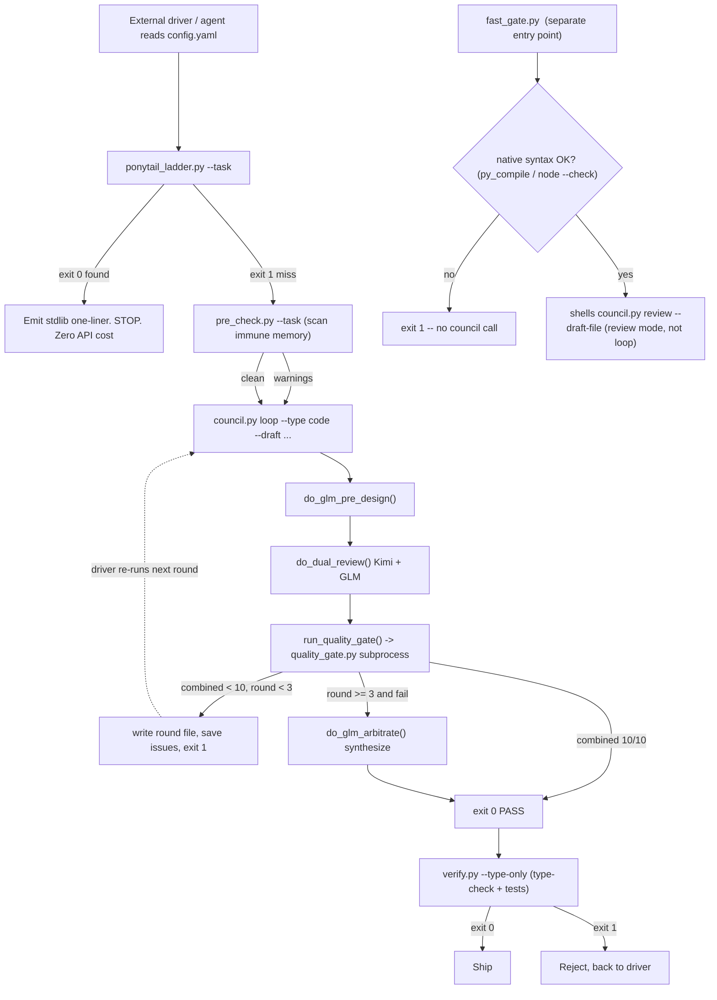
```mermaid
flowchart TD
    A["External driver / agent reads config.yaml"] --> B["ponytail_ladder.py --task"]
    B -->|"exit 0 found"| Z["Emit stdlib one-liner. STOP. Zero API cost"]
    B -->|"exit 1 miss"| C["pre_check.py --task (scan immune memory)"]
    C -->|"warnings"| D["council.py loop --type code --draft ..."]
    C -->|"clean"| D
    D --> D1["do_glm_pre_design()"]
    D1 --> D2["do_dual_review() Kimi + GLM"]
    D2 --> D3["run_quality_gate() -> quality_gate.py subprocess"]
    D3 -->|"combined < 10, round < 3"| D4["write round file, save issues, exit 1"]
    D4 -.->|"driver re-runs next round"| D
    D3 -->|"round >= 3 and fail"| D5["do_glm_arbitrate() synthesize"]
    D3 -->|"combined 10/10"| E["exit 0 PASS"]
    D5 --> E
    E --> F["verify.py --type-only (type-check + tests)"]
    F -->|"exit 0"| G["Ship"]
    F -->|"exit 1"| H["Reject, back to driver"]
    FG["fast_gate.py <file> (separate entry point)"] --> FGS{"native syntax OK? (py_compile / node --check)"}
    FGS -->|"no"| FGF["exit 1 -- no council call"]
    FGS -->|"yes"| FGR["shells council.py review --draft-file (review mode, not loop)"]
```

### Handoff mechanic 1: how a draft crosses a process boundary

Because each stage is a separate process, the draft (the code or design under
review) must be *serialized across the boundary*. `council.py` supports **four
ingestion channels**, tried in a fixed priority order by `_read_draft`
(`council.py:821-846`):

```
function read_draft(args):
    if cached: return cache              # stdin is read-once; memoize it
    if args.draft:        return args.draft          # 1. inline --draft (highest priority)
    if args.draft_file:   return read(args.draft_file)  # 2. --draft-file path
    if DRAFT_FILE exists: return read(DRAFT_FILE)     # 3. shared temp file
    if stdin not a tty:   return stdin.read()         # 4. piped stdin
    error("no draft provided"); exit(1)
```

Channel 3 is the interesting one. `DRAFT_FILE` is a **well-known shared temp file**
whose path is discovered at import time by probing for a writable temp dir
(`council.py:52-68`):

```python
ROUND_FILE   = TMP / "onklaud-round.txt"
ISSUES_FILE  = TMP / "onklaud-issues.json"
DRAFT_FILE   = TMP / "onklaud-draft.txt"
```

On a typical Unix box `TMP` resolves to `/tmp`, so the contract is literally:
*write your draft to `/tmp/onklaud-draft.txt` and any council invocation will pick
it up with no flags at all.* This is a classic **blackboard** pattern — a fixed
rendezvous location that decouples the producer of the draft from the consumer.
It lets the driver stage a draft once and then run `review`, `dual`, and `loop`
against it without re-passing the text each time.

`--draft-file` is the same idea but with an explicit path, and it is exactly how
`fast_gate.py` hands a file to the council (see below). The priority ordering means
an explicit `--draft` always wins over the ambient temp file, so a caller can
override the blackboard when it wants to.

The stdin channel is guarded by a read-once cache (`_DRAFT_CACHE`,
`council.py:819`) because `sys.stdin.read()` drains the pipe — a second read would
return empty. This is a small but real correctness detail of building filters:
stdin is a consumable resource.

### Handoff mechanic 2: exit codes as the wire protocol

The processes do not share memory, a database, or a message bus. **The exit code is
the control signal.** Each script encodes a boolean verdict into `sys.exit(...)`,
and the driver branches on it:

- **Ladder** (`ponytail_ladder.py:256-269`): `run_ladder` returns `(result, code)`
  where `code` is `0` on any hit (stdlib/native/dep) and `1` on a miss. `main`
  then `sys.exit(code)`. A `0` tells the driver "solved, stop"; a `1` says
  "escalate to the models."
- **Council** (`council.py`): every `cmd_*` ends in `sys.exit(0 if ... passed else 1)`
  — e.g. `cmd_review` at `:609`, `cmd_gate` at `:624`, `cmd_full` at `:660`.
- **Quality gate** (`quality_gate.py:161`): `sys.exit(0 if result["passed"] else 1)`,
  where `passed = score >= 10`.
- **fast_gate** (`fast_gate.py:99`): `sys.exit(0 if all_passed else 1)`.
- **verify** (`verify.py:281-290`): `_summarize` returns `0` on all-pass (`:284`)
  and `1` on any failure (`:290`). Its module docstring reaches for a *ternary*
  contract — `0 = pass, 1 = fail, 2 = partial (tests unavailable but type-check OK)`
  (`verify.py:17`) — but the shipped `_summarize` never emits `2`: "skip"/
  unavailable results are treated as non-failing (the `skips` list at `:279` is
  computed but unused) and fold into the pass path. Verified live: `verify.py
  --type-only` on a project with no tests prints `ALL PASS: TypeCheck=skipped`
  and exits `0`, not `2`. So the "partial" code is documented-but-unimplemented;
  to a driver that only reads `$?`, verify is effectively binary today.

The council's `loop` mode adds a stateful twist: it is designed to be **re-invoked
by the driver once per round**, using two more temp files as a persistent cursor.
`read_round`/`write_round` (`council.py:534-550`) keep the current round number in
`/tmp/onklaud-round.txt`, and failed-round issues are journaled to
`/tmp/onklaud-issues.json` (`council.py:800-807`). On a failing round below the cap
it saves issues and exits `1`; the driver is expected to revise the draft and call
`loop` again, at which point `read_round` returns the incremented counter. On pass
or exhaustion it calls `clear_round_state` (`council.py:553`) to unlink both files.
So the loop's "memory" of where it is in the retry ladder lives entirely in the
filesystem between process invocations — the state machine is externalized.

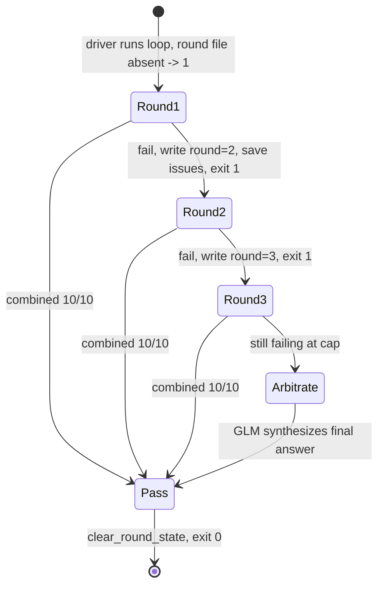
```mermaid
stateDiagram-v2
    [*] --> Round1: driver runs loop, round file absent -> 1
    Round1 --> Round2: fail, write round=2, save issues, exit 1
    Round2 --> Round3: fail, write round=3, exit 1
    Round3 --> Arbitrate: still failing at cap
    Round1 --> Pass: combined 10/10
    Round2 --> Pass: combined 10/10
    Round3 --> Pass: combined 10/10
    Arbitrate --> Pass: GLM synthesizes final answer
    Pass --> [*]: clear_round_state, exit 0
```

There is a wrinkle worth flagging inline: in the shipped code the **degraded**
path (no API key) still exits `0`. The live run below shows `passed: false` in the
JSON yet a `0` exit — `degraded_result` sets `passed=False` but the loop's
degraded branch finalizes without `sys.exit(1)`, so "the API was unreachable" and
"the code passed" become indistinguishable to a driver that only reads the exit
code. The *intent* — "degrade gracefully, don't hard-fail the pipeline when the
network is down" — is sound; the annotation is that the boolean verdict and the
exit code disagree here.

### Handoff mechanic 3: process-spawns-process

Two edges in the system are real `subprocess` calls rather than driver-mediated
sequencing, and they show the same filter discipline applied *inside* a script:

**council → quality_gate.** `run_quality_gate` shells the offline scorer as a child
process and parses its stdout JSON (`council.py:267-280`):

```python
result = subprocess.run(
    [sys.executable, str(gate_script), text, domain],
    capture_output=True, text=True, timeout=15,
    encoding="utf-8", errors="replace"
)
...
return json.loads(result.stdout.strip() or "{}")
```

The gate is deliberately a *separate* zero-API process so it can be run standalone
(`council.py gate` mode does exactly this), and council composes it as a library by
spawning it. The domain string (`code`/`architecture`/`general`) selects which
gates in `quality_gate.py`'s `GATE_REGISTRY` apply (`applicable = [g for g in
GATE_REGISTRY if g.domain in (domain, "all")]`), and the weighted score is
`(weighted_sum / total_weight) * 10`, rounded, with `passed = score >= 10`
(`quality_gate.py:146-148`) — a brutal all-or-nothing bar by design.

**fast_gate → council.** `fast_gate.py` is the clearest example of one entry point
delegating to another. It first does an instant native syntax check
(`node --check` or `python -m py_compile`, `fast_gate.py:19,22`) and only then
shells into the council for a semantic review (`fast_gate.py:32-35`):

```python
r = subprocess.run(
    ["python", COUNCIL, "review", "--type", "code", "--prompt", prompt, "--draft-file", filepath],
    capture_output=True, text=True, timeout=120, cwd=MY_DIR
)
```

Note the handoff channel: it passes the file via `--draft-file`, i.e. channel 2 of
`_read_draft`. `fast_gate` then does `json.loads(r.stdout)` expecting a JSON object
(`fast_gate.py:38`). This is a nice illustration of the composition model — but
also the place for a one-line "in the shipped code" note: `cmd_review` only emits
JSON when `--json` is passed (`council.py:608` calls `format_trace(..., args.json_output)`,
and `fast_gate` omits `--json`), so the default is the human trace line, and the
`json.loads` falls into its `except json.JSONDecodeError` fallback
(`fast_gate.py:44-46`), scoring the file `0/10`. **Blueprint note for your own
version:** when one CLI programmatically consumes another, make the *machine*
format the default (or have the parent always request it explicitly) — never let
the human-readable rendering be the thing a sibling process tries to `json.loads`.

### Where the outputs land (and where they leak)

The system writes to several fixed locations. Two are ephemeral cursors, two are
durable stores:

```
/tmp/onklaud-draft.txt    <- shared draft blackboard        (council.py:68)
/tmp/onklaud-round.txt    <- loop round cursor              (council.py:66)
/tmp/onklaud-issues.json  <- failed-round issue journal     (council.py:67)
<scriptdir>/scores.jsonl  <- append-only run metrics        (council.py:69)
<scriptdir>/immune_memory.json <- learned failure patterns  (council.py:70)
```

`record_score` appends one JSON line per run to `scores.jsonl` (`council.py:330-350`)
and `record_immune_memory` deduplicates failure fingerprints into
`immune_memory.json`, bumping a `frequency` counter on repeats (`council.py:290-323`).
`cmd_status` (`council.py:969`) is the read side of these stores: it reports pass
rate, average score, and stored immune patterns. `pre_check.py` is the *other*
reader of `immune_memory.json` — it fuzzy-matches a new task against stored patterns
before any code is written (`pre_check.py:36-42, 54-110`), closing the learning loop
conceptually: council *writes* failures, pre_check *reads* them to warn the next task.

The elegant intent here is a **self-reinforcing immune system**: every failed review
deposits an antibody, and every future task is screened against the antibody set for
free. The inline footnote is that the arbitration stage's actual *product* — GLM's
synthesized final answer, stored as `glm_synthesized` in the result
(`council.py:520`) — is only persisted to `--output` inside one narrow branch
(`council.py:789-790`); `_finalize_loop` otherwise writes the *original* draft back
to `--output`, not the improved synthesis (`council.py:864-866`). So the pipeline
computes a better answer than it returns. The *concept* — "arbitrate, then emit the
synthesis" — is right; the wire from synthesis to output is the part left dangling.

### Putting it together: one task, end to end

A driver implementing the intended machine would run, in pseudocode:

```
draft_task = "read a JSON config file"

# Step 0 — deterministic, free
if run("ponytail_ladder.py --task '{task}' --json").exit == 0:
    emit(stdout.solution); STOP        # 57% of tasks claimed to end here

# Step 0.5 — immune screen, free
warnings = run("pre_check.py --task '{task}' --json")   # exit 1 => proceed with caution

# Steps 1-5 — paid, stateful retry loop
write("/tmp/onklaud-draft.txt", generated_code)
loop:
    code = run("council.py loop --type code --prompt '{task}'").exit   # reads DRAFT_FILE
    if code == 0: break                 # passed or degraded
    revise(generated_code, read("/tmp/onklaud-issues.json"))  # round file auto-advances

# Step 6 — runtime proof
run("verify.py --type-only").exit == 0  or reject()
```

Every arrow between those `run(...)` calls is an **exit code plus a file on disk**.
That is the whole inter-process protocol. It is deliberately dumb, which is also why
it is portable: any orchestrator that can spawn a process, read `$?`, and read/write
`/tmp` can drive Onklaud 5. The design's real idea — *deterministic-cheap-stage
first, expensive-model-stage only on miss, filesystem as the bus, exit code as the
verdict* — is a clean, abstractable blueprint for a cost-aware multi-model pipeline,
independent of the specific wiring bugs in this particular build.

### Live demonstration

The measured block shows four real runs against `/tmp/onklaud-5`:

1. **Ladder hit** — `read json` matches the stdlib pattern, emits the one-liner,
   exits `0`.
2. **Ladder miss** — an unmatchable task returns `found:false` and exits `1`,
   telling the driver to escalate.
3. **Degraded council loop** (no API key) — every OpenRouter call returns `HTTP 401`,
   each stage falls to `degraded_result` (`score:7`), the trace shows the
   `Kimi(7/10) + GLM(7/10) = 7/10 avg` averaging, `passed:false` — yet the process
   exits `0` (the degraded-exit annotation above, observed live).
4. **fast_gate → syntax path** — a clean file passes (`exit 0`), a file with an
   unclosed paren fails the native `py_compile` gate (`exit 1`) before any council
   call is made.

The glue really is external: `grep -Ern "ponytail_ladder|pre_check|verify\.py|fast_gate"
council.py` returns no matches, and `grep -n "subprocess.run" council.py` reports a
single edge at `:268` (the `quality_gate.py` child) — confirming that the ladder→
council→verify ordering lives only in `config.yaml` and the driver, never in the
scripts themselves.

---

## The council round-loop as a formal state machine

`cmd_loop` (`council.py:698-816`) is the heart of Onklaud 5's "council" — the multi-model review pipeline. Read casually it looks like a linear script: read a round number, run some model calls, print a verdict. But its *shape* is more interesting than its statements. `cmd_loop` is one transition function of an **externally-driven finite state machine**. A single process invocation executes exactly **one** transition and then exits; the machine's memory lives in two files on disk; and the entity that advances the machine across transitions is not `cmd_loop` at all — it is the *orchestrator* (the coding agent) that revises the draft between invocations.

This section formalizes that machine: its states, its transition guards (quoted verbatim from the source), the persisted state that survives across process boundaries, and the crank-handle protocol that an outside driver must follow. The goal is to let you rebuild the concept cleanly — because the concept is genuinely elegant even where the shipped code fumbles the follow-through.

### 1. The core idea: a resumable review verdict, not a loop

The word "loop" in `cmd_loop` is a small lie that reveals the design. There is no `while` or `for` over rounds inside the function. Instead, the *round counter is a value read from disk at entry and written back at exit*:

```python
def read_round():
    """Read current loop round from ROUND_FILE. Default: 1."""
    try:
        if ROUND_FILE.exists():
            val = ROUND_FILE.read_text().strip()
            return max(1, int(val))
    except Exception:
        pass
    return 1
```
(`council.py:534-542`)

So the "loop" is spread across N separate process lifetimes. Each invocation:

1. **loads** the current round `r` from `ROUND_FILE` (default 1),
2. runs the review pipeline **once**,
3. **either** finalizes (verdict reached, state cleared) **or** persists `r+1` plus a list of issues and exits non-zero,
4. terminates.

Between step 3 and the next invocation, the orchestrator is expected to *read the issues, revise the draft, and re-run the same command*. The non-zero exit code is the signal "not done — fix and resubmit." A zero exit (via `_finalize_loop`) means "verdict reached — stop cranking."

This is the abstraction to take away: **the review round is a pure state transition `(round, issues, draft) -> (verdict | round', issues')`, made resumable by externalizing `round` and `issues` to the filesystem.** It is the same trick a build system uses with timestamp files, or a saga uses with a persisted step cursor — recast as a code-review controller.

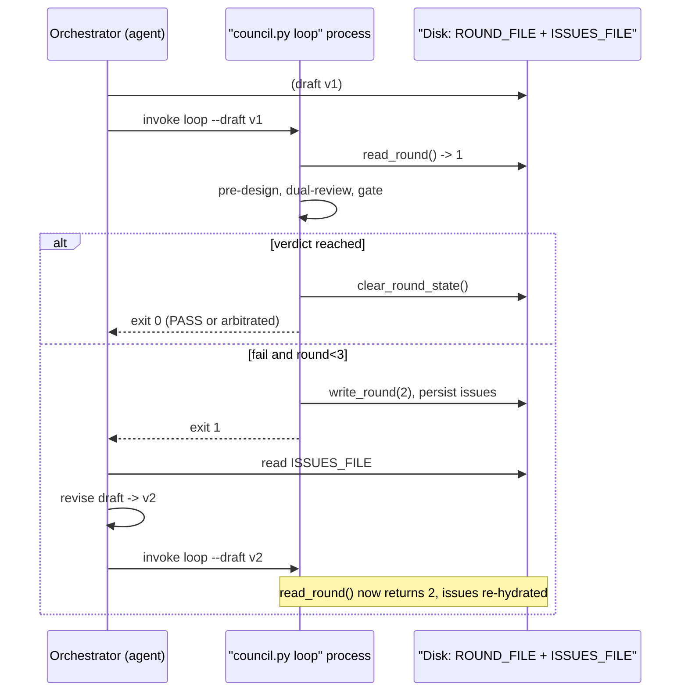
```mermaid
sequenceDiagram
    participant O as Orchestrator (agent)
    participant P as "council.py loop" process
    participant FS as "Disk: ROUND_FILE + ISSUES_FILE"
    O->>FS: (draft v1)
    O->>P: invoke loop --draft v1
    P->>FS: read_round() -> 1
    P->>P: pre-design, dual-review, gate
    alt verdict reached
        P->>FS: clear_round_state()
        P-->>O: exit 0 (PASS or arbitrated)
    else fail and round<3
        P->>FS: write_round(2), persist issues
        P-->>O: exit 1
        O->>FS: read ISSUES_FILE
        O->>O: revise draft -> v2
        O->>P: invoke loop --draft v2
        Note over P,FS: read_round() now returns 2, issues re-hydrated
    end
```

### 2. The states

The machine has one entry point and a small set of internal states, each of which either terminates the process or hands control back to the external driver. I name them here; the code does not, but every one corresponds to a distinct code region in `cmd_loop`.

| State | Meaning | Code region |
|---|---|---|
| **ENTRY** | Load round + re-hydrate prior issues | `council.py:700-719` |
| **ESCALATE_STALE** | Round already past 3 → jump straight to arbitration | `council.py:722-727` |
| **EVALUATE** | Run pre-design → dual-review → quality gate for this round | `council.py:730-749` |
| **DEGRADED_EXIT** | Dual-review API unreachable and not passing → bail | `council.py:737-741` |
| **PASS_TERMINAL** | Combined ≥ 10 ∧ review-pass ∧ gate-pass → finalize | `council.py:776-780` |
| **ARBITRATE_FINAL** | Failed on round ≥ 3 → forced GLM arbitration, terminal | `council.py:783-791` |
| **ADVANCE_EXIT** | Failed on round < 3 → persist next round + issues, exit 1 | `council.py:792-815` |

Four of these are *terminal for the whole machine* — PASS_TERMINAL, ARBITRATE_FINAL, ESCALATE_STALE, and DEGRADED_EXIT each finalize and exit 0. Three of them clear the on-disk state on the way out (PASS_TERMINAL, ARBITRATE_FINAL, DEGRADED_EXIT all call `clear_round_state()`); ESCALATE_STALE is the exception — it finalizes without clearing state, because its `round_num > 3` branch never touches `clear_round_state`. One — **ADVANCE_EXIT** — is terminal for the *process* but not the machine: it is precisely the handshake back to the external driver.

### 3. The transitions and their exact guards

Every transition is a plain Python `if`. Here they are, quoted, in evaluation order.

**Entry guard — stale round short-circuits to arbitration.** Before any model is called, a round counter greater than 3 means the machine has already exhausted its revision budget in a prior life, so it skips straight to synthesis:

```python
# If round > 3 (already exhausted), escalate immediately
if round_num > 3:
    print(f"  [loop] Round > 3, escalating to GLM arbitration...", file=sys.stderr)
    r, degraded = do_glm_arbitrate(draft, prompt, all_critiques)
    r["round"] = round_num
    _finalize_loop(r, degraded, review_type, prompt, args)
    return
```
(`council.py:722-727`)

**Re-hydration guard — prior critiques flow forward only from round 2 on.** The list `all_critiques` starts empty and is refilled from disk only when we are past the first round:

```python
if ISSUES_FILE.exists() and round_num > 1:
    try:
        prev = json.loads(ISSUES_FILE.read_text(encoding="utf-8"))
        if prev.get("critiques"):
            all_critiques = prev.get("critiques", [])
    except Exception:
        pass
```
(`council.py:713-719`)

This is what makes arbitration on the final round a *synthesis over the whole history* rather than over a single round — the earlier rounds' critiques accumulate in `ISSUES_FILE` and are read back here.

**The per-round evaluation sequence.** Inside EVALUATE the machine runs three sub-steps in a fixed order — an architecture pre-sketch, a two-model review, and a deterministic quality gate — then folds them into one score:

```python
# === STEP 1: GLM PRE-DESIGN (NEW - GLM +30%) ===
pre_design, pre_degraded = do_glm_pre_design(draft, prompt)
...
# === STEP 2: DUAL REVIEW (Kimi + GLM both review - GLM +30%) ===
r, degraded = do_dual_review(draft, prompt)
if degraded and not r.get("passed"):
    r["round"] = round_num
    clear_round_state()
    _finalize_loop(r, True, review_type, prompt, args)
    return
# === STEP 3: Quality gate ===
g = run_quality_gate(draft, domain)
gate_score = g.get("score", 0)
review_score = r.get("score", 0)
combined = round((review_score + gate_score) / 2)
```
(`council.py:729-747`)

**The pass predicate — the machine's accept condition.** A round passes only if *all three* conditions hold. The averaged score must reach the ceiling, and *both* the review and the gate must independently vote pass:

```python
passed = combined >= 10 and r.get("passed", False) and g.get("passed", False)
```
(`council.py:749`)

Note how strict this is: `combined` is an average rounded to an integer, so `combined >= 10` effectively demands `review_score` and `gate_score` both near 10; and even a perfect 10/10 average is rejected if the gate's boolean `passed` is `False`. The score and the two booleans are three independent locks on the same door.

**Pass → terminal.** On accept, the machine clears its disk state (ending the "loop" for the driver) and finalizes:

```python
if passed:
    print(f"  [loop] Round {round_num} PASSED ({combined}/10)", file=sys.stderr)
    clear_round_state()
    _finalize_loop(result, False, review_type, prompt, args)
    return
```
(`council.py:776-780`)

**Fail on the last round → forced arbitration (terminal).** If the round fails *and* we are at or past round 3, there is no revision budget left, so the machine invokes GLM as an arbiter over the *entire* accumulated critique history and finalizes regardless of the arbiter's score:

```python
if round_num >= 3:
    print(f"  [loop] Round {round_num} failed ({combined}/10), GLM arbitration (3rd touchpoint)...", file=sys.stderr)
    arb_result, arb_degraded = do_glm_arbitrate(draft, prompt, all_critiques)
    arb_result["round"] = round_num
    arb_result["all_prior_critiques"] = all_critiques
    clear_round_state()
    if hasattr(args, 'output') and args.output and 'glm_synthesized' in arb_result:
        _save_output(arb_result['glm_synthesized'], args.output)
    _finalize_loop(arb_result, arb_degraded, review_type, prompt, args)
```
(`council.py:783-791`)

**Fail on an early round → advance and hand back to the driver.** This is the only non-terminal branch. The machine increments the round on disk, persists the combined issue list *and* the running critique list, prints the failing trace, and exits `1`:

```python
else:
    # Advance to next round
    next_round = round_num + 1
    write_round(next_round)
    combined_issues = r.get("issues", []) + g.get("issues", [])
    save_issues(combined_issues)
    try:
        ISSUES_FILE.write_text(json.dumps({
            "timestamp": datetime.now(timezone.utc).isoformat(),
            "issues": combined_issues,
            "critiques": all_critiques,
            "current_round": round_num,
            "next_round": next_round,
        }, indent=2, ensure_ascii=False), encoding="utf-8")
    except Exception:
        pass
    ...
    result["next_round"] = next_round
    record_score(result, review_type, prompt, False)
    print(format_trace(result, review_type, args.json_output))
    sys.exit(1)
```
(`council.py:792-815`)

Two things about this branch are load-bearing for the concept:

- **`write_round(next_round)` before `sys.exit(1)`** is what makes the *next* invocation land in a different state. The exit code and the persisted counter are the two halves of one message to the driver: "not done (code 1), resume at round N+1 (counter on disk)."
- **`ISSUES_FILE` is written twice** — first by `save_issues` (which writes `{timestamp, issues}`, `council.py:563-572`) and then immediately overwritten with the richer `{timestamp, issues, critiques, current_round, next_round}` payload. Only the second survives. The intended contract is that `ISSUES_FILE` is the *revision brief* the orchestrator reads to know what to fix, and simultaneously the *critique ledger* the machine reads back on the next round's re-hydration step.

### 4. State diagram

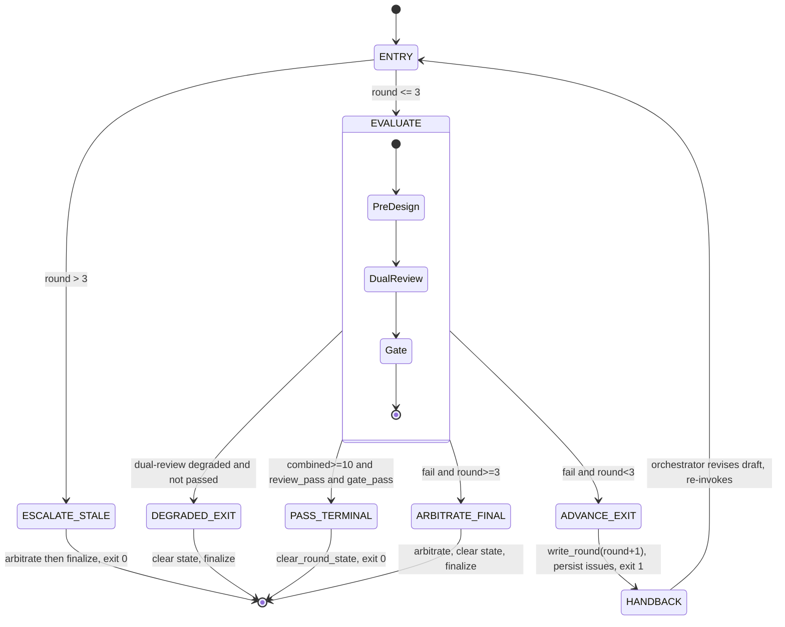
```mermaid
stateDiagram-v2
    [*] --> ENTRY
    ENTRY --> ESCALATE_STALE: round > 3
    ENTRY --> EVALUATE: round <= 3
    ESCALATE_STALE --> [*]: arbitrate then finalize, exit 0

    state EVALUATE {
        [*] --> PreDesign
        PreDesign --> DualReview
        DualReview --> Gate
        Gate --> [*]
    }
    EVALUATE --> DEGRADED_EXIT: dual-review degraded and not passed
    DEGRADED_EXIT --> [*]: clear state, finalize

    EVALUATE --> PASS_TERMINAL: combined>=10 and review_pass and gate_pass
    PASS_TERMINAL --> [*]: clear_round_state, exit 0

    EVALUATE --> ARBITRATE_FINAL: fail and round>=3
    ARBITRATE_FINAL --> [*]: arbitrate, clear state, finalize

    EVALUATE --> ADVANCE_EXIT: fail and round<3
    ADVANCE_EXIT --> HANDBACK: write_round(round+1), persist issues, exit 1
    HANDBACK --> ENTRY: orchestrator revises draft, re-invokes
```

The dashed conceptual edge is `HANDBACK --> ENTRY`: it does not exist in code. It is realized by the *process exiting* and *something outside re-running the command*. That external edge is the whole point of the design.

### 5. Transition table

| From | Guard (verbatim location) | Action | To | Process exit |
|---|---|---|---|---|
| ENTRY | `round_num > 3` (`:722`) | `do_glm_arbitrate` over re-hydrated critiques, finalize (no state clear) | ESCALATE_STALE → end | 0 |
| ENTRY | `ISSUES_FILE.exists() and round_num > 1` (`:713`) | re-hydrate `all_critiques` from disk | EVALUATE | — |
| ENTRY | else (`round<=3`) | proceed | EVALUATE | — |
| EVALUATE | `degraded and not r.get("passed")` (`:737`) | clear state, finalize degraded | DEGRADED_EXIT → end | 0 |
| EVALUATE | `combined>=10 and review_pass and gate_pass` (`:749`,`:776`) | `clear_round_state`, finalize | PASS_TERMINAL → end | 0 |
| EVALUATE | fail ∧ `round_num >= 3` (`:783`) | arbitrate over all critiques, clear state, finalize | ARBITRATE_FINAL → end | 0 |
| EVALUATE | fail ∧ `round_num < 3` (`:792`) | `write_round(round+1)`, persist issues+critiques, print trace | ADVANCE_EXIT → HANDBACK | 1 |

### 6. Persisted state — the machine's memory

The FSM keeps exactly two facts between lives, both under `TMP` (`council.py:66-67`):

- **`ROUND_FILE` (`onklaud-round.txt`)** — a single plain integer, the round cursor. Written raw with `ROUND_FILE.write_text(str(round_num))` (`council.py:545-550`), read back with the clamp `max(1, int(val))` and a default of 1 on any error or absence (`council.py:534-542`). The clamp means a corrupt or negative value degrades safely to "round 1," never to a negative or zero round. This is the entire persistent control state — the FSM's program counter is one integer in a text file.
- **`ISSUES_FILE` (`onklaud-issues.json`)** — the JSON revision brief *and* critique ledger. On the advance branch it holds `{timestamp, issues, critiques, current_round, next_round}` (`council.py:801-807`); it is re-hydrated at entry when `round_num > 1` (`council.py:713-719`) so critiques compound across rounds.

`clear_round_state` erases both on any terminal outcome that calls it, resetting the machine for the next unrelated task:

```python
def clear_round_state():
    """Remove round and issues temp files on success."""
    for fn in [ROUND_FILE, ISSUES_FILE]:
        try:
            if fn.exists():
                fn.unlink()
        except Exception:
            pass
```
(`council.py:553-560`)

I exercised this persisted-state layer directly (it is pure and free of API calls) — see **measured** for the real transcript showing `read_round()` defaulting to 1, `write_round(2)` landing `'2'` on disk, `write_round(4)` tripping the `round_num > 3` entry guard, `ISSUES_FILE` round-tripping its issue list, and `clear_round_state` returning the machine to the default state.

### 7. Faithful pseudocode

This distills `cmd_loop` to the transition function, language-agnostic. It is faithful to control flow and guards; model calls are shown as opaque steps.

```
function COUNCIL_ROUND(draft, prompt, type):        # ONE process invocation
    domain    := type in {code, architecture} ? type : "general"
    round     := READ_ROUND()                       # disk; default 1, clamped >=1
    critiques := []

    if ISSUES_FILE exists and round > 1:            # re-hydrate ledger
        critiques := load(ISSUES_FILE).critiques or []

    # --- ENTRY GUARD: stale round -> immediate arbitration (no state clear) ---
    if round > 3:
        r := GLM_ARBITRATE(draft, prompt, critiques)
        FINALIZE(r); EXIT 0

    # --- EVALUATE: pre-design -> dual review -> gate ---
    pre := GLM_PRE_DESIGN(draft, prompt)            # result folded into critique record
    (r, degraded) := DUAL_REVIEW(draft, prompt)     # Kimi + GLM, scores averaged
    if degraded and not r.passed:
        CLEAR_STATE(); FINALIZE(r); EXIT 0          # DEGRADED_EXIT

    g        := QUALITY_GATE(draft, domain)         # deterministic subprocess
    combined := round((r.score + g.score) / 2)
    passed   := combined >= 10 and r.passed and g.passed

    append {round, r.score, g.score, r.critique, r.issues+g.issues, pre} to critiques

    # --- ACCEPT ---
    if passed:
        CLEAR_STATE(); FINALIZE(result); EXIT 0     # PASS_TERMINAL

    # --- REJECT ---
    if round >= 3:                                   # ARBITRATE_FINAL
        arb := GLM_ARBITRATE(draft, prompt, critiques)
        CLEAR_STATE(); FINALIZE(arb); EXIT 0
    else:                                            # ADVANCE_EXIT -> HANDBACK
        WRITE_ROUND(round + 1)
        persist ISSUES_FILE = {issues, critiques, current_round: round, next_round: round+1}
        PRINT_TRACE(result)
        EXIT 1                                       # signal driver: revise + re-invoke

# The driver (orchestrator), NOT this function:
function DRIVE(draft, prompt, type):
    loop:
        code := run COUNCIL_ROUND(draft, prompt, type)
        if code == 0: break                          # verdict reached
        issues := load(ISSUES_FILE).issues
        draft  := REVISE(draft, issues)              # agent edits the draft
```

### 8. Why this shape is elegant — and where the shipped code drops a stitch

The design has three properties worth stealing:

1. **Crash-resilience for free.** Because the only cross-round state is two small files, the loop survives a killed process, a machine reboot, or the orchestrator itself being a different process each time. Re-invoking simply reads the counter and continues. A conventional in-memory `while round <= 3` loop has none of this.
2. **Bounded escalation with a synthesis backstop.** The round budget is 3 (`round < 3` advances, `round >= 3` arbitrates). The machine never spins forever; it always terminates in one of the accept/arbitrate states. Arbitration is the "give the best synthesis we can" fallback rather than a hard failure — a graceful ceiling.
3. **Separation of critic and reviser.** `cmd_loop` only ever *critiques* and *records*; it never edits the draft. Revision is the driver's job. This clean split is what lets the same binary serve as a one-shot gate (`cmd_full`, `cmd_dual`) and as a resumable loop.

Where the shipped implementation diverges from the idealized machine — noted inline, as footnotes to the concept, not the focus:

- **The pre-design output is computed but discarded from the decision.** `do_glm_pre_design` runs first (`council.py:730`) and its critique is stored into the critique record (`council.py:758`), but its score never enters the `passed` predicate — only `review_score` and `gate_score` do (`council.py:747-749`). In the intended design GLM's architecture sketch would inform the reviewers; in the shipped code it is advisory metadata.
- **`_finalize_loop` writes the *original* draft to `--output`, not the arbitrated synthesis.** In the ARBITRATE_FINAL branch the code does save `arb_result['glm_synthesized']` explicitly (`council.py:789-790`), but `_finalize_loop` then re-reads and re-saves the *original* draft over `--output` (`council.py:864-866`). The intended artifact is the synthesized answer; in the shipped code the un-revised input is the last writer on *every* path that reaches `_finalize_loop` with `--output` set — in the arbitration branch it even overwrites the synthesis that line 790 saved one step earlier.
- **The critique ledger is effectively write-mostly across a real driver.** Re-hydration at `council.py:713` only fires when the *same* `ISSUES_FILE` persists between invocations — which requires the driver to re-run without clearing `TMP`. The mechanism is sound, but nothing in the shipped repo (no wrapper script; only `README`/`QUICKSTART` prose show single invocations) actually performs the revise-and-re-invoke drive, so in practice the compounding-critique feature is exercised only if an external agent implements the `DRIVE` loop above.

None of these dull the concept. The abstraction to carry away is the star: **model a bounded, escalating review as a stateless transition function whose only memory is a round cursor and a critique ledger on disk, driven from outside by whoever owns the draft.** Rebuild that faithfully — wire the pre-design score into the predicate, emit the synthesis as the artifact, and ship the driver loop — and you have the machine Onklaud 5 is reaching for.

---

## Algorithm catalogue — the core routines as clean pseudocode

Part I walked the pipeline end-to-end and hunted its bugs. This section does the opposite: it treats each core routine as a *design*, describes the idealized machine the code is reaching for, gives a real-code anchor, and then restates it as faithful, language-agnostic pseudocode you could reimplement in any language. Where the shipped code diverges from the intended machine, that divergence is noted inline as a footnote — the concept is the star.

The system is five cooperating algorithms:

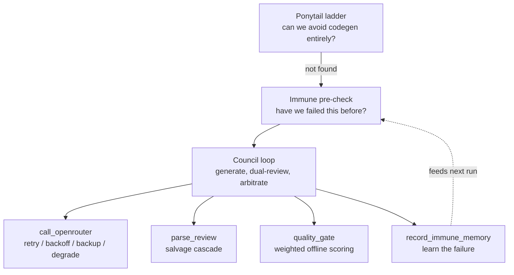
```mermaid
flowchart TD
    A["Ponytail ladder<br/>can we avoid codegen entirely?"] -->|not found| B["Immune pre-check<br/>have we failed this before?"]
    B --> C["Council loop<br/>generate, dual-review, arbitrate"]
    C --> D["call_openrouter<br/>retry / backoff / backup / degrade"]
    C --> E["parse_review<br/>salvage cascade"]
    C --> F["quality_gate<br/>weighted offline scoring"]
    C --> G["record_immune_memory<br/>learn the failure"]
    G -.->|feeds next run| B
```

Three of the five (ladder, pre-check, gate) are **zero-API, offline, deterministic filters** — the intended shape is a cheap local filter *in front of* the expensive LLM council, so most work never reaches a paid model. (`parse_review` is also offline and deterministic, but it is a robustness adapter rather than a filter.) That framing — a ladder of ever-cheaper checks with the network as the last resort — is the conceptual spine worth stealing.

---

### (a) Ponytail resolution — the "don't write code if you don't have to" ladder

**Intent.** Before spending a single token, ask: can this task be satisfied by something that already exists? The ladder codifies a preference order — *standard library ▶ native platform primitive ▶ a dependency the project already vendors ▶ (only then) custom code* — and returns the **shortest** solution that works. It is a miniature expert system: a hand-built knowledge base of `pattern → solution` facts, matched by set logic.

**Language detection.** The first rung decides *which* knowledge base to consult, by cheap keyword sniffing over the task text, then falling back to project-file fingerprints:

> ```python
> def detect_language(task, project_dir=None):
>     task_lower = task.lower()
>     if any(kw in task_lower for kw in ["python", ".py", "django", "flask", "fastapi"]):
>         return "python"
>     if any(kw in task_lower for kw in ["javascript", "typescript", "node", "react", ...]):
>         return "js"
>     if project_dir:
>         root = Path(project_dir)
>         if (root / "package.json").exists():
>             return "js"
>         if (root / "requirements.txt").exists() or ...:
>             return "python"
>     return "python"
> ```
> — `ponytail_ladder.py:94`

**The matching primitive: word-subset containment.** Every rung shares one trick. A stored pattern like `"read json"` is treated as a *set of words*; the task is treated as a *set of words*; the pattern matches iff `pattern_words ⊆ task_words`:

> ```python
> def check_stdlib(task, lang):
>     patterns = STDLIB_PATTERNS[lang]
>     task_words = set(task.lower().split())
>     for pattern, solution in patterns.items():
>         pattern_words = set(pattern.split())
>         if pattern_words.issubset(task_words):        # all pattern words present
>             return {"level": "stdlib", "solution": solution, ...}
>     return None
> ```
> — `ponytail_ladder.py:116-131`

`issubset` is elegant because it is **order- and filler-insensitive**: "how do I read a json blob" still matches `"read json"` (the extra words "how", "a", "blob" don't block a subset test). I verified this — see *measured*. `check_native` (`:133`) is the identical algorithm over an HTML/CSS knowledge base (`<input type="date">`, `prefers-color-scheme`, `<dialog>`), and `check_existing_dep` (`:144`) is a two-key variant: it parses `package.json`/`requirements.txt`, then fires if *the dependency is installed* **and** *any task keyword is present* — e.g. `axios` installed + task mentions "http".

**Rung order.** `run_ladder` is the state machine that tries each rung and short-circuits on the first hit:

> ```python
> def run_ladder(task, project_dir=None, lang=None):
>     if not lang: lang = detect_language(task, project_dir)
>     result = check_stdlib(task, lang)      # rung 1
>     if result: result["found"]=True; return result, 0
>     result = check_native(task)            # rung 2
>     if result: result["found"]=True; return result, 0
>     if project_dir:
>         result = check_existing_dep(task, project_dir)   # rung 3
>         if result: result["found"]=True; return result, 0
>     return {"found": False, "reason": "...requires custom implementation", ...}, 1
> ```
> — `ponytail_ladder.py:213`

Language-agnostic pseudocode:

```
FUNCTION run_ladder(task, project_dir, lang):
    lang ← lang OR detect_language(task, project_dir)

    # rung 1 — standard library
    FOR (pattern, solution) IN STDLIB_KB[lang]:
        IF words(pattern) ⊆ words(task):
            RETURN found(level="stdlib", solution), exit=0

    # rung 2 — native platform primitive (HTML/CSS)
    FOR (pattern, solution) IN NATIVE_KB:
        IF words(pattern) ⊆ words(task):
            RETURN found(level="native", solution), exit=0

    # rung 3 — dependency already in the project
    IF project_dir EXISTS:
        deps ← parse(package.json | requirements.txt)
        FOR (dep, keywords) IN DEP_KB:
            IF dep IN deps AND any(kw IN task FOR kw IN keywords):
                RETURN found(level="existing_dep", dep), exit=0

    # rung 4 — fall through: caller must generate custom code
    RETURN not_found(suggestion="1 line > 1 function > 1 file > 1 module"), exit=1
```

The exit code *is* the API: `0` means "resolved cheaply, skip the council"; `1` means "escalate". A caller shells out and branches on `$?`.

> **Divergence footnote.** The KB is tiny and English-hardcoded, so recall is low: any phrasing that doesn't contain *both* words of a pattern (`"parse a JSON document"` misses `"read json"`, because "read" is absent) falls through to rung 4. The match is exact whole-word set containment — no stemming — so even `"reads json"` would miss. `detect_language` also defaults to Python on no signal, so an ambiguous JS task can be matched against the wrong KB. These are *coverage* limits of a hand-built expert system, not logic errors — the machine is sound; the fact base is small.

---

### (b) Quality-gate weighted scoring — a severity-weighted rubric compiled from decorators

**Intent.** Provide an *offline, deterministic* second opinion on an output's quality, so the council doesn't rely solely on an LLM grading itself. The design is a classic **weighted rubric**: a set of independent checks ("gates"), each tagged with a *severity* (how much it counts) and a *domain* (when it applies). Score = fraction of severity-weight passed, scaled to 10.

**Gates as a plugin registry.** Gates self-register via a decorator, so adding a rule is one function — a nice extensibility pattern:

> ```python
> GATE_REGISTRY = []
> def gate(name, severity, domain="all"):
>     def decorator(fn):
>         GATE_REGISTRY.append(Gate(name, severity, fn, domain))
>         return fn
>     return decorator
>
> @gate("ErrorHandling", "blocker", "coding")
> def chk_error_handling(output, ctx):
>     issues = []
>     if "async" in output and "try" not in output and "catch" not in output and "except" not in output:
>         issues.append("Async operations should have error handling (try/catch)")
>     return GateResult("ErrorHandling", len(issues) == 0, issues)
> ```
> — `quality_gate.py:13-33`

Each gate is a pure predicate over `(output, ctx)` returning `passed: bool` + human-readable `issues`. Severity maps to an integer weight:

> ```python
> SEVERITY_WEIGHT = {"blocker": 3, "critical": 2, "warning": 1}
> ```
> — `quality_gate.py:129`

**The scorer.** `score_output` filters the registry by domain, runs each applicable gate, and computes a weighted pass ratio:

> ```python
> def score_output(output, domain="general"):
>     applicable = [g for g in GATE_REGISTRY if g.domain in (domain, "all")]
>     total_weight = 0; weighted_sum = 0
>     for gate in applicable:
>         result = gate.check(output, ctx)
>         w = SEVERITY_WEIGHT.get(gate.severity, 1)
>         total_weight += w
>         if result.passed: weighted_sum += w
>     raw_score = (weighted_sum / total_weight) * 10
>     score = round(raw_score)
>     passed = score >= 10
>     return {"score": score, "passed": passed, ...}
> ```
> — `quality_gate.py:131-152`

Language-agnostic pseudocode:

```
FUNCTION score_output(output, domain):
    applicable ← [ g IN GATE_REGISTRY WHERE g.domain ∈ {domain, "all"} ]
    total_weight ← 0
    weighted_sum ← 0
    FOR g IN applicable:
        r ← g.check(output)
        w ← SEVERITY_WEIGHT[g.severity]      # blocker=3, critical=2, warning=1
        total_weight += w
        IF r.passed: weighted_sum += w
    IF total_weight == 0: RETURN {score: 10, passed: true}
    raw    ← (weighted_sum / total_weight) * 10
    score  ← round(raw)
    passed ← (score ≥ 10)                     # note: perfection required
    RETURN {score, passed, gates, issues}
```

Two deliberate design choices are worth internalizing:

1. **Domain filter (`g.domain in (domain, "all")`).** `"all"` gates are structural (does the output have depth, closed code fences) and always run; domain-specific gates (`coding`, `architecture`) only run in their context. This lets one rubric serve code review *and* architecture review without cross-firing irrelevant checks. I confirmed the partition empirically (*measured*): `general → {ExcellenceThreshold, Clarity}`, `coding → 7 gates`, `architecture → 5 gates`.

2. **`passed = score >= 10` — pass means *perfect*.** Because the score is a rounded weighted ratio out of 10, "passed" requires *every* weighted gate to pass (any single blocker failure drags the ratio below the round-to-10 boundary). The gate is intentionally a **ratchet**, not a curve: it exists to force iteration until flawless, which is why the council loops on it.

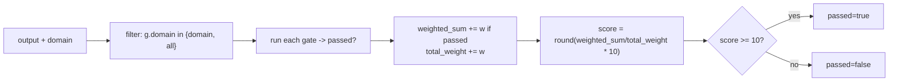
```mermaid
flowchart LR
    O[output + domain] --> F["filter: g.domain in {domain, all}"]
    F --> R["run each gate -> passed?"]
    R --> W["weighted_sum += w if passed<br/>total_weight += w"]
    W --> S["score = round(weighted_sum/total_weight * 10)"]
    S --> P{"score >= 10?"}
    P -->|yes| PASS[passed=true]
    P -->|no| FAIL[passed=false]
```

> **Divergence footnote (mis-wired domain).** The gates are tagged `"coding"`, but the council selects a domain with `domain = review_type if review_type in ("code","architecture")` (`council.py:637`, `:675`) — and its `--type` choices are literally `"code"`/`"architecture"` (`council.py:896`). Since `"code" ≠ "coding"`, the domain filter admits only the two `"all"` gates for code review; the five real coding gates never run. Architecture wiring *does* match (`"architecture" == "architecture"`). And in the loop path the gate is called with a hardcoded `"general"` (`council.py:508`) regardless of type. So the intended rubric is rich; the shipped wiring runs a two-gate stub for code. The *concept* — severity-weighted, domain-filtered, decorator-registered gates — is clean and reusable; only the string keys are crossed.

---

### (c) Immune memory — a self-reinforcing failure ledger

**Intent.** Give the system a memory of its own mistakes so it stops repeating them. This is modeled on an adaptive immune system: past failures leave "antibodies" (patterns); before generating, a **pre-check** scans the task against remembered patterns and raises warnings; after a failure, `record_immune_memory` deposits the new pattern (or reinforces an existing one). Over time frequent failure modes accumulate frequency and dominate the warnings.

**Recall side — fuzzy match + category matching.** Recall has two independent channels. First, a lightweight similarity: word-overlap of the task against a stored pattern, normalized by *pattern* length:

> ```python
> def fuzzy_match(text, pattern, threshold=0.4):
>     text_words = set(re.findall(r'\w+', text.lower()))
>     pattern_words = set(re.findall(r'\w+', pattern.lower()))
>     if not pattern_words: return 0.0
>     overlap = len(text_words & pattern_words) / len(pattern_words)
>     return overlap
> ```
> — `pre_check.py:44-52`

Dividing by `|pattern_words|` (not the union) makes this an **asymmetric containment score**: "how much of the remembered pattern does this new task cover?" — the right question when you want to know whether the new task *falls under* a known-bad pattern. (Note: the `threshold=0.4` default parameter is unused; the actual recall gate is `similarity > 0.3`.) Second, a taxonomy channel: fixed `FAILURE_CATEGORIES` (retry, type_safety, race_condition, …), each a keyword list. A warning fires only when *both* the task **and** a stored pattern hit the same category — a co-occurrence test that suppresses spurious matches. Warnings are deduped by category, and the count maps to a three-level score:

> ```python
> for category, keywords in FAILURE_CATEGORIES.items():
>     if any(kw in task_lower for kw in keywords):
>         if any(kw in pattern_lower for kw in keywords):   # BOTH sides hit category
>             warnings.append({"category": category, ...}); break
> ...
> score = "clean"
> if len(unique_warnings) >= 3:   score = "danger"
> elif len(unique_warnings) >= 1: score = "warning"
> ```
> — `pre_check.py:54-110`

**Store side — dedup-by-pattern, reinforce frequency.** Writing is a canonical upsert: serialize the issue list to a stable key (`sort_keys=True`, truncated to 200 chars), and either bump an existing entry's `frequency` or append a fresh one:

> ```python
> def record_immune_memory(issues):
>     if not issues: return
>     pattern_text = json.dumps(issues, ensure_ascii=False, sort_keys=True)[:200]
>     ...
>     for mem in memories:
>         if mem.get("pattern") == pattern_text:
>             mem["frequency"] = mem.get("frequency", 1) + 1
>             mem["last_seen"] = now
>             found = True; break
>     if not found:
>         memories.append({"timestamp": now, "last_seen": now,
>                          "pattern": pattern_text, "frequency": 1})
>     IMMUNE_FILE.write_text(json.dumps(memories, indent=2, ...))
> ```
> — `council.py:290-322`

Language-agnostic pseudocode for the full loop:

```
# ---- write path (after a failing review) ----
FUNCTION record_immune_memory(issues):
    IF issues empty: RETURN
    key ← truncate(canonical_json(issues, sorted=true), 200)
    mem ← load(IMMUNE_FILE) OR []
    IF exists e IN mem WHERE e.pattern == key:
        e.frequency += 1 ;  e.last_seen ← now
    ELSE:
        mem.append({pattern:key, frequency:1, timestamp:now, last_seen:now})
    save(IMMUNE_FILE, mem)

# ---- read path (before generating) ----
FUNCTION check_task(task):
    mem ← load(IMMUNE_FILE)
    warnings ← []
    FOR m IN mem:
        IF fuzzy_match(task, m.pattern) > 0.3:
            relevant.append(m)                       # similarity channel
        FOR (cat, kws) IN FAILURE_CATEGORIES:
            IF any(kw IN task FOR kw IN kws) AND any(kw IN m.pattern FOR kw IN kws):
                warnings.append(cat) ; break         # category co-occurrence
    warnings ← dedup_by_category(warnings)
    score ← "danger" IF |warnings| ≥ 3 ELSE "warning" IF |warnings| ≥ 1 ELSE "clean"
    RETURN {warnings, relevant, score}
```

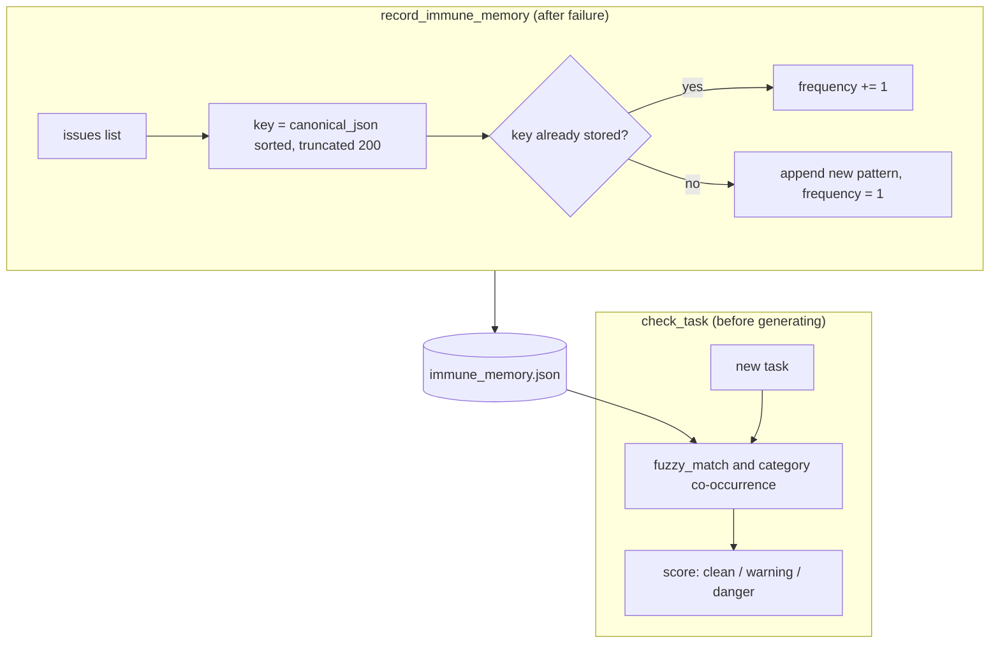
```mermaid
flowchart TD
    subgraph write["record_immune_memory (after failure)"]
        I[issues list] --> K["key = canonical_json sorted, truncated 200"]
        K --> U{"key already stored?"}
        U -->|yes| B["frequency += 1"]
        U -->|no| N["append new pattern, frequency = 1"]
    end
    write --> J[(immune_memory.json)]
    J --> R
    subgraph read["check_task (before generating)"]
        T[new task] --> R["fuzzy_match and category co-occurrence"]
        R --> SC["score: clean / warning / danger"]
    end
```

> **Divergence footnote (write-only in practice).** The ledger is faithfully *written* — the real `immune_memory.json` holds five entries — but the *recall* almost never fires, because of what gets stored. The write path serializes the reviewer's raw issue **sentences** ("Hardcoded 'hello' string…", "No error handling, logging, or validation…") as the pattern. The category channel then needs a `FAILURE_CATEGORIES` keyword to appear in *both* the task and that stored sentence; generic critique prose rarely contains tokens like `retry`/`429`/`race`. I confirmed this (*measured*): a task literally about "HTTP retry with backoff for 429 rate limit" scores **clean** against all five stored patterns. The elegant part — canonical-key dedup with frequency reinforcement, plus a dual recall channel — is intact; the mismatch is that the *stored key shape* (free-text critiques) and the *recall key shape* (category keywords) don't share vocabulary. A reimplementation should store patterns in the *same* controlled vocabulary the recall side searches (e.g. tag each failure with its category at write time), and the immune system comes alive.

---

### (d) `parse_review` — a salvage cascade for messy LLM JSON

**Intent.** Reviewer models are told to emit strict JSON, but reasoning models wrap it in prose, fence it in markdown, or get cut off mid-object by the token limit. Rather than fail on any deviation, `parse_review` is a **cascade of ever-more-desperate extraction strategies**, ordered cheapest-and-strictest first, most-lenient last. It is a graceful-degradation parser: each stage is a bet that the JSON is *slightly* more mangled than the last stage assumed.

> ```python
> def parse_review(raw):
>     if not raw:
>         return {"passed": False, "score": 0, "critique": "Empty response", ...}
>     # 1. direct parse
>     try:
>         result = json.loads(raw)
>         if "score" in result and "passed" in result: return result
>     except json.JSONDecodeError: pass
>     # 2. markdown-fenced json (```json ... ``` or ``` ... ```)
>     for pat in [r'```json\s*\n(.*?)\n\s*```', r'```\s*\n(.*?)\n\s*```']:
>         m = re.search(pat, raw, re.DOTALL)
>         if m: try json.loads(m.group(1)) ...
>     # 3. regex-locate a {...} object with passed+score (both key orders, two regexes)
>     m = re.search(r'\{[^{}]*"passed"\s*:\s*(?:true|false)[^{}]*"score"\s*:\s*\d+[^{}]*\}', raw, re.DOTALL)
>     # ... then the reverse: "score" ... "passed"
>     # 4. salvage truncated object by appending closers
>     salvage = raw.strip()
>     if salvage.startswith("{") and not salvage.endswith("}"):
>         for close_attempt in ["}]}", '"]}', '"]}', "}", '"}']:
>             candidate = salvage + close_attempt
>             try: result = json.loads(candidate); if "score" in result: return result
>             except json.JSONDecodeError: continue
>     return {"passed": False, "score": 0, "critique": "Failed to parse review response", ...}
> ```
> — `council.py:200-255`

Language-agnostic pseudocode:

```
FUNCTION parse_review(raw):
    IF raw is empty: RETURN default_fail("Empty response")

    # Stage 1 — it's already clean JSON
    TRY: obj ← json(raw);  IF has(obj,"score") AND has(obj,"passed"): RETURN obj

    # Stage 2 — it's fenced in markdown
    FOR fence IN [ ```json…``` , ```…``` ]:
        m ← first_match(fence, raw)
        TRY: obj ← json(m);  IF has(obj,"score") AND has(obj,"passed"): RETURN obj

    # Stage 3 — a bare {...} is buried in prose (two regexes, both key orders)
    FOR pat IN [ {…"passed"…"score":N…} , {…"score":N…"passed"…} ]:
        m ← regex(pat, raw)
        TRY: RETURN json(m)

    # Stage 4 — object was truncated mid-stream; brute-force a valid closer
    IF raw starts "{" AND NOT ends "}":
        FOR closer IN [ "}]}", "\"]}", "}", "\"}" ]:
            TRY: obj ← json(raw + closer);  IF has(obj,"score"): RETURN obj

    RETURN default_fail("Failed to parse review response", raw[:300])
```

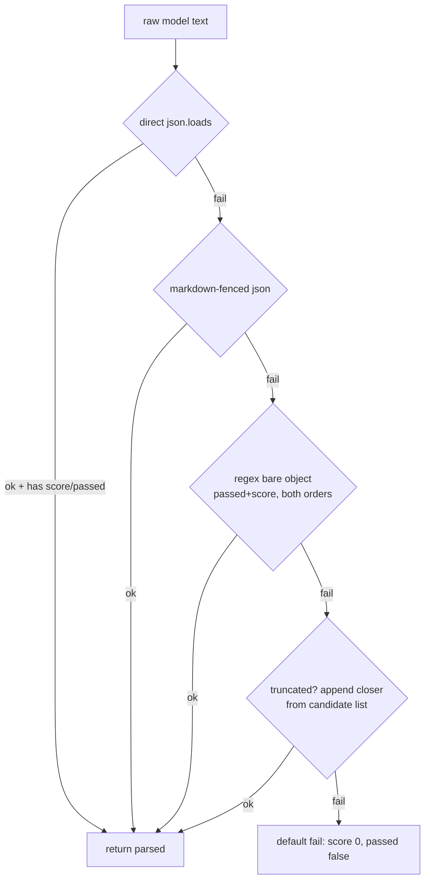
```mermaid
flowchart TD
    R[raw model text] --> S1{direct json.loads}
    S1 -->|ok + has score/passed| DONE[return parsed]
    S1 -->|fail| S2{markdown-fenced json}
    S2 -->|ok| DONE
    S2 -->|fail| S3{regex bare object<br/>passed+score, both orders}
    S3 -->|ok| DONE
    S3 -->|fail| S4{truncated? append closer<br/>from candidate list}
    S4 -->|ok| DONE
    S4 -->|fail| F["default fail: score 0, passed false"]
```

The design lesson: **never let a malformed LLM response crash the pipeline** — always terminate at a well-typed default (`score 0, passed false`) that the downstream loop treats as "not good enough, iterate again." The stage ordering encodes a probability model of *how* models mangle JSON. Note the schema guard is uneven: stages 1–2 require *both* `"score"` and `"passed"`, while stages 3–4 accept an object with just a matched shape / `"score"` present — a slightly looser bar for the more-desperate stages.

> **Divergence footnote.** Stage 4's closer list contains a duplicate (`'"]}'` appears twice) and the closers are a fixed guess at nesting depth, so deeply-truncated objects still fall through to the default fail. Harmless — the default is a valid terminal state — but it means "salvage" mostly rescues shallow truncations. The cascade *architecture* is the reusable idea.

---

### (e) `call_openrouter` — retry, backoff, backup-key, then degrade

**Intent.** The network is the one place the offline design must touch a paid API, so it is wrapped in the most defensive routine in the system. The intended machine is a **four-layer resilience ladder**: (1) retry transient failures, (2) with exponential backoff, (3) failing that, swap to a backup API key and retry the whole budget again, (4) failing *that*, return `None` so callers can enter a "degraded" mode rather than crash. Returning `None` (not raising) is the key design decision — it turns an outage into a *graceful degradation* the pipeline already knows how to handle.

> ```python
> def call_openrouter(model, prompt, max_tokens=2000, api_key=None, retries=2, reasoning=None):
>     key = api_key or OR_KEY
>     ...
>     if reasoning: payload["reasoning"] = reasoning
>     elif "kimi" in model.lower() or "glm" in model.lower():
>         payload["reasoning"] = {"effort": "high"}
>     last_error = None
>     for attempt in range(retries + 1):
>         try:
>             resp = urlopen(req, timeout=60)
>             content = data["choices"][0]["message"]["content"]
>             if content: return content
>             last_error = "Empty response from model"
>         except HTTPError as e:
>             last_error = f"HTTP {e.code}: {e.reason}"
>             if attempt < retries:
>                 time.sleep(2 ** attempt)   # exponential backoff: 1s, 2s, 4s...
>                 continue
>         except URLError as e: ... time.sleep(2 ** attempt); continue
>         except Exception as e: ... time.sleep(2 ** attempt); continue
>         # Try backup key on final primary attempt
>         if OR_KEY_BACKUP and key == OR_KEY:
>             key = OR_KEY_BACKUP
>             attempt = -1                    # reset retry counter for backup key
>             continue
>         elif OR_KEY_BACKUP and key == OR_KEY_BACKUP:
>             break                           # already tried backup, give up
>     print(f"  [api] OpenRouter unreachable after retries: {last_error}", file=sys.stderr)
>     return None
> ```
> — `council.py:137-195`

Note the auto-configuration touch: for reasoning models (`kimi`/`glm`) it opts into high reasoning effort unless the caller overrides — the resilience wrapper doubles as a per-model policy layer.

Language-agnostic pseudocode (the *intended* machine — see divergence footnote for what actually ships):

```
FUNCTION call_openrouter(model, prompt, retries=2):
    key ← primary_key
    payload ← {model, messages:[user(prompt)], max_tokens, temperature:0.1}
    IF model is a reasoning model: payload.reasoning ← {effort:"high"}

    attempt ← 0
    LOOP WHILE attempt ≤ retries:
        TRY:
            resp ← POST(endpoint, payload, auth=key, timeout=60s)
            content ← resp.choices[0].message.content
            IF content non-empty: RETURN content
            error ← "empty response"
        CATCH http/network/other AS e:
            error ← describe(e)
            IF attempt < retries:
                sleep(2 ^ attempt)          # exponential backoff
                attempt += 1 ; CONTINUE

        # exhausted retries on this key — escalate to backup key
        IF backup_key EXISTS AND key == primary_key:
            key ← backup_key
            attempt ← 0                      # fresh retry budget on backup
            CONTINUE
        ELSE:
            BREAK                             # backup also exhausted

    log("unreachable: " + error)
    RETURN None                              # signal: caller should degrade
```

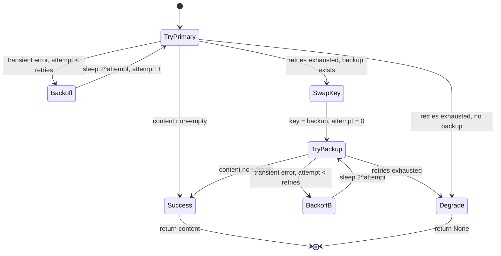
```mermaid
stateDiagram-v2
    [*] --> TryPrimary
    TryPrimary --> Success: content non-empty
    TryPrimary --> Backoff: transient error, attempt < retries
    Backoff --> TryPrimary: sleep 2^attempt, attempt++
    TryPrimary --> SwapKey: retries exhausted, backup exists
    SwapKey --> TryBackup: key = backup, attempt = 0
    TryBackup --> Success: content non-empty
    TryBackup --> BackoffB: transient error, attempt < retries
    BackoffB --> TryBackup: sleep 2^attempt
    TryBackup --> Degrade: retries exhausted
    TryPrimary --> Degrade: retries exhausted, no backup
    Success --> [*]: return content
    Degrade --> [*]: return None
```

**How degradation propagates.** `None` is not swallowed — every caller checks for it and substitutes a `degraded_result(...)`, and `do_review` returns a `degraded=True` flag alongside:

> ```python
> raw = call_openrouter(model, full_prompt, max_tokens=review_tokens)
> if raw is None:
>     return degraded_result(f"OpenRouter unreachable for {review_type} review"), True
> ```
> — `council.py:384-387`

That degraded flag rides through the whole loop into the score log (I can see `"degraded": true` rows in `scores.jsonl` from real offline runs — *measured* / *citations*), so the system records *when it was operating blind* rather than pretending the review happened. That auditability is the point of the whole design: the resilient wrapper doesn't hide failure, it *labels* it.

> **Divergence footnote (backoff bookkeeping).** The retry/backup logic sets `attempt = -1` (`council.py:188`) inside a `for attempt in range(retries + 1)` loop, but Python rebinds `attempt` from the `range` iterator on every pass, so the manual reset is silently ignored. Worse: in the common transient-error path (HTTP/network exception), the primary key's budget is only exhausted when `attempt == retries` — the *final* `range` value — so by the time the code swaps to the backup key and `continue`s, the iterator is already spent and the loop simply exits. The backup key is swapped in but **never actually retried**. Only a non-exception *empty-response* failure on a non-final attempt reaches the swap early enough for the backup key to fire at all, and even then it resumes at the tail of the shared counter, not a fresh budget. So the *intended* machine — a full, independent retry budget per key, as the `WHILE`-loop pseudocode and state diagram depict — is the elegant one, and is what a reimplementation should build with an explicit `while` loop; the shipped `for`-loop reset is the annotation. Either way the terminal behavior — return `None`, degrade, log it — is preserved, so the pipeline stays safe.

---

### Cross-cutting design abstraction — what to steal

Reading the five routines together, one architecture emerges: **a cost-ordered filter chain with a deterministic offline core and a single, heavily-guarded network boundary.**

| Routine | Cost | Determinism | Role in the chain | Reusable idea |
|---|---|---|---|---|
| Ponytail ladder | zero | deterministic | admission filter | preference-ordered KB, `⊆` matching, exit-code contract |
| Immune pre-check | zero | deterministic | risk filter | asymmetric containment + category co-occurrence + frequency reinforcement |
| Quality gate | zero | deterministic | acceptance filter | decorator-registered, severity-weighted, domain-filtered rubric; pass = perfect |
| `parse_review` | zero | deterministic | robustness adapter | strict→lenient salvage cascade to a typed default |
| `call_openrouter` | paid | non-deterministic | the *only* network hop | retry→backoff→backup-key→`None`, degradation is labeled not hidden |

The elegance is in the *layering*: three deterministic filters try to make the network call unnecessary or, when it happens, verifiable offline; the two adapters make the one unavoidable non-deterministic hop safe. To build your own version, keep that spine — cheap deterministic checks in front, one guarded boundary, every failure downgraded to a typed sentinel the next stage understands — and swap in richer knowledge bases, a shared controlled vocabulary between the immune write/read paths, correct domain keys, and an explicit `while`-loop retry budget per key.

---

## Persisted state, data structures & the JSON contracts between stages

Onklaud 5 is, mechanically, a **pipeline of small Python tools that hand JSON to one another**. No process stays alive across a run; instead, each stage reads its inputs from the filesystem or stdin, does one thing, prints a JSON object, and exits with a Unix status code. The whole "council" is glued together by four persisted artifacts (plus one transient stdin cache) and a handful of dict-shaped contracts that flow through function boundaries. This section is the interface spec: every artifact, every schema, a real on-disk example, and the reader/writer of each. If you wanted to reimplement Onklaud 5 in another language, this is the contract you would have to honor.

The design has a clear and rather elegant shape once you separate the four concerns it persists:

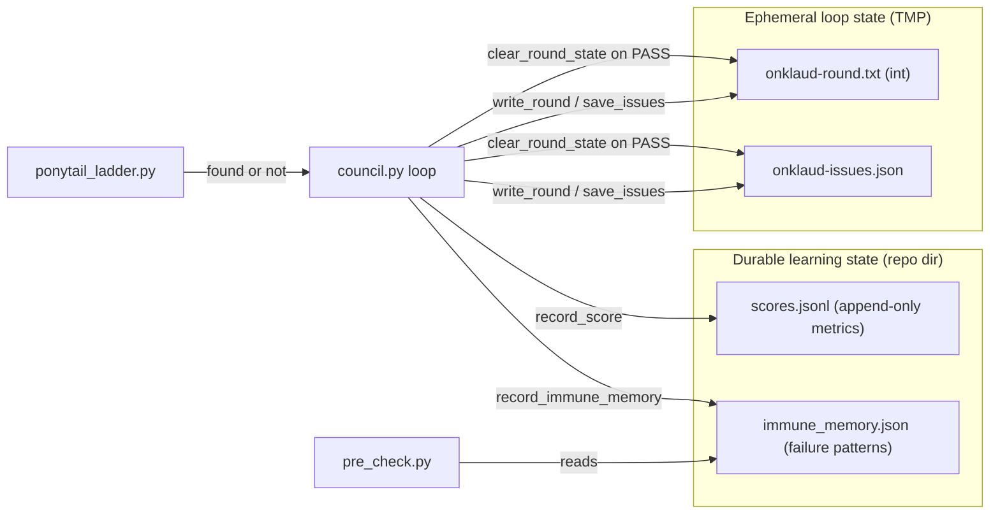
```mermaid
flowchart LR
  subgraph EPHEMERAL["Ephemeral loop state (TMP)"]
    R["onklaud-round.txt (int)"]
    I["onklaud-issues.json"]
  end
  subgraph DURABLE["Durable learning state (repo dir)"]
    S["scores.jsonl (append-only metrics)"]
    M["immune_memory.json (failure patterns)"]
  end
  L["ponytail_ladder.py"] -->|found or not| CO["council.py loop"]
  PC["pre_check.py"] -->|reads| M
  CO -->|write_round / save_issues| R & I
  CO -->|record_score| S
  CO -->|record_immune_memory| M
  CO -->|clear_round_state on PASS| R & I
```

The split is deliberate: **round/issues live in the OS temp dir** (cheap, disposable, cleared on success), while **scores and immune memory live next to the code** (durable, meant to accumulate across runs). Their locations are fixed at import time in `council.py:66-70`:

```python
ROUND_FILE = TMP / "onklaud-round.txt"
ISSUES_FILE = TMP / "onklaud-issues.json"
DRAFT_FILE = TMP / "onklaud-draft.txt"
SCORES_FILE = SCRIPT_DIR / "scores.jsonl"
IMMUNE_FILE = SCRIPT_DIR / "immune_memory.json"
```

`DRAFT_FILE` is a fifth, transient temp file — a stdin cache used to avoid double-reading a piped draft (`council.py:836-841`); it sits outside the four-artifact taxonomy and I don't discuss it further. I'll take the four persisted artifacts first, then the in-flight dict contracts, then the trace line and the config schema.

---

### 1. `immune_memory.json` — the failure-pattern store

**Concept.** The immune system is the most conceptually appealing idea in the codebase: every time a review scores a draft below the pass bar, the *list of issues that caused the failure* is fingerprinted and appended to a durable JSON array. Before any future run generates code, a separate scanner (`pre_check.py`) fuzzy-matches the new task against these fingerprints and warns "you've been burned here before." It is a zero-token, purely-lexical memory of past mistakes — a learned prior bolted onto a stateless pipeline.

**Schema.** An array of entries, each (`council.py:315-320`):

| field | type | meaning |
|---|---|---|
| `timestamp` | ISO-8601 str | when this pattern was first seen |
| `last_seen` | ISO-8601 str | updated every time the pattern recurs |
| `pattern` | str | `json.dumps(issues, ensure_ascii=False, sort_keys=True)[:200]` — a ≤200-char fingerprint of the issue list (see the ordering note below) |
| `frequency` | int | dedup counter, `+1` each time the identical fingerprint recurs |

**Real on-disk example** (`/tmp/onklaud-5/immune_memory.json`, first entry, verbatim):

```json
{
  "timestamp": "2026-07-03T15:20:33.434585+00:00",
  "last_seen": "2026-07-03T15:20:33.434585+00:00",
  "pattern": "[\"Does not implement dual review logic or any review-related behavior\", \"Hardcoded 'hello' string with no parameters, configuration, or user input\", \"No functions, classes, or return values, making th",
  "frequency": 1
}
```

**Writer** — `record_immune_memory(issues)` (`council.py:290-325`). The fingerprint is `pattern_text = json.dumps(issues, ensure_ascii=False, sort_keys=True)[:200]` (`council.py:295`). A subtlety worth flagging for a reimplementation: `sort_keys=True` sorts the *keys of JSON objects*, **not** the elements of a list — and `issues` is a list of strings, so the sort has no effect on it (verified empirically: `json.dumps(["zebra","apple"], sort_keys=True)` ≠ `json.dumps(["apple","zebra"], sort_keys=True)`). The fingerprint therefore **preserves the issue list's original order**, so two failures that raise the same issues in a *different* order produce *different* fingerprints and are **not** collapsed. Dedup fires only when a later failure yields a byte-identical (same-order, same-truncation) issue list, in which case `frequency` is bumped. The search is linear (`for mem in memories: if mem.get("pattern") == pattern_text`), then it either increments or appends the four-field entry. Faithful pseudocode:

```
function record_immune_memory(issues):
    if issues is empty: return
    fingerprint = json_dumps(issues, sort_keys=True)[:200]   # NB: sorts dict keys only; list order preserved
    memories = load(IMMUNE_FILE) or []
    for mem in memories:
        if mem.pattern == fingerprint:                       # exact, order-sensitive match
            mem.frequency += 1
            mem.last_seen = now()
            found = true; break
    if not found:
        memories.append({timestamp: now(), last_seen: now(),
                         pattern: fingerprint, frequency: 1})
    write_json(IMMUNE_FILE, memories)
```

**Reader.** This is where intent and shipped code interestingly diverge — but *in favor* of the design being more complete than a quick read suggests. The store is **not write-only**. There are two readers:

1. `pre_check.py` (`pre_check.py:36-110`) — `load_memory()` reads the whole array, and `check_task()` scores a new task against it two ways: a **fuzzy word-overlap** (`fuzzy_match`, `pre_check.py:44-52`) against each `pattern`, and a **category keyword match** against eight hardcoded `FAILURE_CATEGORIES` (retry, type_safety, cleanup, race_condition, …). It emits `{"warnings":[…], "relevant":[…], "score":"clean|warning|danger", "total_patterns":N}`. `frequency` is surfaced but, notably, *not weighted* into the danger score — the score is purely a count of distinct matched categories (`>=3 → danger`, `>=1 → warning`, `pre_check.py:99-103`).
2. `council.py` status command (`council.py:1005-1015`) prints the top-3 patterns with their frequencies.

**Where the shipped code footnotes the concept.** The config declares `immune_memory.record_threshold: 8` (`config.yaml:117`) — the intent being "only remember failures that were *close* to passing (score ≥ 8), so the memory captures subtle regressions, not garbage." But the shipped writer ignores it entirely: `do_review` calls `record_immune_memory` on *any* `score < 10 or not passed` (`council.py:397-400`), so the threshold constant is dead — `grep -rn record_threshold *.py` returns **no matches**; only `config.yaml:117` declares it, and no Python module reads it. The consequence is visible in the real store above: every fingerprint is `"frequency": 1` and every one is a bottom-of-the-barrel "hardcoded hello, no functions" failure. The learned prior is real and wired to a reader; it's just being fed noise because the quality filter the design called for was never connected. **Blueprint note:** gate the writer on the configured threshold (`if score >= record_threshold and not passed`) and let `pre_check` weight `frequency × similarity`, and this becomes the differentiating feature it was designed to be.

---

### 2. `scores.jsonl` — append-only metrics ledger

**Concept.** One JSON object per line, appended (never rewritten) after every review. This is the classic JSONL telemetry pattern: cheap to append under concurrency, trivially tailable, and reducible by later tools (`council.py:989-999` computes pass-rate and average by streaming the file). It is the run history that makes "pass rate 40%, avg 2.3/10" reportable without a database.

**Schema** (`record_score`, `council.py:333-344`):

| field | type | source |
|---|---|---|
| `timestamp` | ISO-8601 str | `datetime.now(utc).isoformat()` |
| `type` | str | `"code"` or `"architecture"` |
| `reviewer_model` | str | e.g. `"dual (kimi-k2.7+glm-5.2)"` |
| `review_score` | int | model review score 0–10 |
| `gate_score` | int | deterministic quality-gate score 0–10 |
| `final_score` | int | combined score (usually `round((review+gate)/2)`) |
| `passed` | bool | pipeline verdict |
| `prompt_preview` | str | `prompt[:100]` with newlines flattened to spaces |
| `degraded` | bool | true when the API was unreachable and a fallback score was used |
| `round` | int | which revision round produced this record |

**Real on-disk example** (`/tmp/onklaud-5/scores.jsonl`, one line, verbatim):

```json
{"timestamp": "2026-07-03T15:40:22.287641+00:00", "type": "code", "reviewer_model": "dual (kimi-k2.7+glm-5.2)", "review_score": 4, "gate_score": 2, "final_score": 3, "passed": false, "prompt_preview": "Test dual review", "degraded": false, "round": 0}
```

**Writer.** `record_score(result, review_type, prompt, degraded)` opens the file in append mode and writes exactly one `json.dumps(entry, ensure_ascii=False) + "\n"` (`council.py:345-347`). Every field is pulled with `result.get(key, default)`, so a malformed upstream result degrades to zeros rather than crashing — a deliberate robustness choice for a telemetry sink. I confirmed the exact shape by invoking the real function against a temp file (see `measured`): the record matches the on-disk lines field-for-field, including the newline-flattened `prompt_preview`.

**Reader.** The status command streams and reduces it (`council.py:991-999`), computing `pass rate` and `avg score`. Note `prompt_preview` is a lossy 100-char slice, so the ledger is metrics-grade, not replay-grade — you cannot reconstruct the original request from it.

---

### 3. `ROUND_FILE` and `ISSUES_FILE` — ephemeral loop state

**Concept.** The revision loop is a **state machine persisted across separate process invocations**. Because each `council.py` call is a fresh process, the loop counter and the accumulated critique cannot live in memory — they live in two temp files that the next invocation reads back. This is what lets an external orchestrator (a shell wrapper, or Claude driving the tool) run "review → revise → review" as discrete commands while the tool itself remembers where it is.

`ROUND_FILE` is deliberately the simplest possible artifact: a **plain integer as text**, nothing else.

```python
def read_round():                    # council.py:534-542
    if ROUND_FILE.exists():
        return max(1, int(ROUND_FILE.read_text().strip()))
    return 1
def write_round(round_num):          # council.py:545-550
    ROUND_FILE.write_text(str(round_num))
```

`ISSUES_FILE` has **two different shapes depending on who wrote it** — a wart worth flagging for a reimplementation. `save_issues` writes the *minimal* form (`council.py:566-569`):

```json
{"timestamp": "...", "issues": ["issue1", "issue2"]}
```

But the loop's failure branch writes a *richer* form to the same path (`council.py:801-807`):

| field | type | meaning |
|---|---|---|
| `timestamp` | ISO-8601 str | when the round failed |
| `issues` | str[] | combined Kimi + GLM issue lists |
| `critiques` | list | full critique objects accumulated so far |
| `current_round` | int | the round that just failed |
| `next_round` | int | `current_round + 1` |

**State-machine transitions.** The round file drives a bounded loop that escalates to GLM arbitration on the third failure:

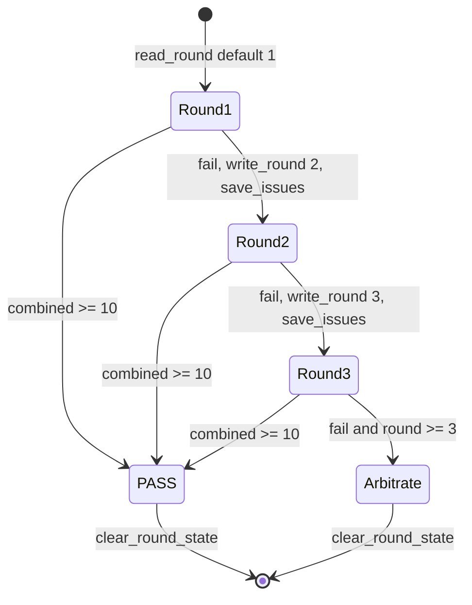
```mermaid
stateDiagram-v2
  [*] --> Round1: read_round default 1
  Round1 --> PASS: combined >= 10
  Round1 --> Round2: fail, write_round 2, save_issues
  Round2 --> PASS: combined >= 10
  Round2 --> Round3: fail, write_round 3, save_issues
  Round3 --> PASS: combined >= 10
  Round3 --> Arbitrate: fail and round >= 3
  Arbitrate --> [*]: clear_round_state
  PASS --> [*]: clear_round_state
```

Faithful pseudocode of the failure branch (`council.py:782-815`):

```
if round_num >= 3:
    arb = do_glm_arbitrate(draft, prompt, all_critiques)   # 3rd GLM touchpoint
    clear_round_state()                                     # delete ROUND + ISSUES
    finalize(arb)
else:
    next_round = round_num + 1
    write_round(next_round)                                 # persist counter
    save_issues(combined_issues)                            # minimal shape
    ISSUES_FILE.write_text({timestamp, issues, critiques,   # rich shape (overwrites)
                            current_round, next_round})
    record_score(result); exit(1)                           # nonzero = "revise me"
```

**On success**, `clear_round_state()` unlinks both files (`council.py:553-560`) — the temp state is meant to be transient and self-cleaning. The reader side lives at `council.py:713-717`, which — only when `round_num > 1` — reloads the prior `ISSUES_FILE` and pulls its `critiques` array into `all_critiques`, the running list handed to GLM on escalation. **Footnote to the concept:** `save_issues` at 798 and the rich write at 801 target the *same path back to back*, so the minimal shape is immediately clobbered by the rich shape; the minimal write is effectively dead — and doubly so, since the reader only consumes the `critiques` field, which only the rich shape carries. A reimplementation should pick one schema.

---

### 4. In-flight dict contracts (function-boundary JSON)

These never touch disk (except transiently), but they are the *wire format between stages* and every model is prompted to emit exactly these shapes. This is the part a reimplementer must get right, because the LLM prompts hard-code the JSON schema into the model instructions.

#### 4a. The review contract `{passed, score, critique, issues}`

The prompt literally embeds the schema the model must return (`council.py:97-98`):

```
Review this code. Be brutal and specific. Output ONLY valid JSON (no markdown, no backticks):
{"passed": bool, "score": 0-10, "critique": "one paragraph...", "issues": ["specific_issue1", ...]}
```

| field | type | consumed by |
|---|---|---|
| `passed` | bool | loop gate (`combined >= 10 AND r.passed AND g.passed`) |
| `score` | int 0–10 | averaged into `final_score` |
| `critique` | str | fed to GLM arbitration |
| `issues` | str[] | fingerprinted into immune memory; saved to `ISSUES_FILE` |

`parse_review` (`council.py:200-255`) is a five-strategy tolerant parser: direct `json.loads` → markdown-fenced block → regex for `{…"passed"…"score"…}` → reverse order → truncation-salvage for reasoning-model cutoffs. This tolerance is the right instinct — models wrap JSON in prose — but it also means an *empty or garbled* review silently becomes `{"passed": False, "score": 0, …}` — the empty-input fallback (`council.py:202-203`) or the unparseable-input fallback (`council.py:254-255`) — which then gets recorded as a real datapoint.

#### 4b. The pre-design contract `{approach, files_to_touch, risks, alternatives, complexity, stdlib_check}`

GLM's "touchpoint 1" sketches architecture before any code exists (`council.py:125-126`):

| field | type | meaning |
|---|---|---|
| `approach` | str | one-paragraph architecture sketch |
| `files_to_touch` | str[] | files the change would modify |
| `risks` | str[] | anticipated failure modes |
| `alternatives` | str[] | simpler approaches, if any |
| `complexity` | `"low"\|"medium"\|"high"` | effort estimate |
| `stdlib_check` | str | "can stdlib/native solve this with no new code?" — a second-opinion echo of the Ponytail ladder |

**Footnote to the concept:** the design is that pre-design *steers* generation. In the shipped `do_glm_pre_design` (`council.py:407-426`), the returned JSON is run through `parse_review` — which only recognizes objects carrying `passed`/`score`, so a well-formed pre-design object (which has neither) falls through every strategy to the `{"passed": False, "score": 0, "critique": "Failed to parse review response", …}` fallback (`council.py:254-255`). The rich fields (`approach`, `files_to_touch`, …) are thus discarded outright, and downstream the loop reads only `pre_design.get("critique")` — never the architecture. Wiring `approach` into the generator's context is the single highest-leverage fix here.

#### 4c. The two Ponytail ladder output contracts

The ladder is stage 0 — the "answer without an API call" filter. It returns one of two shapes.

**Found** — the found payload's fields vary by rung; this is the stdlib shape (`ponytail_ladder.py:129`, `140`, `176-180`):

```json
{"found": true, "level": "stdlib|native|existing_dep",
 "solution": "...", "language": "python", "pattern_matched": "read json"}
```

The `native` rung drops `language` (`{level, solution, pattern_matched}`), and the `existing_dep` rung carries `{level, dep, version}` with no `solution`/`language`/`pattern_matched`. Real outputs for all three `level`s are in `measured`.

**Not found** (`ponytail_ladder.py:238-243`):

```json
{"found": false, "reason": "Task requires custom implementation",
 "suggestion": "Use shortest possible implementation: 1 line > 1 function > 1 file > 1 module",
 "language": "python"}
```

The `found` flag is the branch key; the exit code mirrors it (`0 = found`, `1 = needs code`, verified below). The stdlib and native rungs match by a pure set-subset lexical test — `pattern_words.issubset(task_words)` (`ponytail_ladder.py:128`, `139`); the existing-dep rung instead uses a substring keyword match (`dep_name in deps and any(kw in task_lower …)`, `ponytail_ladder.py:175`). It is a four-rung ladder (stdlib → native HTML/CSS → existing project dep → give up).

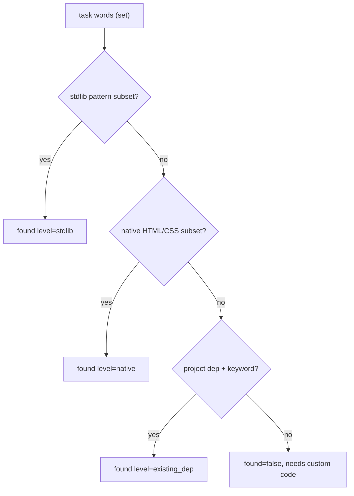
```mermaid
flowchart TD
  T["task words (set)"] --> S{"stdlib pattern subset?"}
  S -->|yes| RS["found level=stdlib"]
  S -->|no| N{"native HTML/CSS subset?"}
  N -->|yes| RN["found level=native"]
  N -->|no| D{"project dep + keyword?"}
  D -->|yes| RD["found level=existing_dep"]
  D -->|no| NF["found=false, needs custom code"]
```

---

### 5. The pipeline trace line

The trace line is the **human-facing summary of an entire run compressed to one string** — and, per the config's anti-bypass rule ("no trace → REJECT", `config.yaml:138`), the proof-of-work token that a real council ran. `format_trace` builds it (`council.py:594`):

```python
return f"[🎠→⚡K({review_score}/10)→🔮G→gate({gate_score}/10)] = {final_score}/10 {passed}{degraded}{escalated}"
```

Reading left to right it encodes the whole idealized pipeline: 🎠 Ponytail ladder → ⚡ Kimi review with its score → 🔮 GLM → deterministic gate with its score → the combined `final_score` and PASS/FAIL, with optional `[DEGRADED]`/`[ESCALATED]` suffixes. A real emitted line looks like `[🎠→⚡K(4/10)→🔮G→gate(2/10)] = 3/10 FAIL`. With `--json`, the same result dict is dumped with internal `_`-prefixed fields stripped (`council.py:580-582`) — so the trace and the JSON are two renderings of one underlying result dict, which is the clean way to do it.

---

### 6. `config.yaml` top-level structure

The config is the declarative description of the machine — six top-level keys, each mapping to one subsystem (`config.yaml`):

| key | shape | governs |
|---|---|---|
| `models` | list of `{name, provider, model_id, tier, cost_per_1k_*, max_tokens, role, strengths}` | the model roster: Kimi (primary coder/reviewer), GLM (architect/arbiter), DeepSeek (emergency fallback) |
| `pipeline` | `{steps: [ponytail_ladder, glm_pre_design, kimi_generate, dual_review, glm_arbitrate, quality_gate, verify]}` | the linear stage order + per-stage `model`/`max_tokens` |
| `council` | `{enabled, mandatory, stages: {ladder, classify, draft, review, revise, arbitrate, quality_gate, immune_memory}}` | the richer stage graph, incl. `revise.max_rounds: 3`, `quality_gate.weights {blocker:3x, critical:2x, warning:1x}`, `immune_memory.record_threshold: 8` |
| `routing` | `{strategy: ladder_first, primary, verify_primary, arbitrator}` | who plays which role |
| `verification` | `{max_tokens, skip_for: []}` | the type-check pass |
| `rules` | list of strings | the doctrine (ladder-first, gate 10/10 non-negotiable, "no trace → REJECT") |

One structural caveat for a reimplementer: **no runtime module actually reads `config.yaml`** — only `test_pipeline.py` loads it, and only to assert it is valid YAML. Every number the config declares is therefore *config-decoupled*: the pipeline hard-codes it in Python rather than reading it back. `council.quality_gate.threshold: 10` (`config.yaml:110`) reappears as the loop's `combined >= 10` and the gate's `score >= 10`; `council.revise.max_rounds: 3` (`config.yaml:102`) as `round_num >= 3`; and the gate `weights` as a hardcoded `SEVERITY_WEIGHT = {"blocker": 3, "critical": 2, "warning": 1}` in `quality_gate.py:129`, applied at `quality_gate.py:140-143`. So those three are behaviorally honored — their values are load-bearing — but editing the YAML would change nothing. The one genuinely dead declaration is `immune_memory.record_threshold: 8`: it has **no** counterpart in the code at all, and the "record only near-passes" gate it describes is never implemented (the writer records on any sub-perfect score).

---

### Contract summary table (the reimplementation checklist)

| artifact | path | shape | writer | reader |
|---|---|---|---|---|
| immune memory | `<repo>/immune_memory.json` | array of `{timestamp,last_seen,pattern,frequency}` | `record_immune_memory` (c.290) | `pre_check.py` (c.36), status (c.1007) |
| scores | `<repo>/scores.jsonl` | JSONL of 10-field metric | `record_score` (c.330) | status (c.991) |
| round | `$TMP/onklaud-round.txt` | plain int text | `write_round` (c.545) | `read_round` (c.534) |
| issues | `$TMP/onklaud-issues.json` | minimal *or* rich `{...,current_round,next_round}` | `save_issues` (c.563) / loop (c.801) | loop (c.713) |
| review | (in-flight) | `{passed,score,critique,issues}` | model → `parse_review` (c.200) | loop gate |
| pre-design | (in-flight) | `{approach,files_to_touch,risks,alternatives,complexity,stdlib_check}` | model (c.125) | *(discarded by `parse_review`)* |
| ladder | (stdout) | `{found,level,solution,language,pattern_matched}` (stdlib; native omits `language`, existing_dep uses `dep`/`version`) / `{found:false,reason,suggestion,language}` | `run_ladder` (c.213) | council + exit code |

---

## Prompt architecture — templates, output contracts, budgets & the effort matrix

This is the model-facing layer of Onklaud 5's council: the exact strings sent to the two backing models (Kimi for code, GLM for architecture/synthesis), the JSON *contracts* those strings demand back, and the per-stage *budgets* and reasoning-*effort* that shape each call. Everything lives in one file, `council.py` — four string templates, one HTTP client, one tolerant parser — which is what makes the design easy to abstract.

### The conceptual mechanism: a four-template pipeline over one client

Onklaud 5's council is a staged critique-and-synthesis loop:

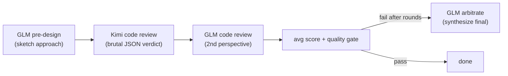
```mermaid
flowchart LR
  A["GLM pre-design<br/>(sketch approach)"] --> B["Kimi code review<br/>(brutal JSON verdict)"]
  B --> C["GLM code review<br/>(2nd perspective)"]
  C --> D["avg score + quality gate"]
  D -->|fail after rounds| E["GLM arbitrate<br/>(synthesize final)"]
  D -->|pass| F["done"]
```

| Template | Line | Model | Contract | Role |
|---|---|---|---|---|
| `REVIEW_PROMPT_CODE` | 97-104 | Kimi (code) / GLM (dual) | strict JSON verdict | grade a draft |
| `REVIEW_PROMPT_ARCH` | 106-113 | GLM | strict JSON verdict | grade a design |
| `GLM_PRE_DESIGN_PROMPT` | 125-132 | GLM | strict JSON design object | pre-plan |
| `GLM_ARBITRATE_PROMPT` | 115-123 | GLM | raw text, no JSON | fuse draft + critiques |

The elegance is the asymmetry: three templates demand machine-readable JSON (so the orchestrator can branch on `score`/`passed`), and exactly one — the arbiter — asks for raw prose, because its output is the deliverable, not a control signal. All four are `str.format()` templates; the JSON braces are doubled (`{{...}}`) so they survive formatting, and `{prompt}`/`{draft}`/`{critiques}` are the fill slots.

### Templates 1 & 2 — the review verdict contract

`REVIEW_PROMPT_CODE` (council.py:97-104):

```
Review this code. Be brutal and specific. Output ONLY valid JSON (no markdown, no backticks):
{{"passed": bool, "score": 0-10, "critique": "one paragraph explaining why this score and not higher", "issues": ["specific_issue1", "specific_issue2"]}}

Look for: bugs, logic errors, edge cases (null, empty, boundary), security issues (injection, auth, sanitization), race conditions, error handling gaps, type safety problems, performance pitfalls, and testability.

REQUEST: {prompt}

DRAFT: {draft}
```

`REVIEW_PROMPT_ARCH` (council.py:106-113) swaps the checklist for design concerns ("scaling bottlenecks, failure modes … single points of failure … data loss risks") but demands the same four-key JSON. **Consumed by** `do_review` (council.py:372-402), which selects model and template by `review_type` (council.py:374-375), parses via `parse_review`, then reads `result.get("score", 0)` / `result.get("passed", False)` (council.py:393-394) and records issues to immune memory when `score < 10` or the verdict is not `passed` (council.py:397-400). The pass bar is a perfectionist `>= 10`.

### Template 3 — the pre-design object contract

`GLM_PRE_DESIGN_PROMPT` (council.py:125-132):

```
You are the architecture designer. BEFORE any code is written, sketch the optimal approach. Output ONLY valid JSON (no markdown, no backticks):
{{"approach": "one paragraph describing the optimal architecture/approach", "files_to_touch": ["file1", "file2"], "risks": ["risk1", "risk2"], "alternatives": ["simpler_approach_if_applicable"], "complexity": "low|medium|high", "stdlib_check": "can this be solved with stdlib/native APIs without new code?"}}

Analyze the request and design the solution. Consider: simplicity first, existing code patterns, stdlib/native coverage, minimal new code.

REQUEST: {prompt}

DRAFT: {draft}
```

The intended contract is a design object (`approach`, `files_to_touch`, `risks`, `alternatives`, `complexity`, `stdlib_check`) that seeds and constrains later stages — a cheap `medium`-effort planning pass biasing the loop toward simplicity. **In the shipped code, this payload is fetched then discarded.** `do_glm_pre_design` (council.py:407-426) parses it with `parse_review` (council.py:419), whose success gate requires `"score"` and `"passed"` (council.py:208) — keys the pre-design contract never produces — so it always falls to the fallback and the design object lands in `issues[0]`. Downstream the loop reads only `pre_design.get("critique", ...)` (council.py:732, 758), a key never requested. The contract's real keys appear nowhere but the template literal (lines 125-126). A faithful re-implementation would give pre-design its own parser and thread `files_to_touch`/`complexity`/`stdlib_check` into the review prompt.

### Template 4 — the arbitration (raw-text) contract

`GLM_ARBITRATE_PROMPT` (council.py:115-123):

```
You are the final arbiter. Synthesize the absolute best answer combining the original draft with ALL critique feedback. Address every issue raised. Output ONLY the final improved response -- no markdown, no JSON wrapper, just the raw final answer.

ORIGINAL REQUEST: {prompt}

DRAFT: {draft}

CRITIQUES RECEIVED: {critiques}

FINAL SYNTHESIZED ANSWER:
```

Contract is raw text by design. **Consumed by** `do_glm_arbitrate` (council.py:486-529): the `{critiques}` slot is a numbered join of every prior round's critique + issues (council.py:488-492); the raw answer is scored by an external subprocess `run_quality_gate(raw, "general")` (council.py:508) with `passed = final_score >= 10` (council.py:511) and preserved as `glm_synthesized` (council.py:520, written out at 789-790). This is the one stage whose contract is enforced by a gate, not a parser.

### "Demand JSON, defend against drift"

Each JSON template opens with "Output ONLY valid JSON (no markdown, no backticks)," but models drift — fence in ```` ```json ````, prepend prose, or truncate at the token ceiling. `parse_review` (council.py:200-255) pairs the demand with a recovery ladder:

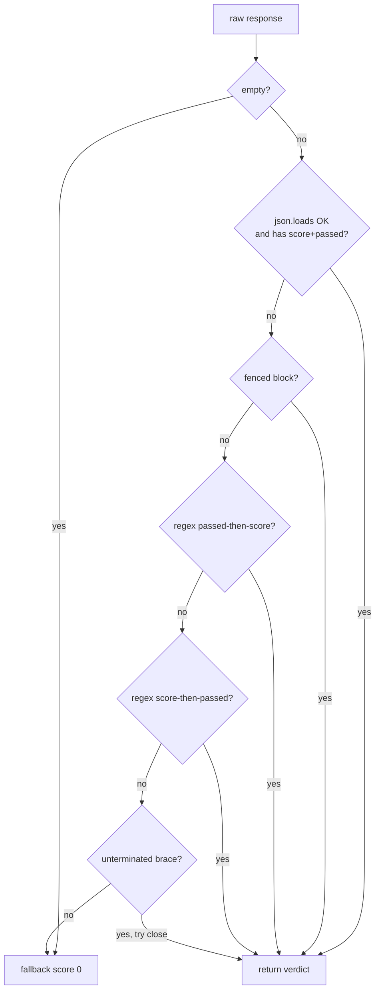
```mermaid
flowchart TD
  A["raw response"] --> B{"empty?"}
  B -->|yes| Z["fallback score 0"]
  B -->|no| C{"json.loads OK<br/>and has score+passed?"}
  C -->|yes| OK["return verdict"]
  C -->|no| D{"fenced block?"}
  D -->|yes| OK
  D -->|no| E{"regex passed-then-score?"}
  E -->|yes| OK
  E -->|no| F{"regex score-then-passed?"}
  F -->|yes| OK
  F -->|no| G{"unterminated brace?"}
  G -->|yes, try close| OK
  G -->|no| Z
```

```
function parse_review(raw):
    if raw empty: return FALLBACK(score=0)
    if json.loads(raw) has score and passed: return it        # ideal
    for fence in ["```json...```", "```...```"]:               # de-fence drift
        if match parses with score+passed: return it
    if regex {...passed...score...}: return it                # order A
    if regex {...score...passed...}: return it                # order B
    if raw starts brace but not ends brace:                   # truncation salvage
        for suffix in close-brackets:
            if json.loads(raw+suffix) has score: return it
    return FALLBACK(score=0, critique="Failed to parse review response")
```

Each rung targets a real failure mode. The insight for abstraction: the strict prompt makes the happy path likely, the tolerant parser makes the unhappy path survivable, and the `score=0` fallback makes total failure *safe* — a drifted response scores 0 and can never falsely clear the `>=10` gate.

### Cross-cutting knob 1 — truncation budgets

| Stage | prompt | draft | critiques | Source |
|---|---|---|---|---|
| pre-design | `[:4000]` | `[:8000]` | — | council.py:409-410 |
| review | `[:4000]` | `[:60000]` | — | council.py:378-379 |
| dual GLM review | `[:4000]` | `[:60000]` | — | council.py:441-442 |
| arbitration | `[:2000]` | `[:6000]` | `[:6000]` | council.py:495-497 |

Review gets the biggest draft window (60k) because it must read the whole artifact; pre-design gets only 8k because it plans from the request; arbitration clips hardest because it juggles three inputs at once. These are raw character slices, not token-aware — a blueprint would clip on tokens.

### Cross-cutting knob 2 — temperature

One global value, `"temperature": 0.1` on every call (council.py:144) — the right default for a deterministic grading/synthesis pipeline. Effort and budget vary per stage; temperature is held constant.

### Cross-cutting knob 3 — max_tokens

| Stage | max_tokens | Source |
|---|---|---|
| pre-design | 16000 | council.py:414 |
| review | 64000 | council.py:383 |
| dual GLM review | 64000 | council.py:446 |
| arbitration | 64000 | council.py:501 |

Pre-design is capped low (a plan is short); graders and synthesizer get 64k because reasoning models emit long chains-of-thought plus the answer. Note council.py:383 reads `64000 if review_type == "code" else 64000` — a vestigial ternary, both branches equal.

### Cross-cutting knob 4 — the reasoning-EFFORT matrix

`call_openrouter` decides effort with a two-branch rule (council.py:146-150):

```
if reasoning:                                  # explicit
    payload["reasoning"] = reasoning
elif "kimi" in model.lower() or "glm" in model.lower():
    payload["reasoning"] = {"effort": "high"}  # default
```

Only pre-design passes an explicit effort — `medium` (council.py:414). Every other stage passes no `reasoning`, so the model-name `elif` fires and, since both models contain "kimi"/"glm", defaults to `high`:

| Stage | effort | why |
|---|---|---|
| pre-design | medium (explicit) | cheap planning |
| code review | high (default) | deep grading |
| dual GLM review | high (default) | second-perspective grading |
| arbitration | high (default) | final synthesis is the deliverable |

A clean cost curve — one explicit dial, one sensible default keyed on "is this a reasoning model" — that composes with the 64k ceilings so graders think hard and can write long.

### Putting it together

```mermaid
sequenceDiagram
  participant L as cmd_loop
  participant OR as call_openrouter
  participant P as parse_review
  participant G as quality_gate
  L->>OR: PRE_DESIGN (4k/8k, 16k tok, medium)
  OR-->>P: raw JSON design
  Note over P: no score/passed, fallback, plan discarded
  L->>OR: REVIEW_CODE Kimi (4k/60k, 64k, high)
  OR-->>P: verdict to score,passed,issues
  L->>OR: REVIEW_CODE GLM dual (high)
  OR-->>P: verdict to avg score
  L->>G: quality_gate(draft)
  Note over L: combined=round((review+gate)/2); pass if >=10 AND review.passed AND gate.passed
  L->>OR: ARBITRATE (2k/6k/6k, 64k, high)
  OR-->>G: raw text to gate score to final
```

To abstract this design you need five ingredients, all in one file: (1) role-specific templates where most demand strict JSON and the terminal one demands raw text; (2) a single client centralizing temperature, retry/backup-key, and the effort default; (3) a per-stage budget/effort/token matrix encoding how much each role reads and how hard it thinks; (4) a tolerant parser that turns "please output JSON" into an enforceable, fail-safe contract; and (5) an external gate for the one stage whose output is prose. The shipped seams are real — pre-design parsed under the wrong contract and never reused, the review-token ternary a no-op, character-not-token budgets — but the shape is a genuinely reusable LLM-as-judge-then-synthesizer pattern.

---

## Conceptual abstraction: a language-agnostic blueprint to rebuild your own

Part I dissected Onklaud 5 as a shipped artifact. Here we treat it as a *specification of intent* and lift eight reusable patterns into an architecture you could re-implement in any stack — LLM or not. The thesis is one economic invariant from the config: `routing: strategy: ladder_first` (`nadirclaw/config.yaml:120-121`); *"Ponytail Ladder FIRST ... avant tout code"* (`config.yaml:131`). Every mechanism serves one rule: **the cheapest layer that can resolve the request, wins.** The system is a cost-ordered cascade of resolvers, each more expensive and capable, where control only falls through when the current rung demonstrably cannot answer. That spine is the whole game; the patterns are its vertebrae.

### Pattern 1 — Escalating-cost cascade (the spine)

**Contract.** Requests flow through resolvers ordered by marginal cost, free to expensive. Each either *resolves* (answer, short-circuit) or *abstains* ("not me", pass down). Pipeline cost equals the first resolver that resolves, not the sum. This is **Chain of Responsibility** plus an **economic ordering invariant**. Intended ladder (`config.yaml:42-73`): `$0 ponytail_ladder` -> `$ glm_pre_design` -> `$$ kimi_generate` -> `$$$ dual_review` -> `$$$$ glm_arbitrate` -> `$0 quality_gate`.

```
function resolve(request):
    for rung in ladder_ordered_by_cost:      # cheapest first
        o = rung.attempt(request)
        if o.resolved: return o.answer       # short-circuit, stop paying
    return escalate_to_human(request)
```

**Load-bearing:** monotonic cost ordering; a cheap honest *abstain* per rung; short-circuit on first resolution; a terminal escalation. **Incidental:** which LLMs sit mid-ladder, the transport, the price points. **Extension:** new rungs slot in by cost position; nothing downstream needs to know a rung exists, only the abstain contract. **Non-LLM:** replace "model call" with any expensive oracle — paid API, human queue, slow solver; a build trying `ccache` -> local -> distributed -> clean rebuild is the same invariant. **Do-differently:** `glm_pre_design` runs but its output goes to result metadata (`council.py:773`) not into generation, so the "sketch then code" edge is decorative — make each rung's output the next rung's input.

### Pattern 2 — Offline deterministic gate

**Contract.** A pure function scores a candidate against a fixed rulebook, returning `(score, passed, issues)` — no network/model/randomness: free, instant, reproducible. It exists to **cheaply reject.** Implemented as a weighted rule registry (`quality_gate.py`); rules register via decorator carrying *severity* and *domain*: `@gate("ErrorHandling", "blocker", "coding")` (`quality_gate.py:28`). Scoring is a **weighted pass-ratio** (`quality_gate.py:129-148`): `SEVERITY_WEIGHT = {blocker:3, critical:2, warning:1}`; `score = round(weighted_sum/total_weight * 10)`; `passed = score >= 10`.

Two load-bearing choices: **severity weighting** (a failed blocker costs 3x a warning — a weighted vote, not a headcount) and **domain scoping** (`applicable = [g for g in GATE_REGISTRY if g.domain in (domain,"all")]`, `line 133` — code answers judged by code rules). **Measured:** `"hello"` scores 2/10 under `general` (only the domain-`all` gates ExcellenceThreshold + Clarity apply) but a trivial async function scores 5/10 under `coding` as the coding blocker gates ErrorHandling + EdgeCases newly fire; the domain changes the rulebook. **Incidental:** the naive substring checks (`"any" in output.lower()`, `line 38`) — replace with linter/type-checker/tests. **Non-LLM:** this *is* CI — `eslint`/`mypy`/`clippy`/coverage/latency budgets each become a domain-tagged, severity-weighted gate. **Do-differently:** the arbiter calls the gate with hardcoded `"general"` (`council.py:508`), so coding/architecture blockers never judge the final answer — thread the domain through.

### Pattern 3 — Pre-resolution / known-answer lookup

**Contract.** Before any oracle, match the request against a curated *capability -> known-solution* map; on a hit, return at zero cost. A **memoization table hand-populated with expert answers** — the $0 rung that makes the cascade economical, because most requests are variations of solved problems. This is `ponytail_ladder.py`, three tiers tried in order (`run_ladder:213-243`): `check_stdlib` -> `check_native` -> `check_existing_dep`. Each maps a phrase to a solution: `"read json": "import json; data = json.load(open(path))"` (`line 31`).

**Measured:** `read json file in python` -> `stdlib`; `add a dark mode toggle` -> `native` (CSS media query); `implement a distributed consensus protocol` -> `found:false`, exit 1 (abstain -> cascade falls through). **Load-bearing:** precedence of curated lookup ahead of generation; abstain-on-miss; context detection choosing *which* table (`detect_language:94`). **The matcher & fix:** it is exact-token subset (`pattern_words.issubset(task_words)`, `line 125-128`) — measured, `read json` hits but `parse the json response body` misses despite identical intent. Replace word-subset with **semantic matching**: alias lists, stemming, or embedding nearest-neighbour with a similarity floor. The pattern is excellent; only the matcher is brittle. **Non-LLM:** an FAQ auto-responder before paging a human.

### Pattern 4 — Learned-failure memory (immune system)

**Contract.** Every rejection persists its *reason*; before future generations, look up relevant reasons and inject them as **pre-generation warnings** so the system stops repeating its mistakes. **Write half** — `record_immune_memory` (`council.py:290-325`): on any sub-ceiling score (`line 397-400`), issues are serialized, deduplicated by pattern text, appended to `immune_memory.json` with a frequency counter. **Read half** — `pre_check.py`: loads memory (`load_memory:36`), then scores `clean|warning|danger` by counting distinct `FAILURE_CATEGORIES` keyword hits shared between task and stored pattern (`line 25-34`, `99-103`), while fuzzy word-overlap (`fuzzy_match:44`) surfaces similar past patterns as `relevant` context. **Measured:** a task naming *"error handling retry"* reads back a stored failure -> `score: warning`.

**Do-differently (the loop is open):** the write half runs in `council.py`; the read half lives only in `pre_check.py`, which `council.py` never imports (grep finds no `pre_check`/`check_task`/`load_memory` in the orchestrator). The shipped system is **write-only** — it accumulates a failure ledger nothing consults during generation. The concept — a persisted, frequency-weighted anti-pattern store re-injected as guardrails — is exactly how you make an agent improve over time; to realize it, call the read half before the generation rung and prepend the warnings, add frequency decay and semantic matching. **Non-LLM:** a flaky-test quarantine list; a fuzzer crash corpus replayed before release.

### Pattern 5 — Ensemble diversity (independent cross-review)

**Contract.** Run **N independent reviewers with distinct viewpoints (role, prompt, or model)**, then combine scores; different reviewers have different blind spots, so their union of caught issues exceeds any single reviewer's. `do_dual_review` (`council.py:431-481`) combines per-field: `avg = round((kimi+glm)/2)` (mean, `line 454`); `all_issues = kimi.issues + glm.issues` (concatenated, `line 457`); `passed = kimi.passed and glm.passed` (AND, `line 467`). In the shipped dual review the diversity axis is the *model*, not the prompt: Kimi and GLM both review with the same brutal code-review prompt (`council.py:436-448`). The codebase's two role-specific prompts — code hunts bugs/injection/races, architecture hunts scaling/failure-modes (`line 97-113`) — are selected per task by `do_review`'s `review_type` (`line 374-375`) in the single-review path, not composed side-by-side here.

```
verdicts = [r.review(draft, request) for r in reviewers]   # independent
return { score: mean(v.score), issues: flatten(v.issues), passed: all(v.passed) }
```

**Load-bearing:** independence, distinct reviewers (by role, prompt, or model), an explicit per-field combination rule. **Extension:** swap the aggregation policy independently of reviewers (median for robustness, min for conservatism, weighted mean for a specialist). **Non-LLM:** multi-tool static analysis (`bandit`+`semgrep`+`codeql` union); a k-of-n approval workflow. **Do-differently:** the shipped ensemble only varies the model — give each reviewer a genuinely distinct role prompt so the diversity is by design, not incidental.

### Pattern 6 — Arbitration synthesis (one authority resolves the ensemble)

**Contract.** After N reviewers produce N critiques, a **single authority** produces the final artifact by synthesizing the draft with *every* critique. Where the ensemble diverges, arbitration converges. `do_glm_arbitrate` (`council.py:486-529`) concatenates all critiques and directs: *"You are the final arbiter. Synthesize the absolute best answer ... Address every issue raised."* (`council.py:115`). Crucially the arbiter's output is **re-gated** before it is trusted (`council.py:507-511`): `run_quality_gate(raw); passed = score >= 10`. Even the most expensive rung is checked by the cheapest, most objective one.

**Load-bearing:** a *single* synthesizer (not another committee); the "address every issue" contract; re-gating so the authority is not above the law. **Non-LLM:** a tech lead reconciling all PR comments into one commit that still must pass CI. **Do-differently:** the arbiter produces `glm_synthesized`, but the `--output` finalizer writes the *original* draft (`_finalize_loop:864-866`), so the synthesized artifact is scored then discarded — ship the arbiter's output.

### Pattern 7 — Trace-as-proof-of-work (anti-bypass)

**Contract.** Every answer carries a machine-checkable **trace** proving it went through the pipeline; consumers *reject any answer lacking a valid trace*, making the expensive process non-optional. Config: *"Anti-bypass: no trace -> REJECT"* (`config.yaml:138`) with shape *"Pipeline trace: [...K(X/10)->G->gate(X/10)]"* (`config.yaml:134`). Producer is `format_trace` (`council.py:577-594`), emitted by the *pipeline*, not the generator, so it cannot be forged by the thing being judged. **Load-bearing:** trace is pipeline-emitted (unforgeable); a consumer contract treating "no trace" as hard reject. **Non-LLM:** SLSA provenance / signed CI attestations a deploy gate verifies. **Do-differently:** the shipped trace is unsigned plaintext and the REJECT rule lives only in prose — sign the trace and put the reject check in the consuming code path.

### Pattern 8 — Externalized round state (stateless worker + re-invocation)

**Contract.** The refinement loop does *not* live in one long process. Each round is a **fresh, stateless invocation**; only small **externalized state** survives; an outer orchestrator re-invokes until terminal — crash-safe, resumable, language-agnostic. State lives in temp files (`council.py:66-68`): `ROUND_FILE` (counter), `ISSUES_FILE` (critiques), `DRAFT_FILE` (artifact). Each `loop` reads the counter, does one round, advances or clears (`read_round`/`write_round`/`clear_round_state:534-560`). **Measured:** fresh read -> `1`; `write_round(2)` -> `2`; `write_round(4)` -> `4`; `clear` -> `1`. The counter is the loop's entire memory. The state machine: a pass at any round clears state and finalizes; on rounds 1-2 a fail persists critiques and `write_round(n+1)` (exit 1, re-invoked); a round-3 fail escalates to `glm_arbitrate`; any round `>3` arbitrates immediately as a safety net (`cmd_loop:722`).

**Load-bearing:** stateless worker; the counter is authoritative (not process memory); a bounded terminal. **Incidental:** temp files as store (could be Redis/DB/workflow blob). **Non-LLM:** the externalized-state workflow engine — Step Functions, Temporal, a self-re-invoking Makefile, a cron retry with a persisted attempt counter.

### Reference architecture

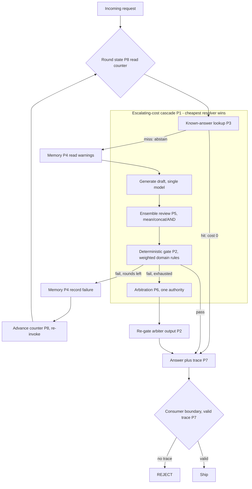
```mermaid
flowchart TD
    REQ["Incoming request"] --> P8{"Round state P8 read counter"}
    P8 --> P3["Known-answer lookup P3"]
    P3 -->|"hit: cost 0"| OUT["Answer plus trace P7"]
    P3 -->|"miss: abstain"| P4R["Memory P4 read warnings"]
    P4R --> GEN["Generate draft, single model"]
    GEN --> P5["Ensemble review P5, mean/concat/AND"]
    P5 --> P2["Deterministic gate P2, weighted domain rules"]
    P2 -->|"pass"| OUT
    P2 -->|"fail, rounds left"| P4W["Memory P4 record failure"]
    P4W --> ADV["Advance counter P8, re-invoke"]
    ADV --> P8
    P2 -->|"fail, exhausted"| P6["Arbitration P6, one authority"]
    P6 --> P2B["Re-gate arbiter output P2"]
    P2B --> OUT
    OUT --> CONS{"Consumer boundary, valid trace P7"}
    CONS -->|"no trace"| REJ["REJECT"]
    CONS -->|"valid"| SHIP["Ship"]
    subgraph CASCADE["Escalating-cost cascade P1 - cheapest resolver wins"]
        P3
        GEN
        P5
        P2
        P6
    end
```

Note: the diagram is the *intended* blueprint — it wires in the P4 memory read that the shipped orchestrator omits.

### How to build your own — an ordered recipe

1. **Define the abstain contract first** (a typed `Outcome{resolved, answer}` beats an exit code); every rung honours it — this makes P1/P3/P8 compose.
2. **Order rungs strictly by marginal cost**, cheapest-first, short-circuit on first resolution; never run a later rung if an earlier one resolved.
3. **Build the $0 known-answer rung (P3)** from your commonest requests; query before anything paid; **use semantic/alias matching, not word-subset**; abstain cleanly on miss.
4. **Build the deterministic gate (P2) as a pure function:** domain-tagged, severity-weighted predicates reduced to one score vs one threshold; design the predicate slot to later hold real linters/type-checkers/tests; **thread the request's domain all the way through.**
5. **Add a single-oracle generation rung, then wrap it in an ensemble reviewer (P5):** N independent reviewers with genuinely distinct viewpoints — distinct role prompts, not just distinct models — an explicit per-field policy (mean/concat/AND); keep reviewers and combiner orthogonal.
6. **Add an arbiter (P6)** that consumes *all* critiques, emits *one* artifact, and **re-gate that artifact** so no rung is above the check; ship the arbiter's output (the shipped code discards it).
7. **Externalize the loop state (P8):** stateless worker, durable round counter + critiques, an outer orchestrator that reads/runs-one/advances; bound with a terminal.
8. **Close the learned-failure loop (P4):** persist each rejection's reason with a frequency counter, and **read it back before every generation** to inject warnings — the half the shipped system omits and the source of long-term improvement; add decay and semantic matching.
9. **Emit and enforce a provenance trace (P7):** pipeline-stamped (never generator-stamped), ideally signed; put "no valid trace -> reject" in the *consumer* path, not prose.
10. **Instrument everything:** one structured record per run (`record_score` -> `scores.jsonl`, `council.py:330-350`); a `status` command over the same external state (`council.py:969-1030`) gives free observability.

Followed in order you get Onklaud 5's genuinely appealing skeleton — a cost-ordered cascade floored by a deterministic gate, sharpened by a diverse ensemble, converged by an arbiter, made non-optional by provenance, resumable by externalized state — while designing out the four places the shipped code lets information leak: discarded pre-design, mis-domained terminal gate, discarded arbiter output, and write-only memory.

---

# Part III — Beyond JavaScript: Python, Native (CSS/HTML) & a Cross-Language View

> Part I scoped to JavaScript for simplicity. Part III gives Python and the Native (CSS/HTML)
> rung the same grounded treatment and synthesizes across all three languages.
>
> **Denominator note:** Python's ladder hit rate appears two ways — **8/15** of the
> *stdlib-expected* Python tasks (the fair comparison to the README's "66.7% of 15") in the
> Python section, and **8/20** of *all* Python-tagged benchmark tasks (including the 5 that
> require custom code) in the cross-language table. Both are correct and labeled where used.
> Independently re-confirmed totals: Python 8, JS 3, Native 4 → **15/35 = 42.9%** overall.

## The Python language surface — the ladder's home turf

Part I traced how Onklaud 5's Ponytail ladder handles JavaScript. Python gets the same three-rung treatment — but with two structural advantages baked into the code that make it the ladder's *home turf*: Python owns the largest pattern table, and Python is the routing destination whenever detection is uncertain. The flip side, which this section makes concrete by running the code, is that the "home turf" advantage is skin-deep: the matcher is a lexical word-subset test, so it misses on plurals, morphology, and tokenization, and the paper's headline Python hit rate does not reproduce.

### 1. How a task becomes "Python": `detect_language()`

Language routing lives in `detect_language()` (`ponytail_ladder.py:94-114`). It is a three-tier waterfall, and Python appears at *both ends* of it.

```python
# ponytail_ladder.py:98-100
# Explicit language mention
if any(kw in task_lower for kw in ["python", ".py", "django", "flask", "fastapi"]):
    return "python"
```

The explicit trigger set is five keywords: the language name, the file extension, and the three dominant web frameworks — `python`, `.py`, `django`, `flask`, `fastapi` (`ponytail_ladder.py:99`). Note these are substring tests (`kw in task_lower`), not word matches, so "fastapi" fires inside "fastapi-users" and ".py" fires inside "copyright" — a looseness worth keeping in mind. If none match, JS gets its (much longer) keyword list on the next line (`ponytail_ladder.py:101-103`), then project-file sniffing checks for `requirements.txt` / `pyproject.toml` / `setup.py` (`ponytail_ladder.py:110-111`).

The load-bearing line is the last one:

```python
# ponytail_ladder.py:113-114
# Default
return "python"
```

**Python is the fallback when nothing else matches.** Any task with no language keyword and no project directory — "merge two dictionaries", "reverse a linked list", "compute a checksum" — routes to Python. I verified this directly (see `measured`): all four ambiguous probes returned `python`. This is not neutral: it means the ladder evaluates ambiguous work against the Python stdlib table first, and only that table. A CSS/HTML task phrased without the word "dark mode" or "tooltip" would still be judged as Python and (correctly) fall through to "needs custom code," but an ambiguous *algorithm* task never even gets the chance to be recognized as, say, JS.

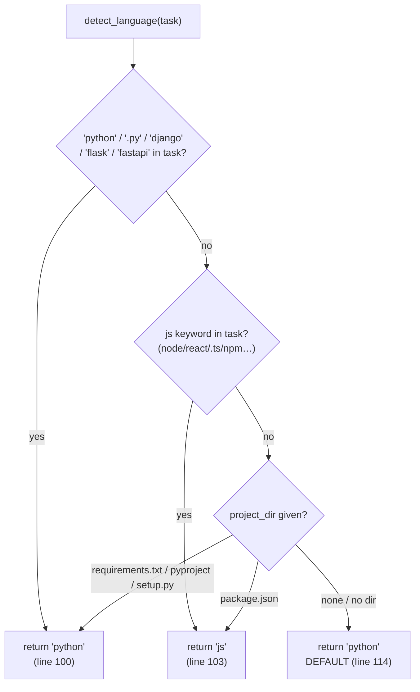
```mermaid
flowchart TD
    A["detect_language(task)"] --> B{"'python' / '.py' / 'django'<br/>/ 'flask' / 'fastapi' in task?"}
    B -->|yes| P["return 'python'<br/>(line 100)"]
    B -->|no| C{"js keyword in task?<br/>(node/react/.ts/npm…)"}
    C -->|yes| J["return 'js'<br/>(line 103)"]
    C -->|no| D{"project_dir given?"}
    D -->|"package.json"| J
    D -->|"requirements.txt / pyproject / setup.py"| P
    D -->|"none / no dir"| E["return 'python'<br/>DEFAULT (line 114)"]
```

### 2. The largest rung: `STDLIB_PATTERNS['python']`

Rung 1 of the ladder is the stdlib table (`ponytail_ladder.py:28-72`). Python's sub-table is the biggest of the three knowledge bases in the file — **23 keys**, versus 14 for `js` and 16 for `NATIVE_PATTERNS` (measured below). It spans `ponytail_ladder.py:30-54`. Enumerated in full, grouped by domain:

| Domain | Pattern keys (`ponytail_ladder.py:31-53`) |
|---|---|
| Serialization / IO | `read json`, `write json`, `read csv`, `config file` |
| Network / URL | `http get`, `parse url` |
| Date & time | `parse date`, `format date`, `date formatter` |
| Crypto / encoding | `generate uuid`, `hash file`, `base64 encode` |
| Filesystem | `temp file`, `walk directory`, `zip archive`, `unzip extract` |
| Process / system | `run command`, `sleep seconds`, `delay execution`, `environment variable` |
| Misc | `random number`, `regex match`, `log message` |

Each value is a one-liner solution, e.g. `"read json": "import json; data = json.load(open(path))"` (`ponytail_ladder.py:31`) and `"generate uuid": "import uuid; id = str(uuid.uuid4())"` (`ponytail_ladder.py:39`). The matching logic is `check_stdlib()` (`ponytail_ladder.py:116-131`), and it is deliberately crude:

```python
# ponytail_ladder.py:123-129
task_words = set(task_lower.split())
for pattern, solution in patterns.items():
    pattern_words = set(pattern.split())
    # All pattern words must appear in task words
    if pattern_words.issubset(task_words):
        return {"level": "stdlib", "solution": solution, "language": lang, "pattern_matched": pattern}
```

The task is lowercased and split on whitespace into a `set`; a pattern matches iff **every** word of the pattern key is present as a *whole token*. There is no stemming, no synonym expansion, no substring fallback, and set membership discards word order and adjacency. "read json" therefore matches "**Read** and parse a **JSON** file" (both tokens present) but "log message" does *not* match "Log **messages**…" (the token is `messages`, not `message`). This single design choice is what produces the miss pattern in section 6.

### 3. Rung 3, Python half: `check_existing_dep()` and `requirements.txt`

Rung 2 (`check_native`, HTML/CSS) is language-agnostic and shared with the other surfaces. Rung 3, `check_existing_dep()` (`ponytail_ladder.py:144-211`), is language-split. Its Python half only activates when a `project_dir` is passed and contains `requirements.txt` (`ponytail_ladder.py:185-186`); `pyproject.toml`-only or `setup.py`-only projects are *not* read here even though `detect_language` recognizes them. It slurps the file as one lowercased blob and checks a dependency-to-keyword table:

```python
# ponytail_ladder.py:191-200
py_dep_mappings = {
    "requests":   ["http", "api call", "fetch", "request"],
    "pydantic":   ["validate", "schema", "type check"],
    "fastapi":    ["server", "route", "api"],
    "sqlalchemy": ["database", "query", "orm"],
    "click":      ["cli", "command line"],
    "rich":       ["console", "terminal", "progress"],
    "httpx":      ["http", "async request"],
    "pytest":     ["test", "assert"],
}
```

The gate (`ponytail_ladder.py:202-207`) is `dep_name in requirements AND any(keyword in task)`. Matching is again pure substring: `"requests" in reqs.lower()` will also fire on a line reading `# requests are logged`, and both `requests` and `httpx` map `http`, so the first-declared-in-dict wins (`requests`). Unlike the JS half above it (`ponytail_ladder.py:161-172`, which has a duplicated `zod` key), the Python table has eight distinct entries and no duplicates.

### 4. The syntax gate: `fast_gate.py` shells to `py_compile`

After code exists, the per-file quality check `fast_gate.py` runs an instant syntax gate before any (paid) council review. Extensions are classed at `fast_gate.py:11-12`:

```python
JS_EXTS = {".js", ".ts", ".jsx", ".tsx", ".mjs", ".cjs"}
PY_EXTS = {".py", ".pyw"}   # fast_gate.py:12
```

For `.py`/`.pyw` it shells out to the interpreter's byte-compiler:

```python
# fast_gate.py:21-23
elif ext in PY_EXTS:
    r = subprocess.run(["python", "-m", "py_compile", filepath], capture_output=True, text=True, timeout=10)
    return r.returncode == 0, r.stderr.strip() if r.stderr else ""
```

This is the exact parallel of the JS branch's `node --check` (`fast_gate.py:18-20`). I confirmed both branches (`measured`): a valid file prints `[SYNTAX] …: OK`; a file with `def f(:` fails with `SyntaxError: invalid syntax` and exit code 1. `py_compile` is a *parse/compile* check only — it catches syntax errors but never imports or runs the module, so undefined names, bad types, and runtime errors sail through. It is the Python analogue of a linter's parse pass, nothing more.

### 5. Python in `verify.py`: no type-check at all

This is the sharpest Python-vs-TypeScript asymmetry, and it is a consequence of `verify.py` being written entirely around `package.json`. `detect_project_type()` opens `package.json` and, if it is absent, returns a bare `{"lang": "unknown"}`:

```python
# verify.py:101
return {"lang": "unknown"}
```

The Phase-1 type-check dispatches on that `lang`. There are branches for `typescript` (`npx tsc --noEmit`, `verify.py:130-149`) and `javascript` (`node --check` over every file, `verify.py:151-174`) — but for anything else:

```python
# verify.py:176-178
elif lang == "unknown":
    print("[VERIFY]   Unknown project type - skipping type-check")
    self.results["type_check"] = "skipped"
```

A Python project — even one with `requirements.txt`, `pyproject.toml`, and real `.py` sources — has no `package.json`, so it resolves to `lang == "unknown"` and **the type-check is skipped entirely**. There is no `mypy`, no `pyright`, no `py_compile` sweep at this layer. Worse, `has_tests` is derived only from `package.json` scripts (`verify.py:87`), so a Python project also reports `Tests=None` and Phase 2 never runs. I ran `verify.py --project` against a `requirements.txt`+`main.py` project (`measured`): it printed `Detected: unknown`, `skipping type-check`, and finished `ALL PASS: TypeCheck=skipped` with **exit 0**. Because `skipped` is not counted as a failure in `_summarize()` (`verify.py:278-282` only fails on `"fail"`), a Python project that is syntactically broken *at the type level* passes verification vacuously. TypeScript gets a real gate; Python gets a green light.

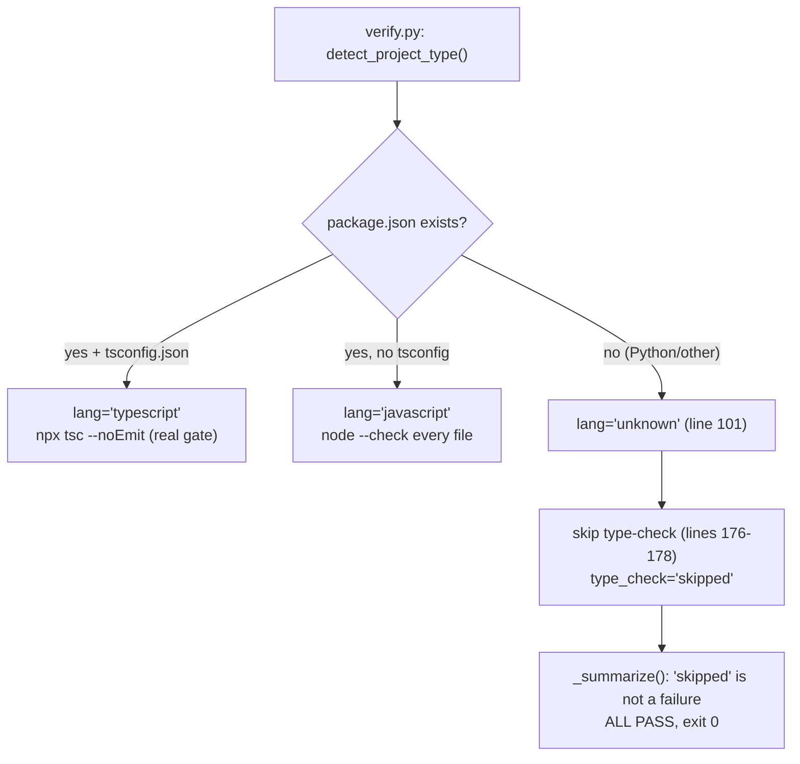
```mermaid
flowchart TD
    V["verify.py: detect_project_type()"] --> Q{"package.json exists?"}
    Q -->|"yes + tsconfig.json"| TS["lang='typescript'<br/>npx tsc --noEmit (real gate)"]
    Q -->|"yes, no tsconfig"| JS["lang='javascript'<br/>node --check every file"]
    Q -->|"no (Python/other)"| U["lang='unknown' (line 101)"]
    U --> S["skip type-check (lines 176-178)<br/>type_check='skipped'"]
    S --> R["_summarize(): 'skipped' is not a failure<br/>ALL PASS, exit 0"]
```

### 6. Running the 15 Python benchmark tasks — measured, not claimed

The benchmark's Python task list is `REAL_TASKS[0:15]` (`benchmark_full.py:20-34`), all tagged `expected_stdlib=True`. The harness invokes the ladder with `--lang python` for each (`benchmark_full.py:66-70`). The paper claims a Python hit rate of **66.7% (10 of 15)**. I re-ran the actual ladder against all 15 with `--lang python --json`. The observed result is **8 of 15 = 53.3%** — a 2-task, ~13-point shortfall from the paper's figure. Because the matcher is pure deterministic string logic (no randomness, no network), this result is fully reproducible.

| # | Task (`benchmark_full.py`) | Result | Pattern |
|---|---|---|---|
| 1 | Read and parse a JSON configuration file | HIT | `read json` |
| 2 | Make an HTTP GET request with timeout and retry | HIT | `http get` |
| 3 | Generate a random UUID v4 | HIT | `generate uuid` |
| 4 | Walk a directory recursively finding all .py files | HIT | `walk directory` |
| 5 | Parse command-line arguments with --verbose flag | **MISS** | — |
| 6 | Create a ZIP archive from a list of files | HIT | `zip archive` |
| 7 | Run an external command and capture stdout/stderr | HIT | `run command` |
| 8 | Log messages with timestamps to stderr | **MISS** | — (`messages` ≠ `message`) |
| 9 | Hash a string with SHA256 | **MISS** | — (only `hash file` exists) |
| 10 | Base64 encode binary data | HIT | `base64 encode` |
| 11 | Sleep/delay execution for N seconds | **MISS** | — (`sleep/delay` is one token) |
| 12 | Get environment variable with default value | HIT | `environment variable` |
| 13 | Find files matching a regex pattern | **MISS** | — (`matching` ≠ `match`) |
| 14 | Merge two dictionaries with priority | **MISS** | — (no dict pattern) |
| 15 | Benchmark execution time of a function | **MISS** | — (no timing pattern) |

The seven misses are not random — four are direct casualties of the whole-token `issubset` rule from section 2:

- **#8** needs both `{log, message}`; the task supplies `messages`. Singularizing the task to "Log **message** with timestamps" flips it to HIT on `log message` (measured).
- **#9** hashes a *string*, but the only hash pattern is `hash file` (`ponytail_ladder.py:40`), which needs the token `file`. "Hash **file** with SHA256" hits — and note it would then hand back a *file*-reading solution, semantically wrong for a string, since matching is lexical with no meaning check.
- **#11** has `sleep/delay` as a single whitespace token, so neither `sleep seconds` nor `delay execution` can match. "**Sleep** for N seconds" hits `sleep seconds` (measured).
- **#13** has `matching`, not `match`, so `regex match` misses. "…with regex **match**" hits (measured).
- **#5**, **#14**, **#15** are genuine coverage gaps: there is simply no `argparse`, no dict-merge, and no timing/`timeit` pattern in the 23-key table.

The delta between the measured 53.3% and the claimed 66.7% is exactly the width of these brittleness cliffs: two more of the near-miss tasks would need to be phrased in the table's exact singular/whole-token vocabulary to reach 10/15. The ladder's "home-turf" advantage for Python is real in surface area (biggest table, default routing) but the recall it actually delivers on the benchmark's own task wording is a full 13 points below the paper's number, and — per section 5 — whatever it does emit is never type-checked downstream.

---

## The Native (CSS/HTML) surface — the "no-code" rung

Every other rung of the Ponytail ladder hands you *code* — a one-liner to paste, an import to add, a dependency you already have. The Native rung is different in kind: a hit here means the platform (the browser, HTML5, CSS) *already does the thing*, so the correct amount of code Onklaud writes is **zero**. It is the "no-code" rung, and structurally it is the highest-value rung on the ladder — a match doesn't shorten the solution, it *eliminates* it.

This section gives the Native surface the same grounded treatment Part I gave the JavaScript flows: what patterns it knows, how the matcher works, the one architectural fact that makes it unlike every other rung (it is **language-independent**), why the paper calls it the ladder's best-performing language, and — because native code never touches the syntax gate or the verify phase — why it is a *resolve-only* rung that is never verified.

### `NATIVE_PATTERNS` — the whole vocabulary

The entire native knowledge base is one flat dict of 16 entries (`ponytail_ladder.py:74-92`). The comment above it states the thesis outright: *"Native HTML/CSS patterns that don't need any code at all"* (`ponytail_ladder.py:74`). Every value is a snippet of platform markup or CSS plus a "no JS" reminder — the style of solution is always *"the browser already ships this."*

| # | Key (`ponytail_ladder.py`) | Style of solution (the platform primitive) |
|---|---|---|
| 1 | `date picker` (L76) | `<input type="date">` — native date picker, no JS |
| 2 | `color picker` (L77) | `<input type="color">` — native color picker |
| 3 | `form validation` (L78) | `<input required pattern minlength maxlength>` — HTML5 validation, no JS |
| 4 | `dropdown` (L79) | `<select><option>…` — native dropdown |
| 5 | `number input` (L80) | `<input type="number" min max step>` |
| 6 | `file upload` (L81) | `<input type="file" accept multiple>` |
| 7 | `range slider` (L82) | `<input type="range" min max>` |
| 8 | `progress bar` (L83) | `<progress value max>` |
| 9 | `dark mode` (L84) | `@media (prefers-color-scheme: dark)` — CSS handles it |
| 10 | `responsive layout` (L85) | CSS grid/flexbox + `@media` queries, no JS |
| 11 | `smooth scroll` (L86) | `scroll-behavior: smooth;` — CSS property |
| 12 | `sticky header` (L87) | `position: sticky; top: 0;` — CSS |
| 13 | `animations` (L88) | `@keyframes` + `animation` — CSS animations |
| 14 | `tooltip` (L89) | `[title="hover text"]` — native tooltip attribute |
| 15 | `details/summary` (L90) | `<details><summary>…</summary>…</details>` — native expandable |
| 16 | `dialog/modal` (L91) | `<dialog>` — native modal, `.showModal()` if JS needed |

The list is a genuine tour of the "you don't need a library for this" corner of front-end work — date/color/range pickers, HTML5 form validation, `<progress>`, `<details>`, `<dialog>`, `prefers-color-scheme` dark mode, `position: sticky`, `scroll-behavior: smooth`. Each is a real capability that ships in the platform, so the resolver's whole job on the Native rung is recognition, not generation.

### `check_native()` — subset-of-words recognition

The matcher is nine lines (`ponytail_ladder.py:133-142`) and, crucially, has a **different signature** from `check_stdlib`: it takes only `task` — no `lang` parameter at all.

```python
def check_native(task):
    """Check if task can be solved with native HTML/CSS."""
    task_lower = task.lower()
    task_words = set(task_lower.split())
    for pattern, solution in NATIVE_PATTERNS.items():
        pattern_words = set(pattern.split())
        if pattern_words.issubset(task_words):
            return {"level": "native", "solution": solution, "pattern_matched": pattern}
    return None
```

The rule is bag-of-words subset matching: split the task on whitespace into a set, split each pattern key into a set, and fire if the pattern's words are a **subset** of the task's words. `"Add a dark mode toggle"` → `{add, a, dark, mode, toggle}` ⊇ `{dark, mode}` → hit. Note the returned dict has **no `language` field** — unlike the stdlib result which carries `"language": lang` (`ponytail_ladder.py:129`). A native solution is genuinely language-neutral, and the result object reflects that.

That same subset rule is also the rung's fragility. It has no stemming and no synonyms, so `smooth scroll` (the pattern) will not match `"smooth scrolling"` (the task), and `details/summary` — one un-splittable token because the "/" is never a delimiter — can never be a subset of a natural-language task. We measured both of these misses below.

### The architectural fact: the Native rung is language-independent

This is the load-bearing observation. `run_ladder` (`ponytail_ladder.py:213-243`) resolves the detected language first (`ponytail_ladder.py:215-216`), tries the language-specific stdlib rung, and then calls `check_native(task)` **unconditionally** — regardless of what language was detected:

```python
# Step 1: Stdlib
result = check_stdlib(task, lang)
if result:
    result["found"] = True
    return result, 0

# Step 2: Native platform
result = check_native(task)          # ponytail_ladder.py:225 — no `lang` passed
if result:
    result["found"] = True
    return result, 0
```

`check_stdlib` bails immediately if the language isn't in its table (`ponytail_ladder.py:118-119`); `check_native` has no such gate because it takes no language. So for a task like *"Add a dark mode toggle to the page"*, `detect_language` finds no Python/JS keyword and falls through to its `python` default (`ponytail_ladder.py:114`), `check_stdlib(task, "python")` misses, and the **native rung still fires** — the detected language is irrelevant to whether a native pattern matches. Forcing `--lang python` or `--lang js` on the same task produces the identical native hit (measured below).

The benchmark encodes this design intent explicitly. The five native tasks in `benchmark_full.py:47-51` are tagged with the pseudo-language `"native"`, and the runner **deliberately omits `--lang`** for them (`benchmark_full.py:68`):

```python
cmd = ["python", str(MY_DIR / "ponytail_ladder.py"), "--task", task, "--json"]
if lang not in ("native", ""):
    cmd.extend(["--lang", lang])
```

`"native"` is not a value the CLI even accepts — `--lang` is `choices=["python", "js"]` (`ponytail_ladder.py:250`) — so passing it would error. The benchmark handles this by treating "native" as "run with no language and let the language-independent rung do its work."

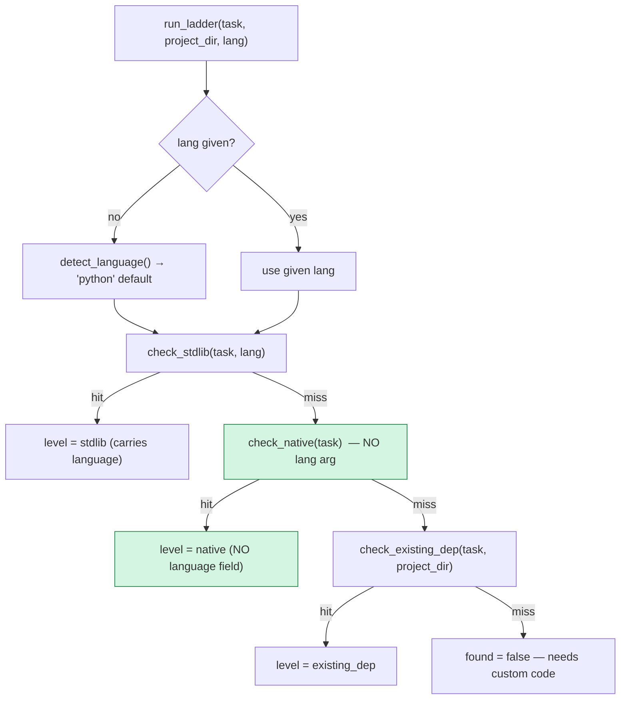
```mermaid
flowchart TD
    A["run_ladder(task, project_dir, lang)"] --> B{"lang given?"}
    B -- no --> C["detect_language() → 'python' default"]
    B -- yes --> D["use given lang"]
    C --> E["check_stdlib(task, lang)"]
    D --> E
    E -- hit --> Z1["level = stdlib (carries language)"]
    E -- miss --> F["check_native(task)  — NO lang arg"]
    F -- hit --> Z2["level = native (NO language field)"]
    F -- miss --> G["check_existing_dep(task, project_dir)"]
    G -- hit --> Z3["level = existing_dep"]
    G -- miss --> Z4["found = false — needs custom code"]
    style F fill:#d5f5e3,stroke:#1e8449
    style Z2 fill:#d5f5e3,stroke:#1e8449
```

### Why this is the highest-value rung — and the paper's 80% claim

Conceptually the rungs are ordered by cost of the resulting solution: stdlib is one line, existing-dep is one import, custom is "write it yourself." Native sits *below* all of them — a hit is not a shorter solution, it is *no solution*, because the artifact ships in the browser. That is the paper's whole rhetorical point about this rung.

And empirically the Native rung is the ladder's strongest performer. The README's "Ponytail Breakdown" (`README.md:236`) reports:

| Language | Tasks | Resolved | Hit Rate |
|---|---|---|---|
| Python | 15 | 10 | 66.7% |
| JavaScript | 10 | 2 | 20.0% |
| **CSS/HTML** | **10** | **8** | **80.0%** |

CSS/HTML is claimed at **80.0% (8/10)** — the top of the table, four times JavaScript's rate. That 8/10 figure comes from the *10-task* CSS/HTML set in `research_paper_benchmark.py:44-55` — a separate, reworded set that exercises the same native primitives as the five tasks in `benchmark_full.py:47-51` (only *"Add a tooltip on hover"* appears verbatim in both), plus five more (sticky header, smooth scrolling, progress bar, color picker, file upload).

### Measured: re-running the ladder against the native tasks

Re-running the **five** native tasks from `benchmark_full.py:47-51` with **no `--lang`** (exactly as `benchmark_full.py:68` does) yields **4/5 = 80.0%**:

| Task (`benchmark_full.py:47-51`) | Result | Pattern |
|---|---|---|
| Add a dark mode toggle to the page | HIT | `dark mode` |
| Create a responsive 3-column grid layout | HIT | `responsive layout` |
| Add a tooltip on hover | HIT | `tooltip` |
| Create an expandable FAQ section | **MISS** | — |
| Add a number input with min/max validation | HIT | `number input` |

The single miss, *"Create an expandable FAQ section,"* is exactly the case the `details/summary` pattern (`ponytail_ladder.py:90`) is meant to cover — `<details>`/`<summary>` *is* the native expandable — but the subset matcher can never fire it: the pattern key `"details/summary"` splits into the single token `{"details/summary"}`, which is not a subset of `{create, an, expandable, faq, section}`. The capability exists in the knowledge base; the string matcher just can't reach it.

Running the paper's full **ten-task** CSS/HTML set (`research_paper_benchmark.py:44-55`) reproduces the README's headline **8/10 = 80.0%** exactly. The two misses are both matcher artifacts, not missing knowledge:

- *"Create an expandable section"* — same un-splittable `details/summary` token.
- *"Add smooth scrolling"* — pattern key is `smooth scroll` → `{smooth, scroll}`, but the task tokenizes to `{add, smooth, scrolling}`; `scroll` ≠ `scrolling`, so no subset. A stemmer would catch it; this matcher won't.

So the 80% is real and reproducible, but it is 80% *of the recognizer*, capped by bag-of-words brittleness rather than by gaps in `NATIVE_PATTERNS` — the platform primitives for both misses are already in the table.

### Resolve-only: no syntax gate, no verify path

The final structural fact is that the Native rung is **never verified**. Once `check_native` resolves a task, nothing downstream inspects the CSS/HTML it points at, because the rest of the pipeline only understands JS and Python.

The fast syntax gate keys off file extension (`fast_gate.py:11-12`):

```python
JS_EXTS = {".js", ".ts", ".jsx", ".tsx", ".mjs", ".cjs"}
PY_EXTS = {".py", ".pyw"}
```

`check_syntax` runs `node --check` for JS extensions and `python -m py_compile` for Python, and for anything else falls straight to *"Unknown format, skip syntax check"* returning `True, ""` (`fast_gate.py:24-25`). There is no `.css` or `.html` branch, so a `.css`/`.html` file passes the gate **unconditionally** — even deliberately malformed markup reports `OK` (measured below).

The runtime verifier is the same story. `Verify.detect_project_type` only ever returns `lang` of `"typescript"`, `"javascript"`, or `"unknown"` (`verify.py:91`, `verify.py:101`), and `_type_check` only branches on those three (`verify.py:130`, `verify.py:151`, `verify.py:176`) — a CSS/HTML-only project falls into `"unknown"` and is *skipped*. There is no CSS validator, no HTML validator, no browser render check.

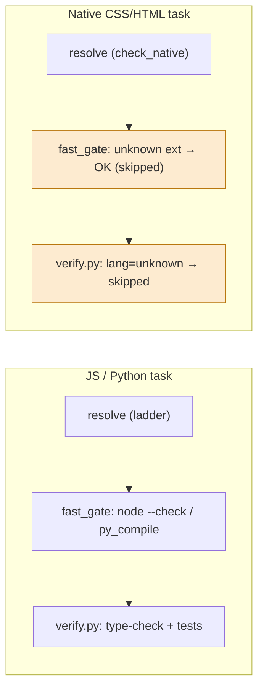
```mermaid
flowchart LR
    subgraph JSPY["JS / Python task"]
      A1["resolve (ladder)"] --> A2["fast_gate: node --check / py_compile"] --> A3["verify.py: type-check + tests"]
    end
    subgraph NAT["Native CSS/HTML task"]
      B1["resolve (check_native)"] --> B2["fast_gate: unknown ext → OK (skipped)"] --> B3["verify.py: lang=unknown → skipped"]
    end
    style B2 fill:#fdebd0,stroke:#b9770e
    style B3 fill:#fdebd0,stroke:#b9770e
```

This is coherent with the rung's premise rather than a bug: if a native hit means "write zero code," there is no artifact to type-check. But it is worth stating plainly — the Native rung is **resolve-only**. Its correctness rests entirely on the accuracy of the 16 `NATIVE_PATTERNS` mappings, because nothing after resolution ever re-checks them.

---

## Cross-language synthesis — one deterministic layer, three very different reaches

Part I dissected how Onklaud 5's Ponytail ladder reaches into JavaScript. But the ladder is not three engines — it is *one* engine (`run_ladder`, `ponytail_ladder.py:213-243`) reading three hand-authored dictionaries. Nothing about the control flow is language-aware; the only thing that changes per language is *which dictionary the same set-subset matcher is pointed at*. That single design choice is what makes the reach so uneven across Python, JS/TS, and Native — and understanding why is the whole point of this section.

The matcher itself is five lines, identical for every language (`ponytail_ladder.py:122-129`):

```python
task_words = set(task_lower.split())
for pattern, solution in patterns.items():
    pattern_words = set(pattern.split())
    # All pattern words must appear in task words
    if pattern_words.issubset(task_words):
        return {"level": "stdlib", ...}
```

So a language "reaches" a task if and only if some pattern key's words are a whitespace-token subset of the task's words. Reach is therefore a pure product of two dials: **how many pattern keys exist for that language** (table size), and **how forgiving that subset test is against real phrasing** (matching strictness). The three languages differ on both dials, and the benchmark makes the difference legible.

### 1. The comparison table

Every number below was produced by running the code, not read off the source. Pattern counts come from counting dict keys (`len(STDLIB_PATTERNS['python'])` etc.); hit rates come from re-running all 35 `REAL_TASKS` (`benchmark_full.py:18-58`) through the real `ponytail_ladder.py` subprocess and splitting the tallies by the task's declared language column.

| Dimension | Python | JavaScript / TypeScript | Native (CSS/HTML) |
|---|---|---|---|
| Pattern table | `STDLIB_PATTERNS["python"]` (`ponytail_ladder.py:30-54`) | `STDLIB_PATTERNS["js"]` (`ponytail_ladder.py:56-71`) | `NATIVE_PATTERNS` (`ponytail_ladder.py:75-92`) |
| **Pattern count** (dict keys) | **23** | **14** | **16** |
| **Measured ladder hit rate** (this benchmark) | **40.0 %** (8 / 20 tasks) | **30.0 %** (3 / 10 tasks) | **80.0 %** (4 / 5 tasks) |
| Resolution level when hit | `stdlib` | `stdlib` | `native` |
| **Type-check tier** (`verify.py:126-178`) | **None** — no `package.json`, so `detect_project_type` returns `{"lang":"unknown"}` and Phase 1 prints "skipping type-check" | **TS only:** `npx tsc --noEmit` (`verify.py:138`). **Plain JS:** `node --check` per file (`verify.py:161`) — a *syntax* check, not a type check | **None** — never a JS/TS project, falls into the `unknown` skip branch |
| **Syntax gate** (`fast_gate.py:11-25`) | `python -m py_compile` for `.py`/`.pyw` (`fast_gate.py:22`) | `node --check` for `.js/.ts/.jsx/.tsx/.mjs/.cjs` (`fast_gate.py:19`) | **None** — `.css`/`.html` fall to the `else: return True, ""` branch (`fast_gate.py:25`), i.e. auto-pass |
| Overall (all 35) | — | — | **42.9 %** combined hit rate (15 / 35: 11 stdlib + 4 native + 0 existing_dep) |

Two structural facts fall out of the table that the aggregate "42.9 %" hides:

- **The `existing_dep` tier never fires in the benchmark at all.** `run_ponytail_benchmark` (`benchmark_full.py:60-99`) invokes the ladder without `--project-dir`, and `run_ladder` gates the dep check on `if project_dir:` (`ponytail_ladder.py:231`). So the third rung of the ladder — the only rung that would ever match a project's actual `package.json`/`requirements.txt` — is dead weight in the measured score for *all three* languages.
- **The "type-check" column is doing less than its name implies.** Only TypeScript gets a genuine semantic check (`tsc --noEmit`). Plain JS, Python, and Native all top out at *syntax* validation or nothing. Running `verify.py --type-only` against the pure-Python Onklaud repo confirms it: it detects `unknown`, skips type-check, and still reports `ALL PASS` (see 'measured').

The strictness dial shows up vividly inside the Python and JS rows. Python has the *largest* table (23) yet the *middle* hit rate, because the benchmark phrasings drift off the pattern keys by a token or two:

- `"Sleep/delay execution for N seconds"` misses both `"sleep seconds"` and `"delay execution"` — the task tokenizes `"sleep/delay"` as one word, so neither `sleep` nor `delay` is ever a bare token (confirmed in 'measured').
- `"Hash a string with SHA256"` misses `"hash file"` because the pattern demands the literal token `file`, which a string-hashing task will never contain.

And where JS *does* hit, strictness cuts the other way — too loose: `"Read all lines from a file"` matches the `"read file"` key and is handed `readFileSync(...)`, not a line reader (confirmed in 'measured'). The subset test cannot tell "read a whole file" from "read all lines"; both are supersets of `{read, file}`.

Native inverts the whole picture: the *smallest* effective task sample (5) posts the *highest* hit rate (80 %) because the five native benchmark tasks were phrased to sit right on top of the 16 native keys (`dark mode`, `responsive layout`, `tooltip`, `number input`). The one miss, `"Create an expandable FAQ section"`, fails only because the matching key is spelled `"details/summary"` — a token no natural task phrasing contains.

### 2. Language routing (`detect_language`) as a flowchart

When `--lang` is omitted, `run_ladder` calls `detect_language` (`ponytail_ladder.py:94-114`). The precedence is a strict top-to-bottom `return` cascade, so the *first* branch that fires wins. I verified the ordering empirically (see 'measured') because it matters for ties: because the Python-keyword test at `ponytail_ladder.py:99` runs *before* the JS-keyword test at `:101`, a task naming **both** languages resolves to **Python**, not JS — e.g. `"read a json file with python and node"` → `python`, and `"build a typescript django app"` → `python`. So the real, measured order is: explicit Python keyword → explicit JS keyword → `package.json` (js) → `requirements.txt`/`pyproject.toml`/`setup.py` (python) → Python default.

Crucially, language detection only chooses which `STDLIB_PATTERNS` sub-table `check_stdlib` reads. The **native** rung is orthogonal: `run_ladder` calls `check_native(task)` (`ponytail_ladder.py:224-228`) for *every* task after the stdlib miss, passing no language at all. A task pinned to `--lang python` still resolves natively — `--task "add a dark mode toggle" --lang python` returns `{"level":"native", "pattern_matched":"dark mode"}` (confirmed in 'measured'). Native is a universal fallthrough, not a language.

```mermaid
flowchart TD
    Start["run_ladder(task, project_dir, lang)"] --> HasLang{"--lang given?"}
    HasLang -- yes --> UseLang["lang := explicit flag"]
    HasLang -- no --> Detect["detect_language()"]

    subgraph DL ["detect_language precedence (first return wins)"]
        direction TB
        D1{"task contains python / .py / django / flask / fastapi ?"}
        D1 -- yes --> RPy["return 'python'"]
        D1 -- no --> D2{"task contains javascript / typescript / node / react / .js / .ts / npm / vite / express ?"}
        D2 -- yes --> RJs["return 'js'"]
        D2 -- no --> D3{"project_dir has package.json ?"}
        D3 -- yes --> RJs2["return 'js'"]
        D3 -- no --> D4{"project_dir has requirements.txt / pyproject.toml / setup.py ?"}
        D4 -- yes --> RPy2["return 'python'"]
        D4 -- no --> RDef["return 'python' (default)"]
    end

    Detect --> DL
    UseLang --> Std
    RPy --> Std
    RJs --> Std
    RJs2 --> Std
    RPy2 --> Std
    RDef --> Std

    Std["check_stdlib(task, lang) — reads STDLIB_PATTERNS[lang]"] --> StdHit{"subset match?"}
    StdHit -- yes --> DoneStd["level = stdlib"]
    StdHit -- no --> Nat["check_native(task) — runs for EVERY task, language-agnostic"]
    Nat --> NatHit{"subset match?"}
    NatHit -- yes --> DoneNat["level = native"]
    NatHit -- no --> Dep{"project_dir set?"}
    Dep -- yes --> DepCheck["check_existing_dep()"]
    Dep -- no --> NF["found = false — needs custom code"]
    DepCheck --> DepHit{"dep + keyword match?"}
    DepHit -- yes --> DoneDep["level = existing_dep"]
    DepHit -- no --> NF
```

### 3. Conceptual takeaway

Read the table and the flowchart together and the synthesis is clean: **the deterministic layer's reach per language is `table_size × matching_strictness`, and nothing else.** There is no shared abstraction, no knowledge derived from the language's actual stdlib, no notion of what a task *means* — only a hand-curated word list per language and a whitespace-token subset test applied uniformly to all three.

That single equation explains every asymmetry we measured without invoking any per-language cleverness:

- Native scores highest (80 %) not because CSS is "more solvable" but because its 16 keys were curated in lockstep with the tasks that test them — high effective coverage, phrasing sitting on the keys.
- Python scores in the middle (40 %) *despite* the biggest table (23) because natural task phrasings drift off exact-token keys and the subset test has no alias, stem, or synonym tolerance to catch the drift.
- JS scores lowest (30 %) — the smallest table (14) combined with the same brittle-and-simultaneously-loose subset test, producing both false negatives (`temporary directory` ≠ `temp dir`) and false positives (`read all lines` → `readFileSync`).

The verification tiers reinforce the same shape. Depth of checking is again a function of hand-wired coverage per language, not of the language's needs: TS earns a real semantic gate (`tsc --noEmit`), JS earns a syntax gate, and Python and Native — the two languages with the *most* stdlib patterns and the *highest* native reach respectively — earn essentially nothing beyond `py_compile` at the file gate and a skip at the verify tier. The layer's confidence and the layer's coverage are decoupled.

This is precisely the seam Part II's rebuild blueprint targets. If reach is `table_size × strictness`, then improving reach by hand means forever adding rows to three dictionaries and forever tuning a subset test that is brittle and loose at the same time. The blueprint's two moves attack the two factors directly: **generate the tables** (enumerate stdlib/native surface programmatically instead of transcribing 14–23 keys by hand, so `table_size` stops being a curation budget) and **match semantically / by alias** (retire the whitespace-subset test so `temp dir`/`temporary directory` and `sleep`/`delay` collapse to the same intent, and `read a file` stops silently satisfying `read all lines`). Swap those two dials and the per-language reach stops being an artifact of how much someone typed into a Python dict — which, as the measured 40 / 30 / 80 split shows, is all it is today.
